# PhyPiDAQ Dokumentation (für Lehrer)

In dieser Anleitung wird der gesamte Workflow von PhyPiDAQ, begonnen von der\
Installation bis hin zur Auswerten von Versuchen beschrieben.

- [Was ist PhyPiDAQ ?](#wasistphypidaq)
- [Was brauche ich und wie baue ich das zusammen ?](#wasbraucheichundwiebaueichdaszusammen)
	- [Bestellliste](#bestellliste)
	- [Bauanleitung](#bauanleitung)
		- [Platine löten](#platineloeten)	
		- [Koffer bauen](#kofferbauen)
- [Wie setze ich den Raspberry Pi auf und installiere PyPiDAQ?](#wiesetzeichdenraspberrypiaufundinstalliereichphypidaq)
    - [Wie setze ich den Raspberry Pi auf ?](#wiesetzeichdenraspberrypiauf)
    - [Wie installiere ich PhyPiDAQ ?](#wieinstalliereichphypidaq)
- [Wie bediene ich die PhyPiDAQ Software ?](#wiebedieneichdiephypidaqsoftware)
    - [Starten und Startoberfälche](#startenundstartoberflaeche)
    - [Konfigurationsdatei](#konfigurationsdatei)
    - [Messung starten](#messungstarten)
- [Wie führe ich damit Versuche durch ?](#wiefuehreichdamitversuchedurch)
	- [Elektrostatik](#elektrostatik)
	- [Kraftsensor](#kraftsensor)
	- [Photoeffekt](#photoeffekt)


<a name="wasistphypidaq"></a>
## 1. Was ist PhyPiDAQ ? 
PhyPiDAQ ist ein Projekt zur transparenten, einfach verständlichen\
Datenerfassung mit einem Raspberry Pi. Die Software enthält grundlegende\
Funktionen zur Datenaufnahme und -visualisierung wie Datenlogger,\
Balkendiagramm, XY- oder Oszilloskopanzeige und Datenaufzeichnung auf die\
Festplatte zur anschließenden Auswertung.

Die Bedienoberfläche ist so gestaltet, dass vorgefertigte Templates für viele\
Sensoren benutzt werden können, um somit einfach und schnell diese auszulesen.\
Darüber hinaus bietet sie aber auch die Möglichkeit, die einzelnen Parameter\
wie Abtastrate, Intervall, Achsenbeschriftung, Differentieller Modus,\
Funktionen zur direkten Umrechnung und viele mehr zu verändern. Die\
Einstellungen lassen sich bequem abspeichern und wieder aufrufen, sodass ein\
Demonstationsversuch schnell gezeigt werden kann.

Es wird bereits eine Vielzahl unterschiedlicher Sensoren, wie verschiedene\
Analog-Digital-Wandler, Stromsensoren, Klimadatensensoren, Gammadetektoren,\
ect. unterstützt. Hierbei wurde auf weit verbreitete und preiswerte Sensoren\
gesetzt, welche eine hohe Genauigkeit aufweisen, die für Schulversuche mehr als\
ausreichend ist.

Die Sensoren können einzeln mittels sogenannter Jumper-Kabeln mit dem Raspberry\
Pi verbunden werden, oder es kann die eigens für PhyPiDAQ entworfene Platine\
verwendet werden, auf welcher die Sensoren fest angebracht werden. Dadurch kann\
der Verkabelungsaufwand auf ein Mindestmaß reduziert werden und Versuche können\
auch schnell in der 5-Minuten-Pause aufgebaut werden. Mit maßgeschneiderten\
3D-gedruckten Modellen kann alles geräumig in einem Organizer-Koffer befestigt\
werden.  

 *Abb. 1*:  Darstellung der Zeitabhängigkeit von zwei Signalquellen  
 (Kondensatorspannung an Rechteckspannung) an einem AD-Wandler  
                      
 
*Abb. 2*:  Messkoffer mit Raspberry Pi, Vorschaltplatine und eingebautem Display  
                    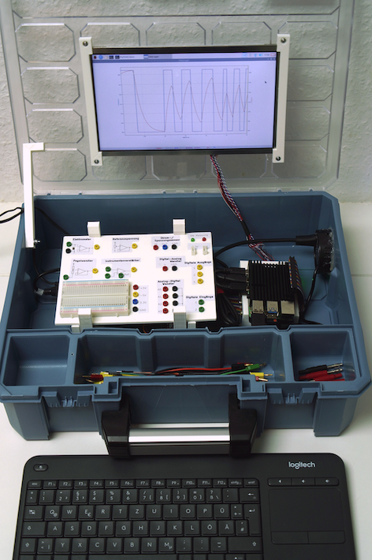  

<a name="wasbraucheichundwiebaueichdaszusammen"></a>  
## 2. Was brauche ich und wie baue ich das zusammen ?  
Die Software ist quelloffen und kann auf dieser Github-Seite heruntergeladen  
werden. Die ausführliche Installation wird [hier](#wiesetzeichdenraspberrypiauf)   beschrieben.

Für den Messkoffer werden die folgenden Bauteile benötigt:


<a name="bestellliste"></a>
### 2.1 Bestellliste


| Beschreibung  | Bestellnummer | Menge |Zulieferer|Einzelpreis in Euro|Gesamtpreis in Euro|
| ------------- |:-------------:|:-:|:--------:|-|-|
| **für die Steckplatte:** |  |  |  |  |  |
| Miniatur-Buchse, 2mm schwarz | MBI 1 SW | 9 | Reichelt | 0,79 | 7,11 |
| Miniatur-Buchse, 2mm rot | MBI 1 RT | 8 | Reichelt | 0,79 | 6,32 |
| Miniatur-Buchse, 2mm grün | MBI 1 GN | 8 | Reichelt | 0,79 | 6,32 |
| Miniatur-Buchse, 2mm gelb | MBI 1 GE | 9 | Reichelt | 0,79 | 7,11 |
| Miniatur-Buchse, 2mm blau | MBI 1 BL | 3 | Reichelt | 0,79 | 2,37 |
| Arduino - Grove Universal- Buchse, 4-Pin (10er Set) | GRV CONNEC4PIN | 1 | Reichelt | 1,25 | 1,25 |
| Standard LED Grün 5 mm | RND 135-00122 | 1 | Reichelt | 0,06 | 0,06 |
| Standard LED Rot 5 mm | RND 135-00126 | 1 | Reichelt | 0,06 | 0,06 |
| Breadboard 400 Löcher | RND 255-00005 | 1 | Reichelt | 1,90 | 1,90 |
| Buchsenleiste 2,54 mm, 1x20 | MPE 115-1-020 | 4 | Reichelt | 1,20 | 4,80 |
| Filament für 3D Drucker |  | 120g |  |  |  |
|  |  |  |  |  |  |
| **für die Platine:** |  |  |  |  |  |
| PCB Platine "PhyPiDAQ" | https://aisler.net/p/ABFAPVWM | 1 | Aisler | ca. 10 Euro| ca. 10 Euro |
| Operationsverstärker, 1-fach, DIP-8 | CA 3140 DIP | 1 | Reichelt | 0,99 | 0,99 |
| Instrumentationsverstärker, 1-fach, DIP-8 | AD 623 ANZ | 1 | Reichelt | 6,35 | 6,35 |
| Seven-Darlington-Arrays, DIP-16 | ULN 2003A | 1 | Reichelt | 0,30 | 0,30 |
| Operationsverstärker, 2-fach, DIP-8 | MCP 6042-I/P | 2 | Reichelt | 0,66 | 1,32 |
| DC-DC 5V Wandler | TMA 0505D | 1 | Reichelt | 5,50 | 5,50 |
| Analog/Digital Konverter ADS1115 | RPI ADC 4CH | 1 | Reichelt | 3,30 | 3,30 |
| Gleichrichterdiode| UF 4003 | 8 | Reichelt | 0,05 | 0,40 |
| Level Shifter | DEBO LEV SHIFTER | 1 | Reichelt | 4,15 | 4,15 |
| INA219 Strom-/ Spannungssensor | DEBO SENS POWER | 1 | Reichelt | 2,80 | 2,80 |
| Digital-Analog-Konverter | 802236543 - 62 | 1 | Conrad | 5,89 | 5,89 |
| Widerstand 10 kOhm, 1% | VI MBA 02040C1002 | 6 | Reichelt | 0,05 | 0,3 |
| Widerstand 1 kOhm, 0.1% | ARC MRA0207 1M B | 2 | Reichelt | 0,37 | 0,74 |
| Widerstand 47 Ohm, 1% | VI MBB 02070C4709 | 6 | Reichelt | 0,03 | 0,18 |
| Widerstand 100 Ohm, 1% | VI MBB 02070C1000 | 1 | Reichelt | 0,04 | 0,04 |
| Keramik-Kondensator 10 nF | KERKO 10N | 1 | Reichelt | 0,06 | 0,06 |
| Keramik-Kondensator 100 nF | KERKO 100N | 4 | Reichelt | 0,06 | 0,24 |
| Keramik-Kondensator 100 pF | KERKO 100P | 4 | Reichelt | 0,05 | 0,20 |
| Elektrolyt-Kondensator 47 μF | M-A 47U 100 | 4 | Reichelt | 0,21 | 0,84 |
| Elektrolyt-Kondensator 10 μF | KS-A 10U 16 | 4 | Reichelt | 0,11 | 0,44 |
| Punkt- Streifenrasterplatine | H25PS200 | 1 | Reichelt | 2,60 | 2,60 |
| IC Sockel 16 Pole | MPE 001-1-016-3 | 1 | Reichelt | 0,35 | 0,35 |
| IC-Sockel 14 Pole | MPE 001-1-014-3 | 1 | Reichelt | 0,29 | 0,29 |
| IC Sockeel 8 Pole | MPE 001-1-008-3 | 4 | Reichelt | 0,26 | 1,04 |
| Präzisionspotentiometer | 64Y-100K | 2 | Reichelt | 0,21 | 0,42 |
| Flachbandkabel | RPI T-COBBLER P | 1 | Reichelt | 3,60 | 3,60 |
|  |  |  |  |  |  |
| **für Gehäuse und Raspberry Pi:** |  |  |  |  |  |
| Raspberry Pi 4, 2 GB RAM | RASP PI 4 B 2GB RAM | 1 | Reichelt | 49,00 | 49,00 |
| Raspberry Pi Ladegerät | GOO 56746 | 1 | Reichelt | 8,50 | 8,50 |
| Display (optional) | RPI LCD 10.1HDMI | 1 | Reichelt | 102,10 | 102,10 |
| Netzteil Display | HNP 15-090L6 | 1 | Reichelt | 9,99 | 9,99 |
| Power supply | DEBO BREAD POWER | 1 | Reichelt | 4,50 | 4,50 |
| Speicherkarte 32GB | SDSQUAR 032GGN6MA | 1 | Reichelt | 7,95 | 7,95 |
| USB Hub | DESKHUB 60- SW | 1 | Reichelt | 6,00 | 6,00 |
| HDMI Kabel | RPI M-HDMI HDMI | 1 | Reichelt | 4,50 | 4,50 |
| Filament für 3D Drucker |  | 170 g |  |  |  |
| Tastatur mit Mauspad | LOGITECH K400PRO | 1 | Reichelt | 29,95 | 29,95 |
| USB A USB C Kabel | GOOBAY 55467 | 1 | Reichelt | 2,40 | 2,40 |
| Kühlgehäuse Raspberry Pi passiv | 2140237 - 62 | 1 | Conrad | 15,49 | 15,49 |
| Jumper Kabel | 096853 - 62 | 1 | Conrad | 2,79 | 2,79 |
| Isolierband |  | 1 Rolle |  |  |  |
| Schrauben M2.5 20 mm |  | 4 |  |  |  |
| Schrauben M3 12 mm |  | 7 |  |  |  |
| Unterlegscheiben für M3 Schrauben |  | 14 |  |  |  |
| Pfostenstecker, 40-polig, mit Verrieglung, gew. | PSL 40W | 1 | Reichelt | 0,49 | 0,49 |
| Universalkoffer | 8519544 | 1 | Hornbach | 17,95 | 17,95 |
|  |  |  |  |  |  |
| **Zubehör:** |  |  |  |  |  |
| Messleitung 15 cm rot, 2mm | 1385668-62 | 2 | Conrad | 2,49 | 4,98 |
| Messleitung 15 cm grün, 2mm | 1385671-62 | 2 | Conrad | 2,49 | 4,98 |
| Messleitung 15 cm blau, 2mm | 1385669-62 | 2 | Conrad | 2,49 | 4,98 |
| Messleitung 15 cm schwarz, 2mm | 1385667-62 | 2 | Conrad | 2,49 | 4,98 |
| Messleitung 15 cm gelb, 2mm | 1385670-62 | 2 | Conrad | 2,49 | 4,98 |
| Messleitung 30 cm rot, 2mm | 1385676-62 | 2 | Conrad | 2,49 | 4,98 |
| Messleitung 30 cm schwarz, 2mm | 1385675-62 | 2 | Conrad | 2,49 | 4,98 |
| Adapterstecker, 2 mm Stecker / 4 mm Buchse, rot | MZS2RT | 2 | Reichelt | 1,45 | 2,90 |
| Adapterstecker, 2 mm Stecker / 4 mm Buchse, schwarz | MZS2SW | 2 | Reichelt | 1,45 | 2,90 |
| Adapterstecker, 4 mm Stecker / 2 mm Buchse, rot | MZS4RT | 2 | Reichelt | 2,30 | 4,60 |
| Adapterstecker, 4 mm Stecker / 2 mm Buchse, schwarz | MZS4SW | 2 | Reichelt | 2,30 | 4,60 |
|  |  |  |  |  |  |
| **Sonstiges:** |  |  |  |  |  |
| Sekundenkleber |  |  |  |  |  |
| Schrumpfschläuche |  |  |  |  |  |
|  |  |  |  |  |  |
| **Gesamt:** |  |  |  |  |  |
| ohne Display |  |  |  |  | 284,52 |
| mit Display |  |  |  |  | 401,11 |


<a name="bauanleitung"></a>
### 2.2 Bauanleitung


<a name="platineloeten"></a>
#### 2.2.1 Platine löten

Zunächst werden die Buchsenleisten (Reichelt, MPE 115-1-020) auf die passenden\
Längen geknipst. Benötigt werden:\
 3 x 1 Pin\
 7 x 2 Pins\
 1 x 3 Pins\
 5 x 4 Pins\
 3 x 5 Pins\
 4 x 6 Pins\
 1 x 10 Pins\
Diese werden an den entsprechenden durch Quadrate gekennzeichnete Bohrungen auf\
der Platine verlötet.
Die weiteren Bauteile werden entsprechend der Beschriftung auf der Platine\
ebenfalls verlötet. Bei den Elkos ist auf die Polarität zu achten - die weiß\
markierte Seite entspricht dem Minus-Pol. Widerstände und Kerkos haben keine\
ausgezeichnete Polarität. Die Halterungen für die ICs werden so eingelötet,\
dass die halbrunde Aussparung mit der Beschriftung übereinstimmt. Daran kann\
erkannt werden, wie herum der IC später eingesteckt werden muss.

In der Abbildung links sind zwei Plätze für Widerstände und zwei für\
Kondensatoren zu sehen, welche frei bleiben. Diese sind dafür vorgesehen, dass\
bei Störungen auf dem I²C-Bus Pull-Up Widerstände und Kondensatoren nach Masse\
eingebaut werden können. Zuerst sollten diese Plätze aber frei bleiben.\

Zuletzt können die zu langen Füßchen auf der Rückseite abgeknipst werden. Die\
Bauteile werden auf die jeweilige Halterungen gesteckt. 

*Abb. 3*:  Löten, Schritt 1  
                    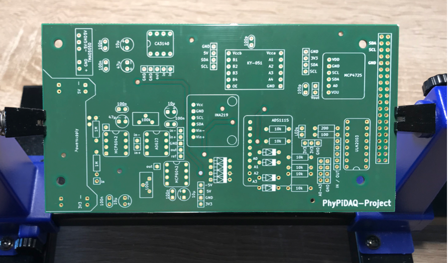  
*Abb. 4*:  Löten, Schritt 2: Die Buchsenleisten werden angebracht  
                    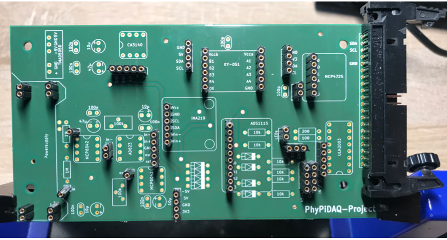  
*Abb. 5*:  Löten, Schritt 3: Die weiteren Bauteile werden angelötet. Die vier  
rot markierten Vorrichtungen werden freigelassen  
                    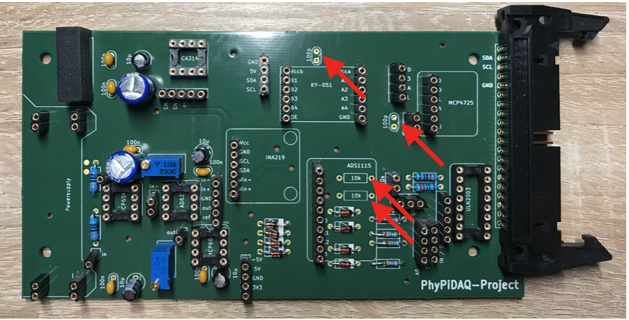  
*Abb. 6*:  Löten, Schritt 4: die fertige Platine  
                      


<a name="kofferbauen"></a>
#### 2.2.2 Koffer bauen

Hier wird beschrieben, wie die Hardware von PhyPiDAQ mit der Vorschaltplatine,\
einem optionalem Display und Funktastatur in einem Standard Organizer-Koffer\
befestigt werden kann, sodass alles geräumig, platzsparend und sicher\
untergebracht werden kann. 


Als Erstes werden die 3D-Modelle im Ordner Hardware/3D_Modelle gedruckt. Je\
nach Drucker kann es sich anbieten, die Modelle entsprechend zu rotieren und\
Stützstruktur zu verwenden. Mit PLA konnten gute Ergebnisse erzielt werden.\
Wenn die gedruckten Modelle vorliegen, kann mit dem Kofferbau begonnen werden.

Zunächst werden die 30cm langen Breadboard Steckverbindungen (C*, 096853-62)\
einmal in der Mitte durchgeschnitten, sodass 15cm lange Kabel vorliegen. Es\
werden insgesamt 46 kurze Kabel benötigt. Die angeschnittene Seite wird jeweils\
abisoliert und mit den 32 2mm-Buchsen (R*, MBI1SW und andere Farben) verlötet\
und abisoliert. Die Füßchen einer roten (R*, RND 135-00126) und einer grünen\
LED (R*, RND 135-00122) werden ebenfalls mit den Kabeln verlötet und isoliert,\
sowie die beiden Grove- Buchsen (R*, GRV CONNEC4PIN) und zwei Pin-Header\
(R*, RPI HEADER 40).
*Abb. 7*:  Kofferbau, Schritt 1: Steckverbindungen vorbereiten  
                      

Nun wird das gedruckte Steckbrett mit einem 5mm Holz-Bohrer an den vorgesehenen\
Stellen durchgebohrt. Die eckigen Ausschnitte für die Grove- Anschlüsse und die\
Pin-Header können beispielsweise mit einem Handstück durchgebohrt werden.

Die 2mm-Buchsen können nun entsprechend der Abbildung links eingeführt und\
verschraubt werden. Die LEDs, Grove-Buchsen und Pin-Header werden mit\
Sekundenkleber an den vorgesehenen Löchern fixiert. Das Breadboard kann mit dem\
rückseitig angebrachten Klebestreifen befestigt werden. Die Beschriftungen\
werden ausgedruckt und an die entsprechende Stelle geklebt.

*Abb. 8*:  Kofferbau, Schritt 2: gedruckte Steckplatte mit Kabeln ausstatten  
                      

*Abb. 9*:  Kofferbau, Schritt 3: Beschriftung an Steckplatte kleben  
                    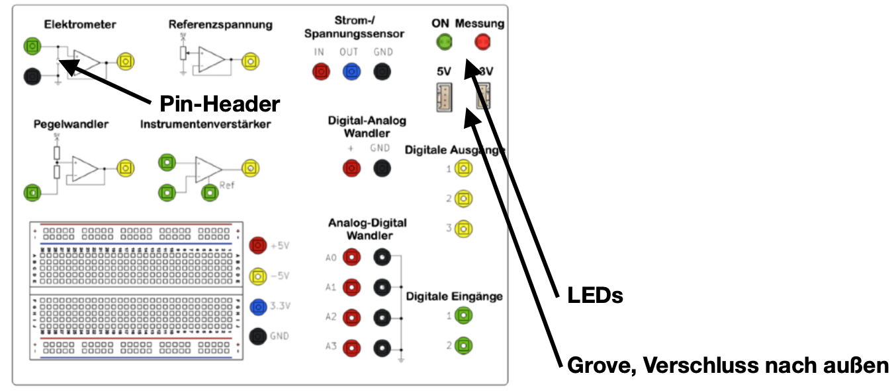  

Während der Sekundenkleber aushärtet kann der Koffer bearbeitet werden.  
Zunächst wird das Loch des gedruckten Haltestabs mit einem 3mm Bohrer\
durchgebohrt. Anschließend wird dieser an der linken Innenseite des Koffers so\
festgebohrt, dass der Deckel mit leichtem Druck von dem Stab gehalten und somit\
ungewolltes Zuklappen verhindert wird. Als Schraube kann eine M3x16mm und\
Sicherungsmutter verwendet werden.

*Abb. 10*:  Kofferbau, Schritt 4: Haltestab anschrauben  
                    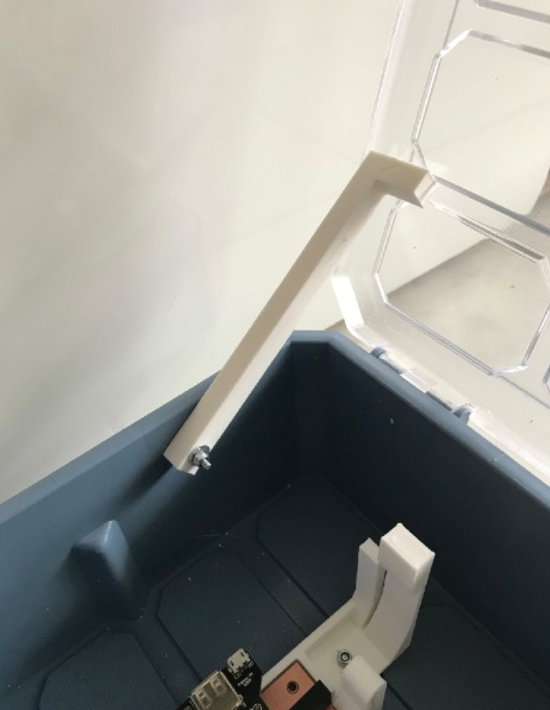  

Nun werden die Halterungen für die Platine und das Steckbrett am Boden  
angeschraubt. Die Platine wird hierzu eingespannt, sodass der Abstand der  
Halterungen zueinander korrekt ist. Der Abstand der Halterungen hinten und  
vorne im Koffer sollte 3,2 cm betragen und 6,5 cm nach links. Als Schrauben  
eignen sich M3x12mm, welche mit dem Kopf nach unten verschraubt werden, um die  
Unterlage später nicht zu verkratzen.

*Abb. 11*:  Kofferbau, Schritt 5: Platine anschrauben  
                    


Die Bohrung für den USB-Hub (R*, DESKHUB 60- SW) wird mit einem 60 mm  
Bohrkranz an der rechten Seite des Koffers hinten gesetzt. Mit Heiß- oder  
Sekundenkleber kann der USB-Hub nun in die Fassung geklebt werden.
 

*Abb. 12*:  Kofferbau, Schritt 6: Loch für USB-Hub bohren  
                    

Weiter wird nun das mit dem Kabel verbundene Display im gedruckten Rahmen  
eingespannt und mit M3x10mm Schrauben am Deckel befestigt. Die Muttern zeigen  
zur Kofferinnenseite. Der Abstand des Displays nach unten beträgt maximal  
5 cm, sodass die Kabel noch zum Controller reichen.  
Der Display-Controller wird mit den Kabeln versehen und die Bedieneinheit an  
der gedruckten Halterung mit M3x10mm Schrauben festgeschraubt. Der Controller  
kann nun eingeklickt werden. Die Halterung kann anschließend am Koffer  
entsprechend der Abbildung mit M3x12mm Schrauben befestigt werden. Der Abstand  
nach rechts sollte mindestens 6 cm betragen, sodass die Anschlüsse noch  
zugänglich sind. Bei einem Kabel ist der Platz am Controller nicht eindeutig.  
Hier hilft die Farb-Codierung der Kabel: die roten Kabel stehen (meist) für  
positive Spannungen. Mit der Beschriftung des Controllers kann somit der  
richtige Platz gefunden werden.
 

*Abb. 13*:  Kofferbau, Schritt 7: Display Controller verkabeln  
                    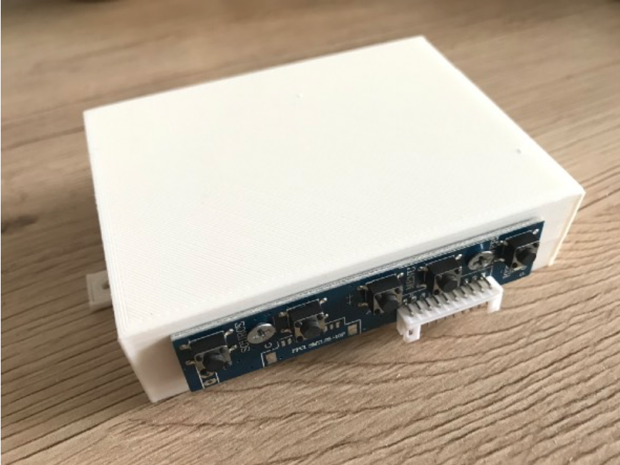  
*Abb. 14*:  Kofferbau, Schritt 8: Display Controller anschrauben  
                    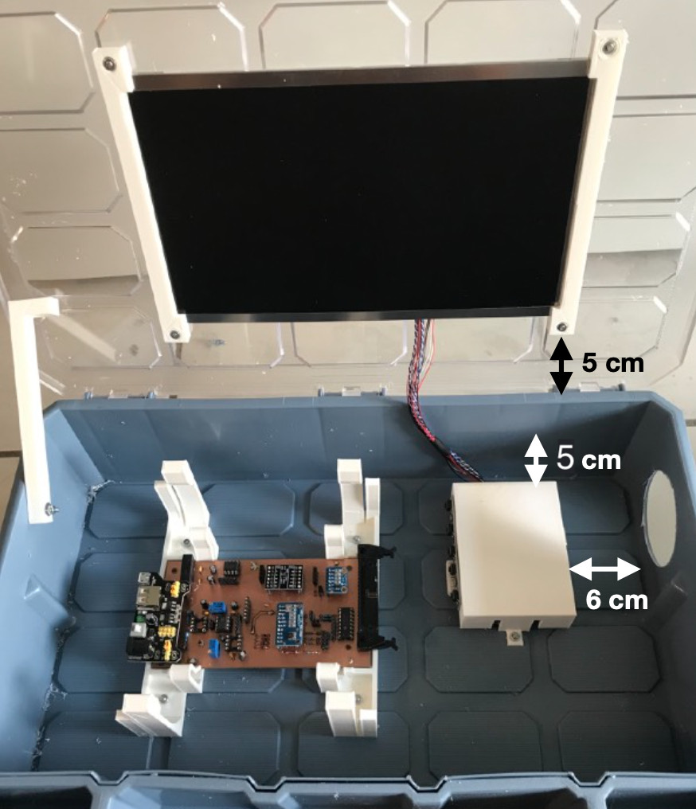  

Wenn der Sekundenkleber getrocknet ist kann die Steckplatte mit der Platine  
verbunden werden. Die Verbindungen sind nachfolgend dargestellt:
 

*Abb. 15*:  Kofferbau, Schritt 9: Steckplatte mit Platine verkabeln  
                    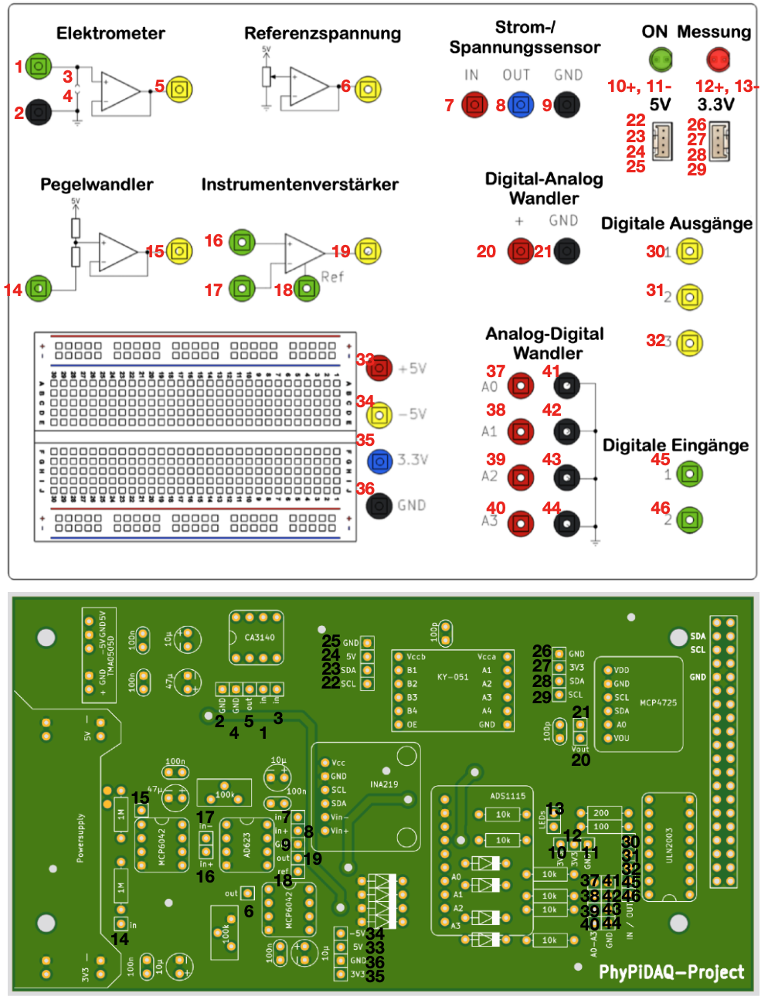  

Nun kann der Raspberry Pi montiert werden. Dazu wird zunächst der Pi auf das  
Display-Controller Gehäuse an die richtigen Stelle gehalten, um die Bohrlöcher  
darauf zu setzen. Anschließend wird das Kühlgehäuse (C*, 2140237 - 62) auf dem  
Pi befestigt. Hierzu werden die drei Wärmeleitplättchen an den entsprechenden  
Stellen angebracht, wobei die Folien der Ober- und Unterseite jeweils zu  
entfernen sind. Mit den Schrauben M2.5x25mm wird der Kühlkörper an der  
Display-Controller Halterung festgeschraubt. Die Halterung mit dem Pi kann nun  
am Koffer mit M3x12mm Schrauben angebracht werden.  


*Abb. 16*:  Kofferbau, Schritt 10: Raspberry Pi Kühlkörper anbringen  
                    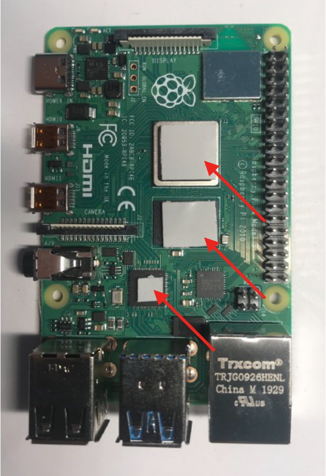  
*Abb. 17*:  Kofferbau, Schritt 10: Raspberry Pi auf Display-Controller verschrauben  
                      
*Abb. 18*:  Kofferbau, Schritt 10: Display-Controller Gehäuse am Koffer befestigen  
                    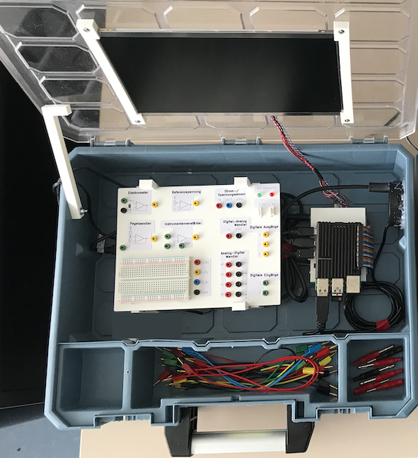  

Zuletzt wird der Raspberry Pi über die Verlängerungs-Pins (R*, RPI HEADER 40)  
mit dem 40-Pin-Kabel (C*, RPI T- COBBLER P) an der Platine befestigt. Die  
Netzteile für Platine und Display werden ebenfalls angeschlossen. Der USB-Hub  
wird mit dem Raspberry Pi verbunden. Das Dongle der Funk-Tastatur  
(R*, LOGITECH K400PRO) wird in den USB Port des Pi gesteckt. Der HDMI-Port des  
Raspberry Pi wird mit dem entsprechenden Adapter (R*, RPI M-HDMI HDMI) mit dem  
Display Controller verbunden. Der HDMI Adapter (R*, DELOCK 65391) wird in den  
anderen Port des Raspberry Pi eingesteckt und kann in dem USB-Hub mit Kleber  
fixiert werden, sodass ein weiteres externes Display angeschlossen werden  
kann. Der Power- Port des Raspberry Pi wird mit dem Adapter (R*, GOOBAY 55467)  
mit der Spannungsversorgung der Platine (R*, DEBO BREAD POWER) verbunden. Die  
Tastatur kann beim Zuklappen des Deckels auf der Steckplatte verstaut werden.  
Die Kabel und Adapter werden in den drei Fächern einsortiert.  


*Abb. 19*:  Koffer, alle Teile mit Display und Tastatur finden in dem Koffer Platz  
                    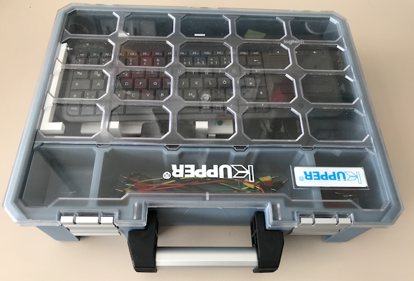  


<a name="wiesetzeichdenraspberrypiaufundinstalliereichphypidaq"></a>
## 3. Wie setze ich den Raspberry Pi auf und installiere PhyPiDAQ ?

Falls sich bereits ein Betriebssystem auf dem Raspberry Pi befindet, können  
Sie direkt mit [3.2](#wieinstalliereichphypidaq) fortfahren. Falls nicht, wird dieses nun aufgesetzt.  

<a name="wiesetzeichdenraspberrypiauf"></a>
### 3.1 Wie setze ich den Raspberry Pi auf ?

Laden Sie auf einem beliebigen Rechner mit SD Karten-Slot zunächst *Raspberry Pi  
Imager* von der offiziellen Seite https://www.raspberrypi.org/downloads/ herunter.  

Installieren Sie den *Raspberry Pi Imager*, indem Sie die heruntergeladene Datei  
doppelklicken.  

*Abb. 20*:  Installation von Raspberry Pi Imager, Doppelklick auf die "Himbeere"  
                    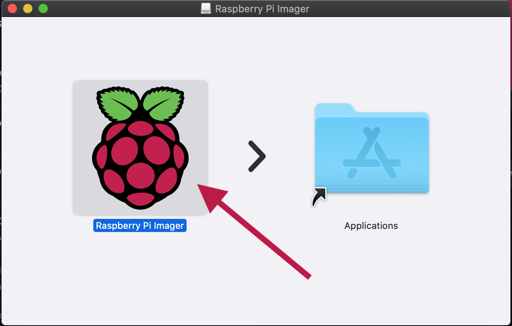  

Es öffnet sich ein neues Fenster, in welchen Sie das zu installierende Betriebssystem  
auswählen können, sowie die SD-Karte. Wählen Sie bei *Operating System*  
*"Raspberry Pi OS (other)"* und dann *"Raspberry Pi OS Full"* aus.  

*Abb. 21*:  Auswahl des Betriebssystems  
                      

*Abb. 22*:  Auswahl des Betriebssystems  
                      

Stecken Sie nun die SD-Karte in den Slot des Rechners. Vergessern Sie sich  
hierbei, dass sich die SD-Karte im beschreibbaren Modus befindet, indem Sie den  
kleinen Schieber am linken Rand des SD-Karten-Adapters nach oben schieben.

*Abb. 23*:  SD-Karte beschreibbar machen, Schieber in obere Stellung bringen  
                    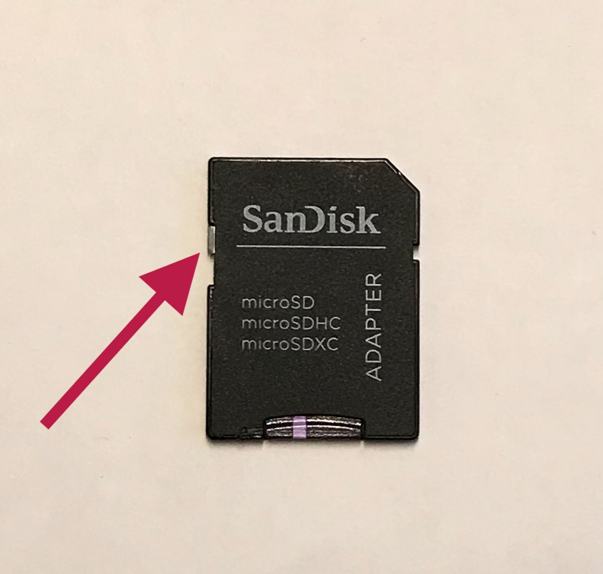  

Im *Raspberry Pi Imager* können Sie nun bei *"SD Card"* per Klick Ihre SD-Karte  
auswählen.  

*Abb. 24*:  Auswahl der SD-Karte  
                    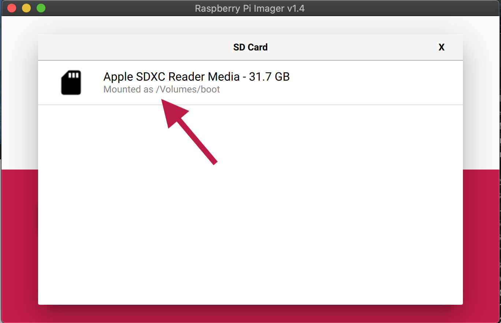  
                    
Mit einem Klick auf *"Write"* und anschließendem bestätigen können Sie schließlich  
die SD-Karte bespielen, ggf. wird hierzu einmal nach dem Passwort gefragt.  
Dieser Vorgang kann nun einige Minuten in Anspruch nehmen.  

*Abb. 25*:  Beschreiben der SD-Karte  
                    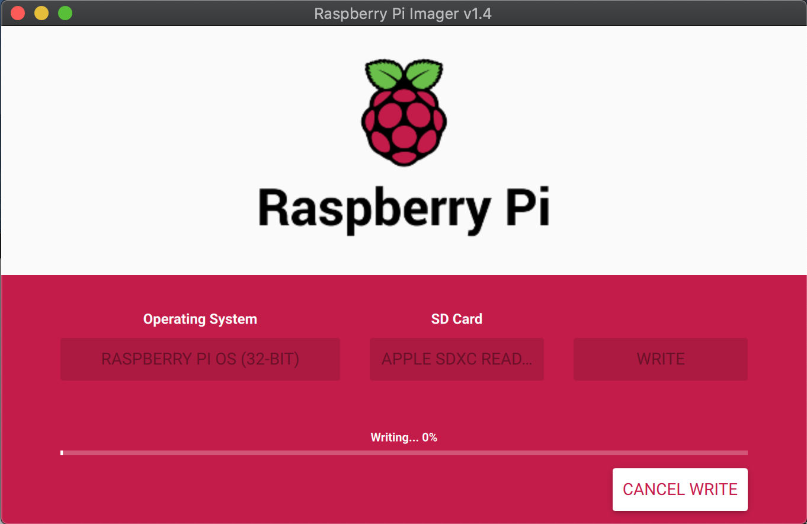  
                    
Wenn der Vorgang abgeschlossen ist befindet sich das Betriebssystem für den  
Raspberry Pi auf der SD-Karte und diese kann in den Raspberry Pi eingesteckt  
werden. Falls Sie sich nicht für die Koffervariante mit Display entschieden  
haben, verbinden Sie nun einen externen Monitor, und stellen Sie sicher, dass  
eine Maus und Tastatur angeschlossen ist. Verbinden Sie weiter ein  
Ethernet-Kabel, falls Sie keine Wlan-Verbindung verfügbar haben. Anschließend  
können Sie den Raspberry Pi mit dem Netzteil verbinden, er startet automatisch.  
Es werden nun verschiedene Pakete automatisch installiert, was ebenfalls  
mehrere Minuten dauern kann. Ist das erfolgreich geschenen, so öffnet sich ein  
Fenster, in welchem Sie grundlegende Systemeinstellungen wie Zeitzone, Land,  
Tastaturlayout und Ihr Wlan-Netz einstellen, sofern das gewünscht ist. Das  
Aufsetzen des Pi ist damit abgeschlossen und wir können mit dem Installieren  
von *PhyPiDAQ* fortfahren.

<a name="wieinstalliereichphypidaq"></a>
### 3.2 Installation von PhyPiDAQ auf dem Raspberry Pi

**Beziehen des PhyPiDAQ Codes und einfache Installation**

Bitte beachten Sie , dass Ihr Raspberry Pi für die folgenden Schritte mit dem  
Internet verbunden sein muss. Öffnen Sie das Terminal, welches Sie in der  
Systemleiste oben links finden.

*Abb. 26*:  Terminal öffnen  
                      
                    

Installieren Sie zunächst *git*, mit welchem sich alle Dateien des Pakets  
*PhyPiDAQ* herunterladen lassen. Geben Sie hierzu folgendes in das  
Terminalfenster ein:
```bash
sudo apt-get install git
```

*Abb. 27*:  Befehl im Terminal eingeben  
                      
                    
Zur Installation von *PhyPiDAQ* geben Sie folgende Befehle ein. Kopieren Sie  
grundsätzlich Zeile für Zeile dieses Cods in das Terminal und bestätigen Sie jeden  
Befehl mit der Enter-Taste. Fügen Sie **NICHT** alle Zeilen auf einmal ein.

```bash
mkdir ~/git
cd ~/git
git clone https://github.com/GuenterQuast/PhyPiDAQ
cd ~/git/PhyPiDAQ
./installlibs.sh
cp ~/git/PhyPiDAQ/phypi.desktop ~/Desktop/
```
Damit ist die Installation schon abgeschlossen und *PhyPiDAQ* ist bereit für  
den ersten Einsatz. 
Falls Sie später die installierte Version aktualisieren wollen geben Sie  
folgendes in das Terminal ein (nicht notwendig bei Erstinstallation, da bereits  
die aktuelle Version heruntergeladen ist):
```bash
cd ~/git/PhyPiDAQ
git pull
./installlibs.sh
```

<a name="wiebedieneichdiephypidaqsoftware"></a>
## 4. Wie bediene ich die PhyPiDAQ Software ?
<a name="startenundstartoberflaeche"></a>
## 4.1 Starten und Startoberfälche

Zum Starten der Anwendung *PhyPiDAQ*, doppelklicken Sie auf dem Desktop auf das Icon  
**PhyPi**.  

*Abb. 28*:  PhyPiDAQ öffnen  
                      
                    
Sie werden gefragt, wie Sie es öffnen möchten, wählen Sie hier "*Ausführen*" aus.  
Es öffnen sich nun zwei Fenster: ein schwarzes Terminal Fenster, welches aktuelle  
Statusmeldungen und Log-Dateien anzeigt. Für die einfache Bedienung können Sie  
dieses Fenster ignorieren. Wichtig wird es erst, wenn Fehler angezeigt werden.  
In diesem Fall zeigt das Terminal-Fenster den Fehlercode und Hinweise, welche  
auf das Problem hinzeigen und das Problem dadurch in der Regel schnell behoben  
werden kann.  
Das wichtigere Fenster ist die Bedienoberfläche von *PhyPiDAQ*.  


*Abb. 29*:  Bedienoberfläche *PhyPiDAQ*  
                    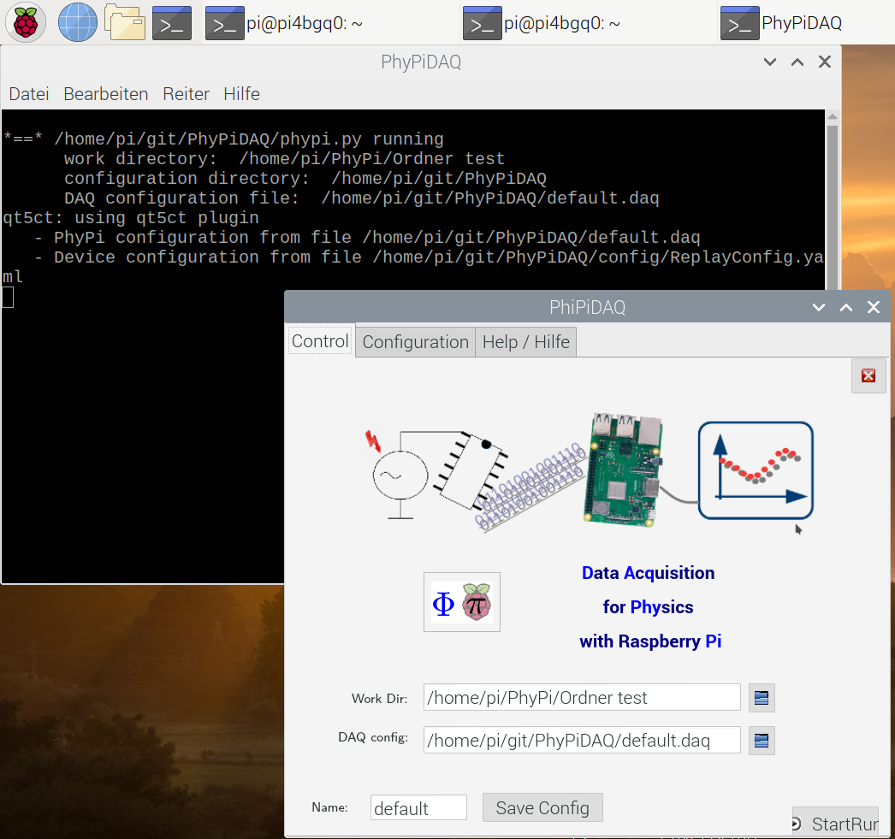  
   
Im Reiter "*Control"*, in welchem Sie sich nach dem Öffnen befinden, ist der  
Startreiter. Von hier aus kann eine Messung gestartet werden, indem der Button  
rechts unten "*StartRun*" geklickt wird, was aber erst später probiert werden  
soll. Weiter lässt sich in diesem Reiter das sogenannte Arbeitsverzeichnis   
auswählen. Hier können Sie bestimmen, wo der konfigurierte Versuch  
abgespeichert werden soll. Eine übersichtliche Ordnerstruktur ist essentiell,  
wenn *PhyPiDAQ* in mehrerern Schulklassen verwendet wird. Es wird daher sehr  
empfohlen, eine Struktur wie die Folgende zu verwenden:  

*Abb. 30*:  Ordnerstruktur  
                      
                    
Sie können neue Ordner im Dateimanager erstellen (ähnlich wie Windows  
"Arbeitsplatz" oder Mac "Finder"), indem Sie mit der rechten Maustaste im  
Fenster auf *"Neu"*->*"Ordner"* klicken.  
   
*Abb. 31*:  neuen Ordner erstellen  
                      
                    
Eine andere Möglichkeit ist die Eingabe des folgenden Befehls im Terminal,  
welcher den Unterordner *"Klasse_12"* im Ordner *"Schule"* erstellt.  

```bash
mkdir /home/pi/PhyPi/Schule/Klasse_12
```  
Sie wählen also in der Bedienoberfläche von PhyPiDAQ in Feld *"Work Dir:"* aus,  
in welchem Ordner Sie das aktuelle Projekt speichern möchten.  
Darunter, in *"DAQ config*" können Sie bereits gespeicherte Projekte öffnen.  
Das ist besonders dann sinnvoll, wenn Sie bereits einen Versuch im Vorraus  
getestet haben und im Unterricht vorführen möchten. Es wird dann das gespeicherte  
Projekt genauso wieder geöffnet und Sie können den Versuch sofort starten.  
Darunter, im Feld *"Name"* können Sie den Namen des Versuchs eingeben. Dieser  
wird im Dateiname erscheinen. Wenn Sie auf *"Save Config"* klicken, speichern  
Sie die Konfigurationsdatei ab. Die Datei wird dann "default.daq" heißen, falls  
Sie bei *Name:* "default" hingeschrieben haben. Bei jedem Starten durch "StartRun"  
wird eine zusätzliche Datei erzeugt mit Name, Uhrzeit und Datum, welche in dem  
Verzeichnis abgespeichert wird, welches Sie bei "Work Dir" angegeben haben, z.B.  
Schule / Klasse_12 / Photoeffekt.

**Aufgabe:** Erstellen Sie nun eine wie in Abb. 30 gezeigte Ordnerstruktur,  
mit Ihren Schulklassen. Erstellen Sie in eine dieser Klassen einen Ordner mit dem  
Namen *"Testversuch"*. Anschließend wechseln Sie zur Bedienoberfläche von  
*PhyPiDAQ* und wählen in *Work Dir* den eben erstellten *Testversuch* aus.  
Vergeben Sie nun den Name "Standardversuch" und speichern Sie das Projekt ab.  
Verifizieren Sie anschließend im Dateimanager, dass sich das erstellte Projekt  
dort befindet.  


<a name="konfigurationsdatei"></a>
## 4.2 Konfigurationsdatei

Wir wollen uns nun mit dem zweiten Reiter, *"Configuration"*, vertraut machen.  
Klicken Sie auf den Reiter *"Configuration"*.  

*Abb. 32*:  Konfiguration
                      
Es ist nun ein Fenster zu sehen, in welchem sämtliche Parameter für den Versuch  
eingestellt werden können, wie beispielsweise:
- welchen Sensor verwende ich (DeviceFile)?
- welche maximalen Werte sollen im Diagramm angezeigt werden (ChanLimits)?
- sollen die Werte des Sensors direkt umrechnet werden (ChanFormula)?
- welche Achsenbeschriftung soll angezeigt werden (ChanLabels)?
- welche Formeln sollen angezeigt werden (ChanUnits)?
- wie oft soll abgetastet werden (Interval)?  

und viele weitere...  
Lassen Sie sich hier nicht abschrecken ! Diese Parameter stellen Möglichkeiten  
dar, wie ein Versuch erweitert oder perfektioniert werden kann. Es sind  
keinesfalls alle Parameter erforderlich - in der Regel reichen hierbei ungefähr  
3-5 Zeilen aus. In der *"default"*-Config, welche in Abb. 32 zu sehen ist, sind  
lediglich alle Einstellmöglichkeiten aufgezeigt und durch ein "#" am Anfang  
der jeweiligen Zeile auskommentiert.  

Wenn Sie Änderungen an der dieser Konfiguration vornehmen möchten, so müssen Sie  
zunächst oben rechts den *"Edit Mode"* aktivieren, indem Sie einmal daruf klicken.  
Dass Sie nun in der Datei schreiben können, wird durch das Feld davor angezeigt.  
Sie können nun direkt in der Oberfläche schreiben und auch hilfreiche  
Tastenkombinationen wie 
- *Str+C* für das Kopieren von ausgewählten Zeichen 
- *Str+V* für das Einfügen der eben kopierten Zeichen 
- *Str+Z* für Rückgängig machen
- *Str+Shift+Z* für erneutes Rückgängig machen  

benutzen. 

Beginnen Sie immer damit, dass Sie der Oberfälche mitteilen, welchen Sensor  
Sie auslesen möchten, indem Sie bei der entsprechenden Zeile am Anfang das "#"  
entfernen.  

Wir wollen nun demonstrativ den Analog-Digital-Wandler ADS1115 auslesen und  
ändern daher die Zeile
```bash
#DeviceFile: config/ADS1115Config.yaml   # 16 bit ADC, I2C bus
```  
in
```bash
DeviceFile: config/ADS1115Config.yaml   # 16 bit ADC, I2C bus
```  
um. Alle weiteren Einstellungen hier können Sie unverändert lassen, da bereits  
automatisch für diesen Sensor passende Parameter gewählt werden. Für den  
Sensor müssen aber ggf. noch änderungen vorgenommen werden, da dieser  
beispielsweise vier Eingänge besitzt, aber ja nach Projekt nicht alle ausgelesen  
werden müssen. Klicken Sie hierzu nun auf *"reload device config"*, was Sie  
unten rechts finden. Es folgt eine Bestätigung, dass *PhyPiDAQ* nun den  
ausgewählten Sensor übernommen hat. 

<a name="sensorkonfiguration"></a>
## 4.2 Sensor-Konfiguration "Device-Config"


Klicken Sie nun oben auf den Reiter  
*"Device Config"*. Es sind nun die Parameter des Sensors zu sehen.  

*Abb. 33*:  Konfiguration des Sensors
                      
                    
Hier ist die Syntax wieder die gleiche, das bedeutet:  
- Zeilen, die mit "#" beginnen, sind auskommentiert und haben keine Funktion  
auf das Programm  
- um Änderungen vorzunehmen müssen Sie in den "Edit-Mode" gehen, indem Sie oben  
rechts das Feld "Edit-Mode" anklicken.  

Sie haben nun die Wahl, welche Kanäle Sie auslesen möchten, was in "ADCChannels"  
bestimmt wird. Möchten Sie nur den Kanal 1 auslesen, so lautet die Zeile  
```bash
ADCChannels: [0]
```  
da bei null mit Zählen begonnen wird. Möchten Sie nur den Kanal 2 auslesen, so  
lautet die Zeile  
```bash
ADCChannels: [1]
```  
Sie können mehrere Eingänge gleichzeitig auslesen, indem Sie die einzelnen Kanäle  
durch Kommata trennen:
```bash
ADCChannels: [0, 1, 2, 3]
``` 
Die anderen Parameter darunter können bei Bedarf genutzt werden, um zum Beispiel  
einen Eingang von einem anderen zu subtrahieren. Folgen Sie hierzu den Hinweisen  
in den entsprechenden Zeilen. Zu beachten ist, dass Sie, wenn Sie mehrere Kanäle  
auslesen wollen, auch die Parameter unten auf die jeweilige Anzahl an Kanälen  
angleichen müssen. Folgendes ist also nicht möglich und wird zu einer  
Fehlermeldung führen:
```bash
# example of a configuration file for ADC ADS1115

DAQModule: ADS1115Config  

ADCChannels: [0, 1, 2, 3]         # active ADC-Channels
DifModeChan: [false]   # enable differential mode for Channels
Gain: [2/3]                # programmable gain of ADC-Channel
sampleRate: 860             # programmable Sample Rate of ADS1115
```  
Korrekt ist:
```bash
# example of a configuration file for ADC ADS1115

DAQModule: ADS1115Config  

ADCChannels: [0, 1, 2, 3]         # active ADC-Channels
DifModeChan: [false, false, false, false]   # enable differential mode for Channels
Gain: [2/3, 2/3, 2/3, 2/3]                # programmable gain of ADC-Channel
sampleRate: 860             # programmable Sample Rate of ADS1115
```  

Wir haben nun also den Sensor *ADS1115* mit vier Kanälen ausgewählt. Sie können  
nun einen Namen unten vergeben und die Konfiguration abspeichern.  

Verbinden Sie nun den Analog-Digital-Wandler mit dem Raspberry Pi - es werden  
vier Leitungen benötigt: GND und +5V für die Spannungsversorgung und SCL und SDA  
für die *i2C*-Verbindung, überwelche der Sensor Daten an den Pi übermittelt.  

<a name="messungstarten"></a>
## 4.3 Messung starten


Anschließend können Sie den Button *"StartRun"* klicken. Es öffnet sich ein  
Fenster mit dem Diagramm und Sie können unten links mit einem Klick auf *"Run"*  
die Messung starten. Herzlichen Glückwunsch, Sie haben Ihre erste Messung mit  
*PhyPiDAQ* getätigt !  

*Abb. 34*:  Auslesen von vier Kanälen mit einem Analog-Digital-Wandler  
                      
            
Es gibt nun zahlreiche Möglichkeiten, wie Sie *PhyPiDAQ* einsetzten können.  
Wichtig ist hier zum Einen die Möglichkeit, aufgenommene Daten zu speichern, was  
mit *"SaveData"* geschieht. Die Werte werden in dem im Arbeitsverzeichnis  
(*"WorkDir"*) ausgewählten Ordner in dem zur Messung gehörenden Ordner gespeichert.  
Standardmäßig werden nur die ersten 12 Sekunden abgespeichert, was genau das  
Intervall ist, welches im Display zu sehen ist. In der Konfiguration kann dies  
natürlich angepasst und verlängert werden, falls gewünscht. Das Datenformat ist  
standardmäßig *".csv"*, was auch angepasst werden kann. 


<a name="wiefuehreichdamitversuchedurch"></a>
## 5. Wie führe ich damit Versuche durch ?
Wir sind nun soweit, dass wir eine Vielzahl unterschiedlicher Sensoren auslesen,  
live im Monitor grafisch plotten und die Werte exportieren können. Das eröffnet  
und unzählige Möglichkeiten, *PhyPiDAQ* im Unterricht einzusetzen. Es werden nun  
drei Beispielversuche beschreiben, damit Sie einmal sehen, wie der gesamte  
Workflow von Anfang bis Schluss aussehen kann.  


<a name="elektrostatik"></a>
### 5.1 Elektrostatik

Im folgenden Versuch soll der Effekt Influenz dargestellt werden. Des Weiteren  
lässt sich derselbe Aufbau ebenfalls zur Demonstration eines Ladungslöffels  
verwenden.  
An das Elektrometer wird eine offene, runde Kondensatorplatte mit einem  
Durchmesser von d ≈ 5 cm angeschlossen. Die Masse des Messkoffers wird auf  
das Erdpotential gezogen. Zwischen der Kondensatorplatte und der Erde wird ein  
Kondensator mit der Kapazität von 1 nF angeschlossen. Der Ausgang des  
Elektrometers wird mit dem Pegelwandler verbunden und dieser wiederum mit dem  
ADC. Somit können sowohl positive, als auch negative Spannungen ausgelesen  
werden.  
**elektrostatik.daq:**
*Abb. 34*:  Aufbau Elektrostatik-Versuch  
                    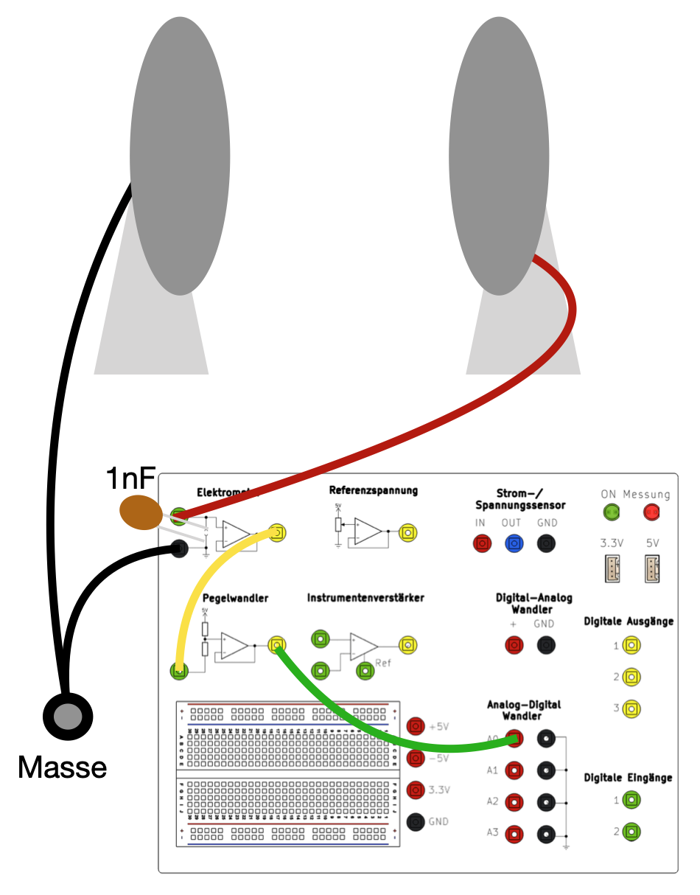  
             
Wir befassen uns nun mit der Konfigurationsdatei.  
Aus Gründen der Übersichtlichkeit sind nun überflüssige Kommentare und auskommentierte  
Zeilen ggf. weggelassen.  
```bash
DeviceFile: config/myADS1115Config.yaml   # 16 bit ADC, I2C bus 
ChanLabels: ['Uc']            # names for channels 
ChanUnits: ['V']         # units for channels 
ChanColors: [darkblue]      # channel colours in display
ChanFormula:
  - 2*c0-5  # chan0
Interval: 0.1                 # logging interval         
DisplayModule: DataGraphs     # text, bar-graph, history and xy-view
Title: "Data from File"       # display title
```
** myADS1115Config.yaml:** 
```bash  
# example of a configuration file for ADC ADS1115

DAQModule: ADS1115Config  

ADCChannels: [0]         # active ADC-Channels
DifModeChan: [false]   # enable differential mode for Channels
Gain: [1]                # programmable gain of ADC-Channel
sampleRate: 860             # programmable Sample Rate of ADS1115  
```
Den *Gain* in der vorletzten Zeile müssen Sie ggf. anpassen - jenachdem,  
ob das angezeigte Signal zu klein oder zu groß ist.  
Softwareseitig wird die Funktion des Pegelwandlers folgendermaßen kompensiert:  
U<sub>Kondensator</sub> = 2 · U<sub>gemessen</sub> − 5 V, was bei  
*ChanFormula* bereits berücksichtigt ist. Bevor die Messung beginnt,  
wird die Kondensatorplatte mit Hilfe eines Leiters mit dem Erdpotential  
verbunden, sodass diese ungeladen ist. Wird nun ein geladener Körper der  
Kondensatorplatte angenähert, so bewirkt das elektrische Feld des geladenen  
Körpers eine Kraft auf die freien Elektronen der Kondensatorplatte, welche  
daraufhin - je nach Ladung des Körpers - zu diesem hin beziehungsweise von  
diesem weg beschleunigt werden (Influenz). Dieser Prozess wird dadurch  
beschränkt, dass durch die Ladungsverschiebung ein elektrisches Feld aufgebaut  
wird, welches der beschleunigenden Kraft entgegenwirkt. Die Ladungstrennung  
kann als elektrische Spannung gemessen werden, welche zwischen Erde und der  
Kondensatorplatte anliegt, also gerade auf der Eingangsseite des Elektrometers.  
Es ist anzumerken, dass für diesen Versuch zwingend ein Elektrometer mit einem  
sehr großen Innenwiderstand erforderlich ist, da sonst der größere Stromfluss  
zwischen dem Eingang des Elektrometers und der Erde zu einem Ladungsausgleich  
an der Kondensatorplatte führt und der Effekt somit nicht sichtbar ist. Mit  
einem herkömmlichen Multimeter ist der Effekt nicht sichtbar. Als Körper wird  
ein Kunststoffstab verwendet, welcher an einem Wollpullover gerieben wurde,  
sodass dieser sich aufgeladen hat. Anschließend wird er der Kondensatorplatte  
angenähert, wobei der Abstand mehrmals variiert wird. Die aufgenommene Kurve  
in Abbildung unten zeigt den zeitlichen Verlauf der Spannung am Kondensator an.  
Die Veränderung der Spannung mit dem Abstand des Stabs ist gut zu erkennen.  
Anhand des Vorzeichens der Spannung ist weiter zu erkennen, dass der Stab  
positiv geladen ist. 

*Abb. 35*:  **Influenz** Zeitlicher Verlauf der Spannung am Kondensator bei  
mehrmaliger Veränderung des Abstandes zum geladenen Stab.  
                      
             


Nun folgt die Demonstration des Ladungslöffels. Hierzu wird eine Metallkugel  
an einem Wollpullover gerieben und anschließend die entladene Kondensatorplatte  
damit berührt. In der Abbildung ist der Verlauf der Spannung zu sehen. Der Anstieg  
der Kondensatorspannung bei Berührung mit der Kugel lässt auf die Ladung  
schließen. Mit ∆Q = C · ∆U, einer bekannten Kapazität von 1 nF und der  
Spannungsdifferenz von −2,7 V beträgt die übertragene Ladung −2,7 nC.

*Abb. 36*:  **Ladungslöffel** Zeitlicher Verlauf der Spannung am Kondensator  
bei Annäherung und Berührung mit einer geladenen Kugel. Bei ca. 66 s wird  
der Kondensator geerdet, sodass die Spannung 0 V beträgt. Bei Annäherung der  
geladenen Kugel steigt der Betrag der Spannung am Kondensator durch Influenz  
an. Bei Berührung der Kugel an der Kondensatorplatte (t ≈ 67,9 s) erreicht  
die Spannung einen konstanten Wert.  
                    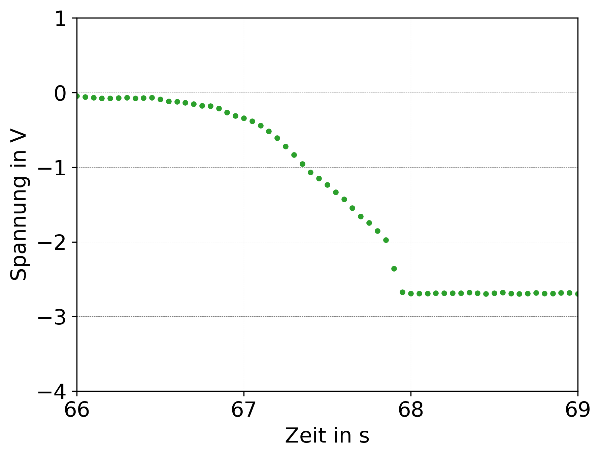  
             

<a name="kraftsensor"></a>
### 5.2 Kraftsensor
*Diese Anleitung ist noch nicht ganz fertig, es ist daher nur das Diagramm sichtbar.  
Die genaue Anleitung wird bis zum 15.12.20 hochgeladen.*  

*Abb. 37*:  Die Spannung der Wägezelle steigt mit zunehmender Kraft an.  
Die Offset-Spannung, welche ohne ein angehängtes Massestück anliegt, wird von den  
restlichen Spannungswerten abgezogen. Die gemessenen Werte sind mit einer  
Ursprungsgeraden kompatibel.  
                      
             

 
<a name="photoeffekt"></a>
### 5.3 Photoeffekt
*Diese Anleitung ist noch nicht ganz fertig, es ist daher nur das Diagramm sichtbar.  
Die genaue Anleitung wird bis zum 15.12.20 hochgeladen.*  

*Abb. 38*:  **Photoeffekt** Aufladung eines Kondensators an einer Vakuum-  
Photozelle für verschiedene Wellenlängen des einfallenden Lichts
                    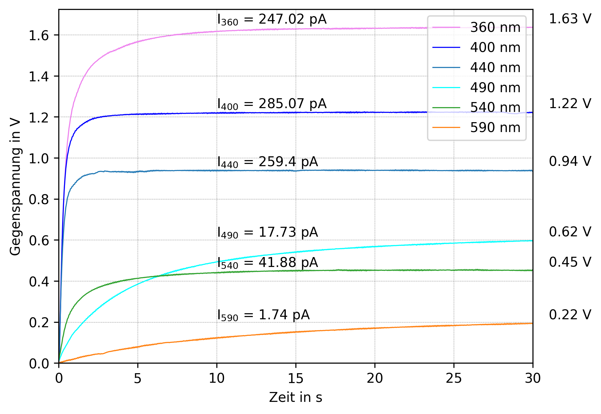  
             
*Abb. 39*:  **Photoeffekt**  Gegenspannung gegen Frequenz des Lichts  
aufgetragen mit linearer Regression. Die Steigung entspricht dem Verhältnis h/e.
                    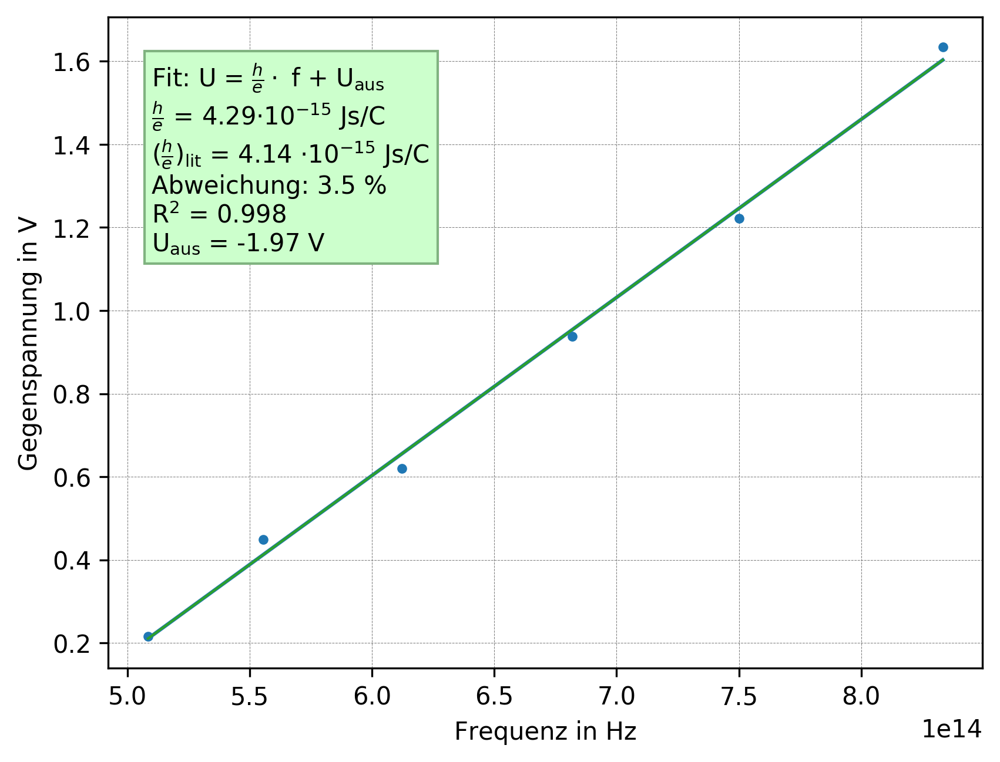  
