# PhyPiDAQ documentation (for teachers)

In this manual, the entire PhyPiDAQ workflow, starting from the  
Installation up to the evaluation of experiments is described.  

- [What is PhyPiDAQ?](#wasistphypidaq)
- [What do I need and how do I assemble it?](#wasbraucheichundwiebaueichdaszusammen)
  - [order list](#bestellliste)
  - [building instructions](#bauanleitung)
    - [soldering the circuit board](#platineloeten)
    - [building the suitcase](#kofferbauen)
- [How do I set up the Raspberry Pi and install PyPiDAQ?](#wiesetzeichdenraspberrypiaufundinstalliereichphypidaq)
    - [How do I set up the Raspberry Pi?](#wiesetzeichdenraspberrypiauf)
    - [How do I install PhyPiDAQ?](#wieinstalliereichphypidaq)
- [How do I use the PhyPiDAQ software?](#wiebedieneichdiephypidaqsoftware)
    - [Starting surface](#startenundstartoberflaeche)
    - [configuration file](#konfigurationsdatei)
    - [starting the measurement](#messungstarten)
- [How do I carry out experiments with it?](#wiefuehreichdamitversuchedurch)
- [electrostatics](#elektrostatik)
- [force sensor](#kraftsensor)
- [photo effect](#photoeffekt)

<a name="wasistphypidaq"> </a>
## 1. What is PhyPiDAQ?
PhyPiDAQ is a project for transparent, easily understandable Data AQuisition (DAQ) 
with a Raspberry Pi. The software contains basic functions for data acquisition and
visualization such as data logger, bar graph, XY or oscilloscope display and data 
recording on disk for subsequent evaluation.

The user interface is designed in such a way that pre-made templates for many 
sensors can be used to read them out quickly and easily.  In addition, it also offers 
the option of changing parameters like, e. g.  sampling rate, range,  axis labeling, 
function evaluation for direct conversion of raw measurements of special sensor
settings. The settings can be conveniently saved and recalled so that initial examples
for own experiments or for a quick demonstration can be easily provided. 

A large number of sensors, such as various analog-digital converters,  current sensors, 
environmental data sensors, gamma ray detectors or a usb-oscilloscope, are supported.
Here, widespread and inexpensive sensors were used, which have a sufficient level
 of accuracy that is more than sufficient for school experiments.  

The sensors can be individually connected to the Raspberry Pi using jumper cables, 
or via a printed board specially designed for use with the PhyPiDAQ software on which
some sensors and amplifiers are permanently attached. The latter set-up reduces
cabling efforts to a minimum and experiments can be set up quickly.  A 3d printed
connection panel and a printed circuit-board  are available so that all components
can be conveniently  provided  in an organizer case.  

 *Fig. 1*:  Representation of the time dependence of two signal sources  
  (square wave and capacitor voltage) connected to an AD converter  
                      

*Fig. 2*:  Measurement case with Raspberry Pi, circuit board and built-in display  
                    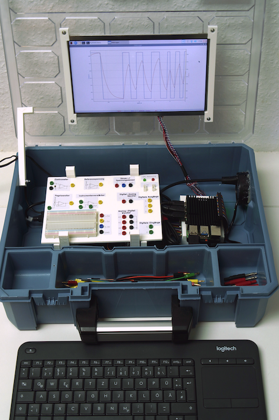  

<a name="wasbraucheichundwiebaueichdaszusammen"></a>  

## 2. What do I need and how do I assemble it?  
The software is open source and can be downloaded from this Github page. 
The  detailed installation is described [here](#wiesetzeichendenraspberrypiauf).  

The following components are required for the measurement box:  

### 2.1 Order list


| Description | Order number | Quantity | Supplier | Unit price in euros | Total price in euros |
| ------------- |:-------------:|:-:|:--------:|-|-|
| **for the plug-in board:** | | | | | |
| Miniature socket, 2mm black | MBI 1 SW | 9 | Reichelt | 0.79 | 7.11 |
| Miniature socket, 2mm red | MBI 1 RT | 8 | Reichelt | 0.79 | 6.32 |
| Miniature socket, 2mm green | MBI 1 GN | 8 | Reichelt | 0.79 | 6.32 |
| Miniature socket, 2mm yellow | MBI 1 GE | 9 | Reichelt | 0.79 | 7.11 |
| Miniature socket, 2mm blue | MBI 1 BL | 3 | Reichelt | 0.79 | 2.37 |
| Arduino - Grove universal socket, 4-pin (set of 10) | GRV CONNEC4PIN | 1 | Reichelt | 1.25 | 1.25 |
| Standard LED green 5 mm | RND 135-00122 | 1 | Reichelt | 0.06 | 0.06 |
| Standard LED red 5 mm | RND 135-00126 | 1 | Reichelt | 0.06 | 0.06 |
| Breadboard 400 holes | RND 255-00005 | 1 | Reichelt | 1.90 | 1.90 |
| Socket strip 2.54 mm, 1x20 | MPE 115-1-020 | 4 | Reichelt | 1.20 | 4.80 |
| Filament for 3D printer | | 120g | | | |
| | | | | | |
| **for the board:** | | | | | |
| PCB board "PhyPiDAQ" | https://aisler.net/p/ABFAPVWM | 1 | Aisler | approx. 10 euros | approx. 10 euros |
| Operational amplifier, 1-way, DIP-8 | CA 3140 DIP | 1 | Reichelt | 0.99 | 0.99 |
| Instrumentation amplifier, 1-way, DIP-8 | AD 623 ANZ | 1 | Reichelt | 6.35 | 6.35 |
| Seven Darlington Arrays, DIP-16 | ULN 2003A | 1 | Reichelt | 0.30 | 0.30 |
| Operational amplifier, 2-way, DIP-8 | MCP 6042-I / P | 2 | Reichelt | 0.66 | 1.32 |
| DC-DC 5V converter | TMA 0505D | 1 | Reichelt | 5.50 | 5.50 |
| Analog / digital converter ADS1115 | RPI ADC 4CH | 1 | Reichelt | 3.30 | 3.30 |
| Rectifier diode | UF 4003 | 8 | Reichelt | 0.05 | 0.40 |
| Level shifter | DEBO LEV SHIFTER | 1 | Reichelt | 4.15 | 4.15 |
| INA219 current / voltage sensor | DEBO SENS POWER | 1 | Reichelt | 2.80 | 2.80 |
| Digital-to-analog converter | 802236543 - 62 | 1 | Conrad | 5.89 | 5.89 |
| Resistance 10 kOhm, 1% | VI MBA 02040C1002 | 6 | Reichelt | 0.05 | 0.3 |
| Resistance 1 kOhm, 0.1% | ARC MRA0207 1M B | 2 | Reichelt | 0.37 | 0.74 |
| Resistance 47 Ohm, 1% | VI MBB 02070C4709 | 6 | Reichelt | 0.03 | 0.18 |
| Resistance 100 Ohm, 1% | VI MBB 02070C1000 | 1 | Reichelt | 0.04 | 0.04 |
| Ceramic capacitor 10 nF | KERKO 10N | 1 | Reichelt | 0.06 | 0.06 |
| Ceramic capacitor 100 nF | KERKO 100N | 4 | Reichelt | 0.06 | 0.24 |
| Ceramic capacitor 100 pF | KERKO 100P | 4 | Reichelt | 0.05 | 0.20 |
| Electrolytic capacitor 47 μF | M-A 47U 100 | 4 | Reichelt | 0.21 | 0.84 |
| Electrolytic capacitor 10 μF | KS-A 10U 16 | 4 | Reichelt | 0.11 | 0.44 |
| Dot-strip grid board | H25PS200 | 1 | Reichelt | 2.60 | 2.60 |
| IC socket 16 poles | MPE 001-1-016-3 | 1 | Reichelt | 0.35 | 0.35 |
| IC socket 14 poles | MPE 001-1-014-3 | 1 | Reichelt | 0.29 | 0.29 |
| IC socket 8 poles | MPE 001-1-008-3 | 4 | Reichelt | 0.26 | 1.04 |
| Precision potentiometer | 64Y-100K | 2 | Reichelt | 0.21 | 0.42 |
| Ribbon cable | RPI T-COBBLER P | 1 | Reichelt | 3.60 | 3.60 |
| | | | | | |
| **for case and Raspberry Pi:** | | | | | |
| Raspberry Pi 4, 2 GB RAM | RASP PI 4 B 2GB RAM | 1 | Reichelt | 49.00 | 49.00 |
| Raspberry Pi charger | GOO 56746 | 1 | Reichelt | 8.50 | 8.50 |
| Display (optional) | RPI LCD 10.1HDMI | 1 | Reichelt | 102.10 | 102.10 |
| Power supply display | HNP 15-090L6 | 1 | Reichelt | 9.99 | 9.99 |
| Power supply | DEBO BREAD POWER | 1 | Reichelt | 4.50 | 4.50 |
| Memory card 32GB | SDSQUAR 032GGN6MA | 1 | Reichelt | 7.95 | 7.95 |
| USB hub | DESKHUB 60- SW | 1 | Reichelt | 6.00 | 6.00 |
| HDMI cable | RPI M-HDMI HDMI | 1 | Reichelt | 4.50 | 4.50 |
| Filament for 3D printer | | 170 g | | | |
| Keyboard with mouse pad | LOGITECH K400PRO | 1 | Reichelt | 29.95 | 29.95 |
| USB A USB C cable | GOOBAY 55467 | 1 | Reichelt | 2.40 | 2.40 |
| Cooling case Raspberry Pi passive | 2140237 - 62 | 1 | Conrad | 15.49 | 15.49 |
| Jumper cable | 096853 - 62 | 1 | Conrad | 2.79 | 2.79 |
| Insulating tape | | 1 roll | | | |
| Screws M2.5 20 mm | | 4 | | | |
| Screws M3 12 mm | | 7 | | | |
| Washers for M3 screws | | 14 | | | |
| Pillar connector, 40-pin, with locking, angled | PSL 40W | 1 | Reichelt | 0.49 | 0.49 |
| Universal case | 8519544 | 1 | Hornbach | 17.95 | 17.95 |
| | | | | | |
| **Accessories:** | | | | | |
| Measuring line 15 cm red, 2mm | 1385668-62 | 2 | Conrad | 2.49 | 4.98 |
| Test lead 15 cm green, 2mm | 1385671-62 | 2 | Conrad | 2.49 | 4.98 |
| Measuring line 15 cm blue, 2mm | 1385669-62 | 2 | Conrad | 2.49 | 4.98 |
| Test lead 15 cm black, 2mm | 1385667-62 | 2 | Conrad | 2.49 | 4.98 |
| Test lead 15 cm yellow, 2mm | 1385670-62 | 2 | Conrad | 2.49 | 4.98 |
| Test lead 30 cm red, 2mm | 1385676-62 | 2 | Conrad | 2.49 | 4.98 |
| Test lead 30 cm black, 2mm | 1385675-62 | 2 | Conrad | 2.49 | 4.98 |
| Adapter plug, 2 mm plug / 4 mm socket, red | MZS2RT | 2 | Reichelt | 1.45 | 2.90 |
| Adapter plug, 2 mm plug / 4 mm socket, black | MZS2SW | 2 | Reichelt | 1.45 | 2.90 |
| Adapter plug, 4 mm plug / 2 mm socket, red | MZS4RT | 2 | Reichelt | 2.30 | 4.60 |
| Adapter plug, 4 mm plug / 2 mm socket, black | MZS4SW | 2 | Reichelt | 2.30 | 4.60 |
| | | | | | |
| **Other:** | | | | | |
| Superglue | | | | | |
| Heat shrink tubing | | | | | |
| | | | | | |
| **Total:** | | | | | |
| without display | | | | | 284.52 |
| with display | | | | | 401.11 |
<a name="bauanleitung"> </a>

### 2.2 Building instructions


<a name="platineloeten"> </a>
#### 2.2.1 Soldering of the circuit board

First the socket headers (Reichelt, MPE 115-1-020) are clipped to the appropriate lengths. 
 These are required:

 - 3 x 1 pin  
 - 7 x 2 pins  
 - 1 x 3 pins  
 - 5 x 4 pins  
 - 3 x 5 pins  
 - 4 x 6 pins  
 - 1 x 10 pins   

These are soldered to the corresponding holes marked by squares on the board. The other 
components are also soldered according to the labeling on the board. Pay attention to the 
polarity of the electrolytic capacitors - the side marked in white corresponds to the minus 
pole. Resistors and ceramic capacitors do not have any polarity. The brackets for the ICs are
soldered  in such a way that the semicircular recess matches the label. This shows in which
direction  the IC must be inserted.  

In the picture on the left you can see two places for resistors and two for capacitors,  which 
remain free. These are provided so that pull-up resistors and capacitors can be  installed
to ground in the event of interference on the I²C bus. But at first, these places should remain 
free.  

Finally, the connection pins that are too long can be clipped off on the back. The components
 are placed on the respective brackets.  

*Fig. 3*: soldering, step 1
                      
*Fig. 4*: Soldering, Step 2: The female headers are attached
                      
*Fig. 5*: Soldering, step 3: The other components are soldered on. The four devices marked  
in red are released
                      
*Fig. 6*: soldering, step 4: the finished board
                    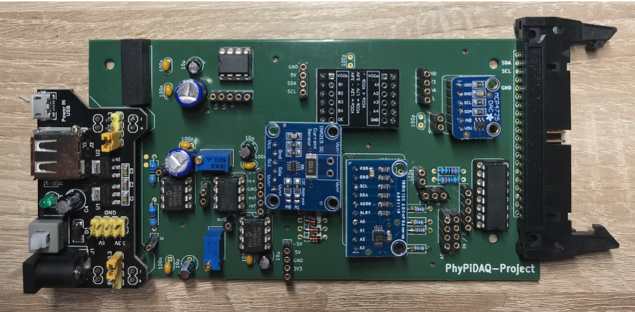  

* Fig. 7*: The finished board with all components 

 <a name="kofferbauen"> </a>

#### 2.2.2 Building the case

The following part describes how the PhyPiDAQ hardware with the circuit board,  an 
optional display and wireless keyboard can be attached to a standard organizer case,
 so that everything can be stored in a spacious,  space-saving and secure manner.  

First the 3D models are printed in the *Hardware/3D_Modelle* folder.  Depending on the
printer, it may be advisable to rotate the models accordingly and use a support structure. 
Good results have been achieved  with PLA filaments. When the printed models are finished,
the  construction of the case  can begin.

First, the 30 cm long breadboard connectors (C *, 096853-62) are cut once in the middle to 
obtain that 15 cm long cables. A total of 46 of such short cables are required. The cut side is
stripped and soldered to the 32 2 mm  sockets (R *, MBI1SW and other colors). The connectio
pins of a red  (R *, RND 135-00126) and a green LED (R *, RND 135-00122) are also soldered to 
the cables and insulated, as well as the two grove sockets  (R *, GRV CONNEC4PIN) and two pin 
headers (R *, RPI HEADER 40).  

*Fig. 7*: Box construction, step 1: Prepare plug connections  
                    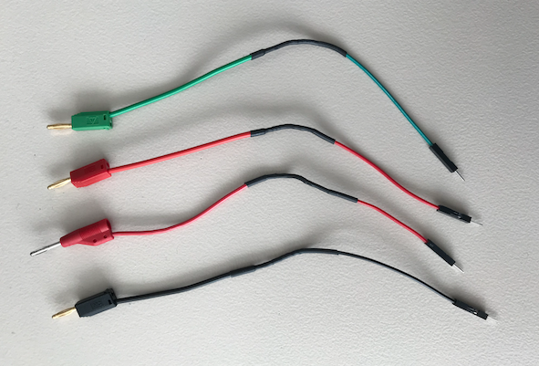  


Next,  the printed breadboard is drilled through with a 5mm wood drill in the designated places. 
The square cutouts for the Grove connections and the  pin headers can be drilled through with 
a handpiece, for example.  

The 2mm sockets can now be inserted and fixed with screws according to the illustration below. 
The LEDs, Grove sockets and pin headers are attached to the holes provided with superglue. 
The breadboard is attached to the connection panel with the adhesive tape on its back. The
labels are printed out  and glued at the appropriate places.

*Fig. 8*: Box construction, step 2: equipping the printed plug-in board with cables
                    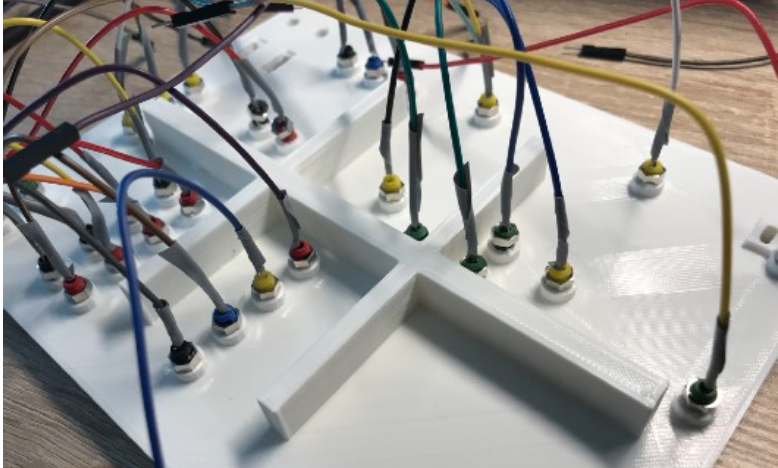  


*Fig. 9*: Box construction, step 3: Stick the lettering on the plug-in plate                    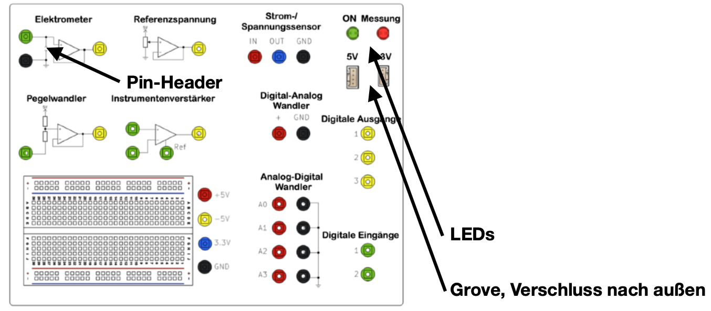  

The case can be processed while the superglue is hardening.  
First, the hole of the printed holding rod is drilled through with a 3mm  drill. This is 
then drilled into the left inside of the case in such a  way that the cover is held by the
rod with slight pressure, thus preventing unintentional closing. A M3x16mm and lock
nut can be used as a screw.

*Fig. 10*: Box construction, step 4: screw on the retaining rod                    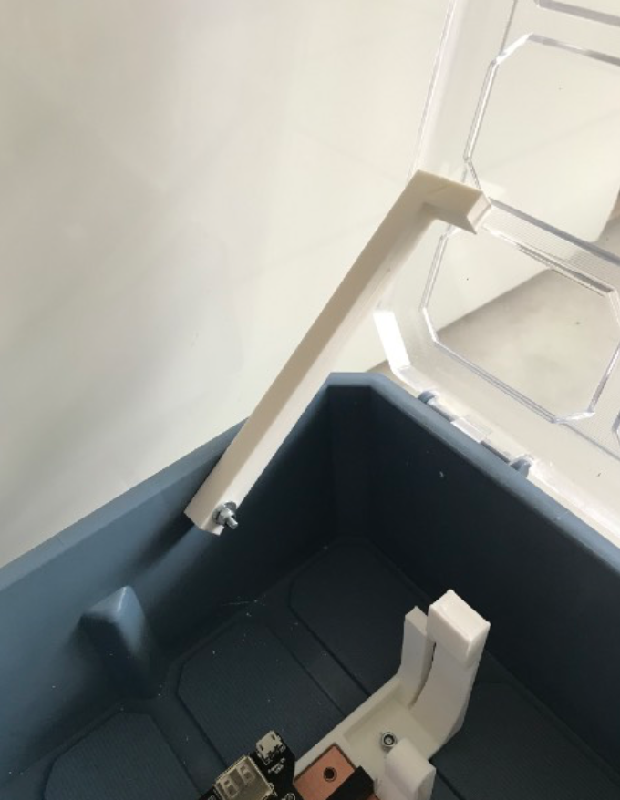  

Now the brackets for the circuit board and the breadboard are screwed to  
the floor. For this purpose, the circuit board is clamped so that the  
spacing between the brackets is correct. The distance between the brackets  
in the back and front of the case should be 3.2 cm and 6.5 cm to the left.  
Suitable screws are M3x12mm, which are screwed upside down so they don't  
scratch the surface later.

*Fig. 11*: Case construction, step 5: Screw on the circuit board                    

The hole for the USB hub (R *, DESKHUB 60-SW) is made with a 60 mm drill  
collar on the right side of the case at the back. The USB hub can now be  
glued into the socket with hot glue or super glue.  

*Fig. 12*: Case construction, step 6: Drill a hole for the USB hub
                    

Next, the display connected to the cable is clamped in the printed frame and  
attached to the cover with M3x10mm screws. The nuts point to the inside of  
the case. The distance from the display to the bottom is a maximum of 5 cm,  
so that the cables still reach the controller. The display controller is  
provided with the cables and the control unit is screwed to the printed  
bracket with M3x10mm screws. The controller can now be clicked in. The  
bracket can then be attached to the case with M3x12mm screws as shown in  
the illustration. The distance to the right should be at least 6 cm so that  
the connections are still accessible. In the case of a cable, the location  
on the controller is not clear. The color coding of the cables helps here:  
the red cables (mostly) represent positive voltages. The right place can be  
found with the labeling of the controller. 

*Fig. 13*: Box construction, step 7: Wire the display controller
                    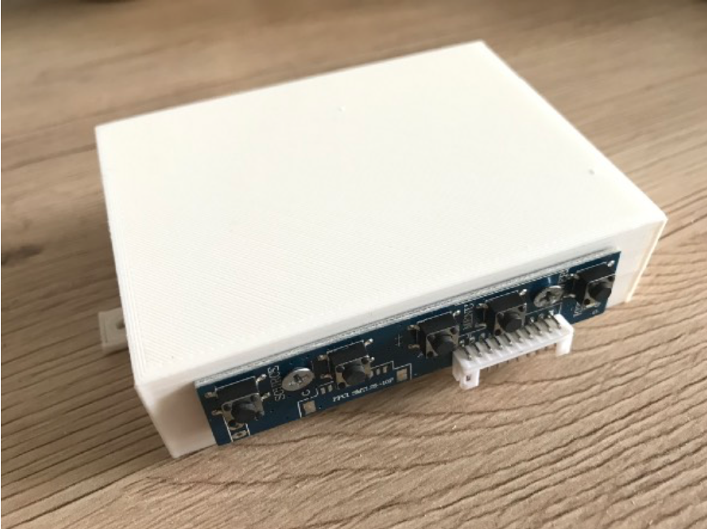  
*Fig. 14*: Case construction, step 8: Screw on the display controller                      

When the superglue has dried, the plug-in board can be connected to the  
circuit board. The connections are shown below:

*Fig. 15*: Box construction, step 9: Wire the plug-in plate to the circuit board
                    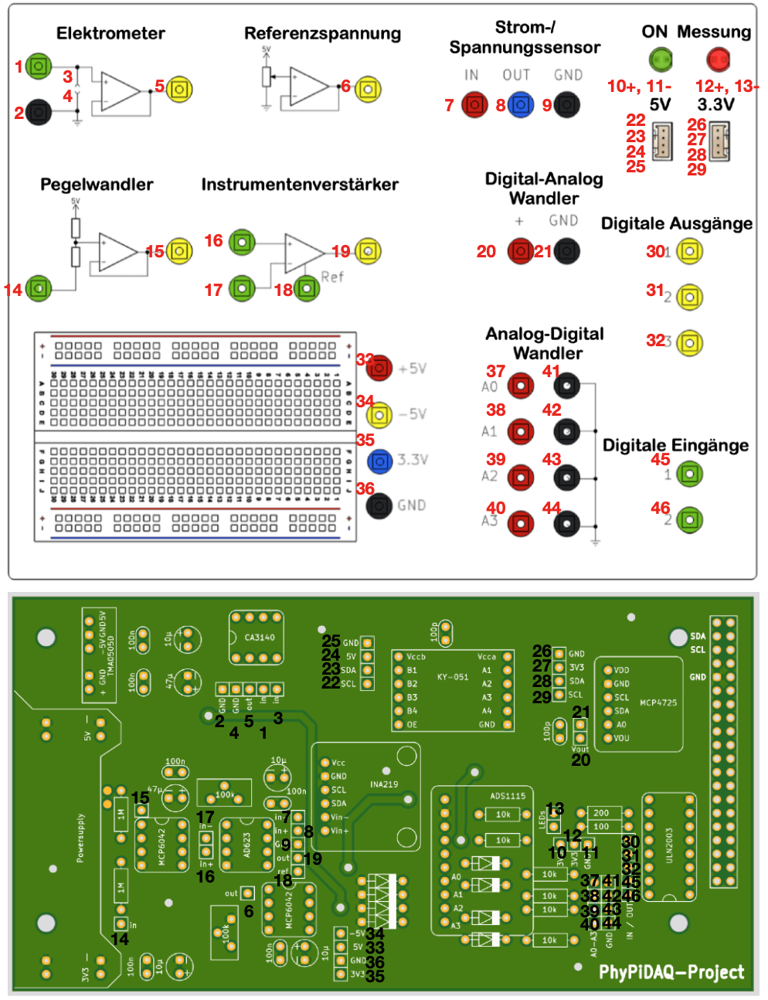  

Next,  the Raspberry Pi is mounted. To do this, the Pi is first held in  
the right place on the display controller housing in order to put the drill  
holes on it. Then the cooling housing (C *, 2140237 - 62) is attached to  
the Pi. For this purpose, the three heat-conducting plates are attached to  
the appropriate places, whereby the foils on the top and bottom must be  
removed. The heat sink is screwed to the display controller bracket using  
the M2.5x25mm screws. The bracket with the Pi can now be attached to the  
case with M3x12mm screws.

*Fig. 16*: Case construction, step 10: attach Raspberry Pi heat sink
                      
*Fig. 17*: Case construction, step 10: Screw the Raspberry Pi onto the display controller                    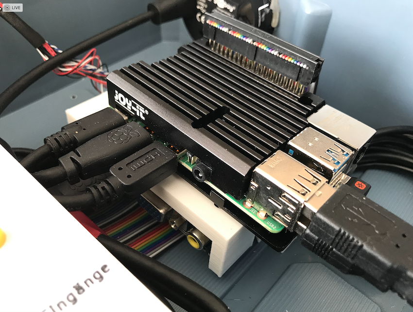  
*Fig. 18*: Case construction, step 10: Attach the display controller housing to the case                    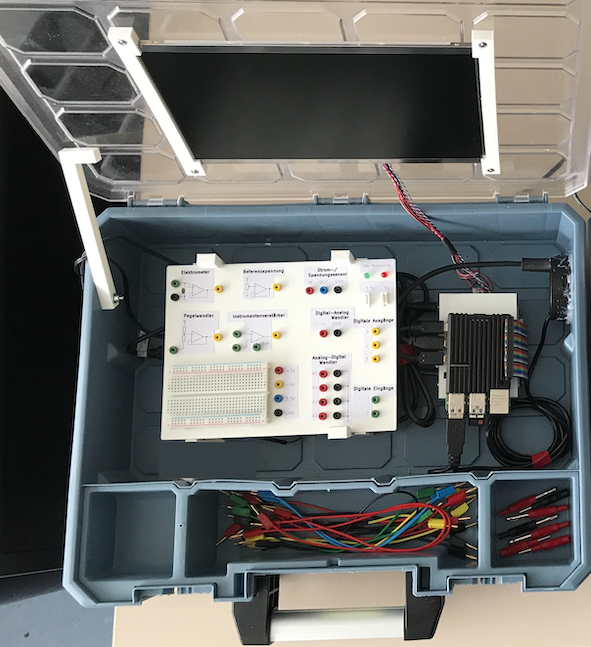  

Finally, the Raspberry Pi is attached to the board via the extension pins  
(R *, RPI HEADER 40) with the 40-pin cable (C *, RPI T-COBBLER P). The  
power supply units for the board and display are also connected. The USB  
hub is connected to the Raspberry Pi. The dongle of the wireless keyboard  
(R *, LOGITECH K400PRO) is plugged into the USB port of the Pi. The HDMI  
port of the Raspberry Pi is connected to the display controller with the  
corresponding adapter (R *, RPI M-HDMI HDMI). The HDMI adapter (R *, DELOCK  
65391) is plugged into the other port of the Raspberry Pi and can be fixed  
in the USB hub with adhesive so that another external display can be  
connected. The power port of the Raspberry Pi is connected to the power  
supply of the board (R *, DEBO BREAD POWER) with the adapter (R *, GOOBAY  
55467). The keyboard can be stored on the plug-in board when the cover is  
closed. The cables and adapters are sorted into the three compartments. 


*Fig. 19*: all parts with display and keyboard can be found in the case
                      


<a name="wiesetzeichdenraspberrypiaufundinstalliereichphypidaq"></a>

## 3. How do I set up the Raspberry Pi and install PhyPiDAQ?

If there already is an operating system on the Raspberry Pi, you can  continue directly with [3.2](#wieinstalliereichphypidaq). 
If not, proceed with this description how to install the operating system. 

<a name="wiesetzeichdenraspberrypiauf"></a>

### 3.1 How do I set up the Raspberry Pi?

First download *Raspberry Pi Imager* from the official website  
https://www.raspberrypi.org/downloads/ to any computer with an SD card slot.  

Install the *Raspberry Pi Imager* by double-clicking the downloaded file.  

*Fig. 20*: Installation of Raspberry Pi Imager, double click on the "Raspberry"
                      
A new window opens in which you can select the operating system to be  
installed and the SD card. Under *Operating System* select "Raspberry  
Pi OS (other)" and then "Raspberry Pi OS Full".

*Fig. 21*: Selection of the operating system
                    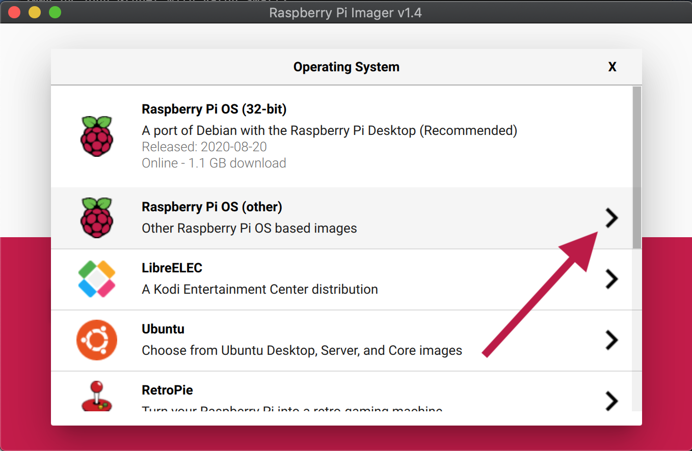  

*Fig. 22*: Selection of the operating system                      

Insert the SD card into the slot of the computer. Ensure that the SD  card is in writable mode by 
pushing the small slide on the left edge of the  SD card adapter upwards.  

*Fig. 23*: Make the SD card writable, move the slider to the top position
                      

In the *Raspberry Pi Imager* you can now select your SD card by clicking on *"SD Card"*.

*Fig. 24*: Selection of the SD card
                    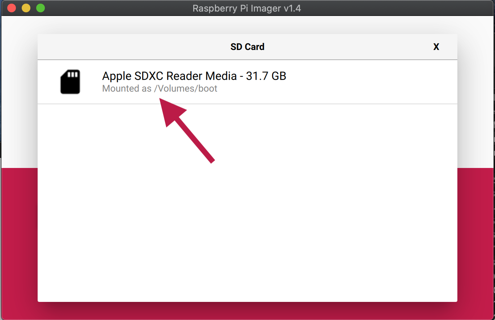  
                    
By clicking on *"Write"* and then confirming, you can finally record onto  
the SD card; you may be asked for the password once. This process can now  
take a few minutes.  

*Fig. 25*: Writing to the SD card
                    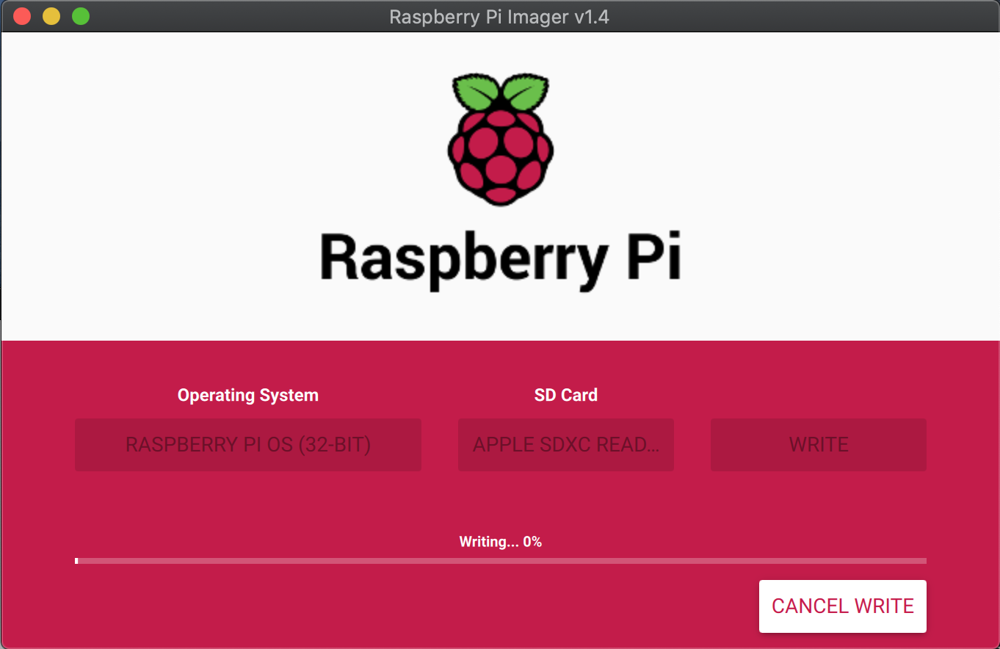  
                    
When the process is complete, the operating system for the Raspberry Pi is  
on the SD card and this can be plugged into the Raspberry Pi. If you have  
not decided to use the case version with a display, connect an external monitor  
and make sure that a mouse and keyboard are connected. Also connect an  
Ethernet cable if you don't have a WiFi connection available. Then you can  
connect the Raspberry Pi to the power supply, and it boots automatically.  
Various packages are now installed automatically, which can take  several minutes.   
If this is successful, a window opens in which you can set  basic system settings such
as time zone, country, keyboard layout and your  WiFi network, if this is desired. 
The installation of the Pi is now   complete and we can continue installing *PhyPiDAQ*.  

<a name="wieinstalliereichphypidaq"></a>

### 3.2 Installation of PhyPiDAQ on the Raspberry Pi

**Obtaining the PhyPiDAQ code and easy installation**

Please note that your Raspberry Pi must be connected to the Internet for  
the following steps. Open the terminal, which you can find in the system  
bar at the top left.  

*Fig. 26*: Open the terminal
                      
                    
First install the repository manager *git*, which is used to download all files of the *PhyPiDAQ* package from its github repository. 
To do this, enter the following texxt in the terminal window:  
`` bash
sudo apt-get install git
``

*Fig. 27*: Enter command in the terminal  
                      
                    
Enter the following commands to install *PhyPiDAQ*. Always copy this code  
line by line into the terminal and confirm each command with the Enter key.  
**DO NOT** insert all lines at once.
```bash
mkdir ~/git
cd ~/git
git clone https://github.com/GuenterQuast/PhyPiDAQ
cd ~/git/PhyPiDAQ
./installlibs.sh
cp ~/git/PhyPiDAQ/phypi.desktop ~/Desktop/
```
The installation is now complete and *PhyPiDAQ* is ready for the first use.  
If you want to update the installed version later, enter the following in  
the terminal (not necessary for the first installation, as the current  
version has already been downloaded):  
```bash
cd ~/git/PhyPiDAQ
git pull
./installlibs.sh
```

<a name="wiebedieneichdiephypidaqsoftware"></a>
## 4. How do I use the PhyPiDAQ software?<a name="startenundstartoberflaeche"></a>
## 4.1 starting surface

To start the *PhyPiDAQ* application, double-click the icon on the desktop **PhyPi**.  

*Fig. 28*: Open PhyPiDAQ  
                      
                    
You will be asked how you would like to open it, select "*Run*" here. Two  
windows open now: a black terminal window, which shows current status  
messages and log files. You can ignore this window for ease of use. It only  
gets important when errors are displayed. In this case, the terminal  
window shows the error code and instructions which point to the problem and  
which can usually be used to fix the problem quickly. The more important  
window is the user interface of *PhyPiDAQ*.


*Fig. 29*: User interface *PhyPiDAQ*  
                      

The tab "*Control"*, in which you are after opening, is the start tab. A  
measurement can be started from here by clicking the button "*StartRun*"  
at the bottom right, but this should only be tried later. The so-called  
working directory can also be selected in this tab. Here you can determine  
where the configured experiment should be saved. A clear folder structure  
is essential if *PhyPiDAQ* is used in several school classes. So it is  
highly recommended to use a structure like the following:  

*Fig. 30*: folder structure
                      
                    
You can create new folders in the file manager (similar to Windows "My  
Computer" or Mac "Finder") by right-clicking on *"New"* -> *"Folder"*  
in the window.  

*Fig. 31*: create a new folder
                      
                    
Another possibility is to enter the following command in the terminal,  
which creates the subfolder *"class_12"* in the folder *"school"*.  
```bash
mkdir /home/pi/PhyPi/school/class_12
```
In the PhyPiDAQ user interface you select in the field *"Work Dir:"* in  
which folder you want to save the current project. Below that, in *"DAQ  
config*", you can open projects that have already been saved. This is  
particularly useful if you have already tested an experiment in advance and  
want to demonstrate it in class. The saved project will then be opened  
again in exactly the same way and you can start the experiment immediately.  
Below, in the field *"Name"* you can enter the name of the experiment.  
This will appear in the file name. If you click on *"Save Config"*, you  
save the configuration file. The file will then be called "default.daq" if  
you wrote "default" in *Name:*. Each time you start the program with  
"StartRun", an additional file is created with name, time and date, which  
is saved in the directory you specified for "Work Dir",  
e.g. school/class_12/photoeffect.

**Task:** Now create a folder structure as shown in Fig. 30 with your  
school classes. Create a folder with the name *"Test"* in one of these  
classes. Then switch to the *PhyPiDAQ* user interface and select the  
*test* you just created in *Work Dir*. Now assign the name  
"standard experiment" and save the project. Then verify in the file  
manager that the created project is there.


<a name="konfigurationsdatei"></a>
## 4.2 configuration file

We now want to familiarize ourselves with the second tab, *"Configuration"*.  
Click on the tab *"Configuration"*.  

*Fig. 32*: configuration  
                      
A window can now be seen in which all parameters for the experiment can be  
set, such as:  
- which sensor do I use (DeviceFile)?
- which maximum values ​​should be displayed in the diagram (ChanLimits)?
- should the values ​​of the sensor be converted directly (ChanFormula)?
- which axis labeling should be displayed (ChanLabels)?
- which formulas should be displayed (ChanUnits)?
- how often should be scanned (Interval)?

and many more...
Don't let this put you off! These parameters represent ways in which an  
experiment can be expanded or perfected. By no means all parameters are  
required - usually around 3-5 lines are sufficient. In the *"default"* -  
Config, which can be seen in Fig. 32, all setting options are  
indicated  and can be commented out by a "#" at the beginning of the  
respective line.

If you want to make changes to this configuration, you must first activate  
the *"Edit Mode"* at the top right by clicking on it once.  
The field in front of it shows that you can now write into the text field.  
Helpful Keyboard shortcuts are:  
- *Str + C* for copying selected characters
- *Str + V* for pasting the characters you just copied
- *Str + Z* for undo
- *Str + Shift + Z* to undo again.

Always start by telling the software which sensor you want to read out by  
removing the "#" at the beginning of the corresponding line.  

We now want to read out the ADS1115 analog-to-digital converter  
demonstratively and therefore change the line  
```bash
#DeviceFile: config/ADS1115Config.yaml   # 16 bit ADC, I2C bus
```
to
```bash
DeviceFile: config/ADS1115Config.yaml   # 16 bit ADC, I2C bus
```
You can leave all other settings here unchanged, as suitable parameters for this  
sensor are automatically selected. Changes may have to be made to the sensor,  
because e.g. it has four inputs but not all of them have to be  
read out depending on the project. To do this, click on *"reload device config"*,  
which you will find at the bottom right. A confirmation follows that *PhyPiDAQ*  
has now accepted the selected sensor.

<a name="sensorkonfiguration"></a>
## 4.2 Sensor configuration "Device-Config"

Now click on the tab *"Device Config"* at the top. The parameters of the  
sensor can be seen now.

*Fig. 33*: Configuration of the sensor  
                    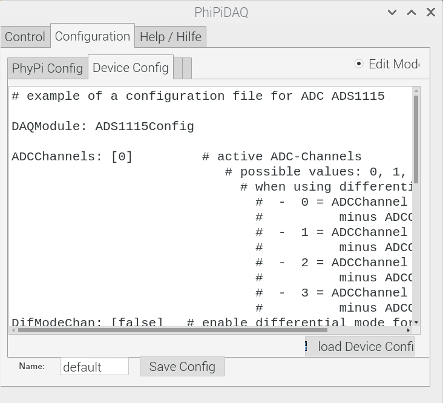  
                    
Here the syntax is the same again, that means:
- Lines that begin with "#" are commented out and have no function
on the program
- To make changes you have to go to "Edit-Mode" by clicking above
on the "Edit-Mode" field on the right.

You now have the choice of which channels you want to read out, what is  
determined in "ADCChannels". If you only want to read out channel 1, this is  
the line:
```bash
ADCChannels: [0]
```
because counting starts at zero. If you only want to read out channel 2, this  
is the line:
```bash
ADCChannels: [1]
```
You can read out several inputs at the same time by separating the individual  
channels with commas:
```bash
ADCChannels: [0, 1, 2, 3]
```
The other parameters below can be used if necessary, for example to subtract one  
input from another. To do this, follow the instructions in the corresponding  
lines. Please note that if you want to read out several channels, you also have  
to adjust the parameters below to the respective number of channels. So the  
following is not possible and will lead to an error message:
```bash
# example of a configuration file for ADC ADS1115

DAQModule: ADS1115Config  

ADCChannels: [0, 1, 2, 3]         # active ADC-Channels
DifModeChan: [false]   # enable differential mode for Channels
Gain: [2/3]                # programmable gain of ADC-Channel
sampleRate: 860             # programmable Sample Rate of ADS1115
```
Correct is:
```bash
# example of a configuration file for ADC ADS1115

DAQModule: ADS1115Config  

ADCChannels: [0, 1, 2, 3]         # active ADC-Channels
DifModeChan: [false, false, false, false]   # enable differential mode for Channels
Gain: [2/3, 2/3, 2/3, 2/3]                # programmable gain of ADC-Channel
sampleRate: 860             # programmable Sample Rate of ADS1115
```

We have now selected the sensor *ADS1115* with four channels. You can now assign  
a name below and save the configuration.

Now connect the analog-digital converter to the Raspberry Pi - four wires are  
required: GND and + 5V for the power supply and SCL and SDA for the *i2C*  
connection, via which the sensor transmits data to the Pi.
<a name="messungstarten"></a>
## 4.3 Starting the measurement

Then you can click the button *"StartRun"*. A window with the diagram opens and  
you can start the measurement by clicking at the bottom left on *"Run"*.  
Congratulations, you have taken your first measurement with *PhyPiDAQ*!

*Fig. 34*: Reading out four channels with an analog-digital converter
                    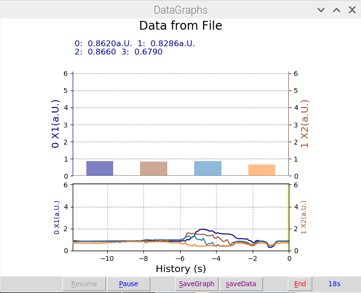  
There are now numerous ways in which you can use *PhyPiDAQ*. On the one hand,  
it is important to be able to save recorded data, which is done with  
*"SaveData"*. The values are saved in the folder selected in the working  
directory (*"WorkDir"*) in the folder belonging to the measurement. By  
default, only the first 12 seconds are saved, which is exactly the interval that  
can be seen in the display. In the configuration this can of course be adjusted  
and extended if desired. The standard data format is *".csv"*, which can also  
be adapted.

<a name="wiefuehreichdamitversuchedurch"></a>
## 5. How do I carry out experiments with it?
We are now ready to read out a large number of different sensors, graphically  
plot them live on the monitor and export the values. That opens up countless  
possibilities to use *PhyPiDAQ* in the classroom. We will now describe three  
sample experiments so that you can see what the entire workflow can look like  
from start to finish.


<a name="elektrostatik"></a>
### 5.1 Electrostatics

In the following experiment, the effect of electrostatic influence will be shown.  
Furthermore, the same setup can also be used to demonstrate a load spoon.  

An open, round capacitor plate with a diameter of d ≈ 5 cm is connected to the  
electrometer. The mass of the measuring case is pulled to the earth potential.  
A capacitor with a capacity of 1 nF is connected between the capacitor plate  
and the earth. The output of the electrometer is connected to the level converter  
and this in turn to the ADC. This means that both positive and negative  
voltages can be read out.  
**elektrostatik.daq:**
*Fig. 34*: Electrostatic experiment setup  
                      
             
We now deal with the configuration file.  

For the sake of clarity, superfluous comments and lines that have been commented  
out have been left out. 
```bash
DeviceFile: config/myADS1115Config.yaml   # 16 bit ADC, I2C bus 
ChanLabels: ['Uc']            # names for channels 
ChanUnits: ['V']         # units for channels 
ChanColors: [darkblue]      # channel colours in display
ChanFormula:
  - 2*c0-5  # chan0
Interval: 0.1                 # logging interval         
DisplayModule: DataGraphs     # text, bar-graph, history and xy-view
Title: "Data from File"       # display title
```
**myADS1115Config.yaml:** 
```bash  
# example of a configuration file for ADC ADS1115

DAQModule: ADS1115Config  

ADCChannels: [0]         # active ADC-Channels
DifModeChan: [false]   # enable differential mode for Channels
Gain: [1]                # programmable gain of ADC-Channel
sampleRate: 860             # programmable Sample Rate of ADS1115  
```
You may have to adjust the *Gain* in the penultimate line - depending on whether  
the displayed signal is too small or too large. On the software side, the function    
of the level converter is compensated as follows:  
U<sub>capacitor</sub> = 2 · U<sub>measured</sub>-5V, which is already taken  
into account in *ChanFormula*. Before the measurement begins, the capacitor plate  
is connected to earth potential using a conductor so that it is uncharged. If a  
charged body is brought closer to the capacitor plate, the electric field of the  
charged body causes a force on the free electrons of the capacitor plate, which  
then - depending on the body's charge - are accelerated towards or away from it  
(influence). This process is limited by the fact that an electric field is built up  
through the charge shift, which counteracts the accelerating force. The charge  
separation can be measured as an electrical voltage that is applied between earth  
and the capacitor plate, i.e. precisely on the input side of the electrometer. It  
should be noted that an electrometer with a very high internal resistance is  
absolutely necessary for this experiment, as otherwise the greater current flow  
between the input of the electrometer and the earth leads to a charge equalization  
on the capacitor plate and the effect is therefore not visible. The effect is not  
visible with a conventional multimeter. A plastic rod is used as the body, which  
was rubbed on a wool sweater so that it became charged. Then it is brought closer  
to the capacitor plate, the distance being varied several times. The curve recorded  
in the figure below shows the time course of the voltage across the capacitor. The  
change in tension with the distance between the rods can be clearly seen. The sign  
of the voltage also shows that the rod is positively charged. 


*Fig. 35*: **Influence** Time curve of the voltage on the capacitor with repeated  
changes in the distance to the charged rod.
                      
             
Now the demonstration of the load spoon follows. To do this, a metal ball is rubbed  
on a wool sweater and then the discharged capacitor plate is touched with it. The  
illustration shows the course of the voltage. The increase in the capacitor voltage  
upon contact with the sphere indicates the charge. With Q = C · U, a known  
capacitance of 1 nF and the voltage difference of −2.7 V, the transferred charge is  
−2.7 nC.


*Fig. 36*: **Charge spoon** Time curve of the voltage on the capacitor when  
approaching and touching a charged ball. At approx. 66 s the capacitor is grounded  
so that the voltage is 0 V. When the charged sphere approaches, the amount of  
voltage on the capacitor increases due to influence. When the ball touches the  
capacitor plate (t ≈ 67.9 s), the voltage reaches a constant value.
                    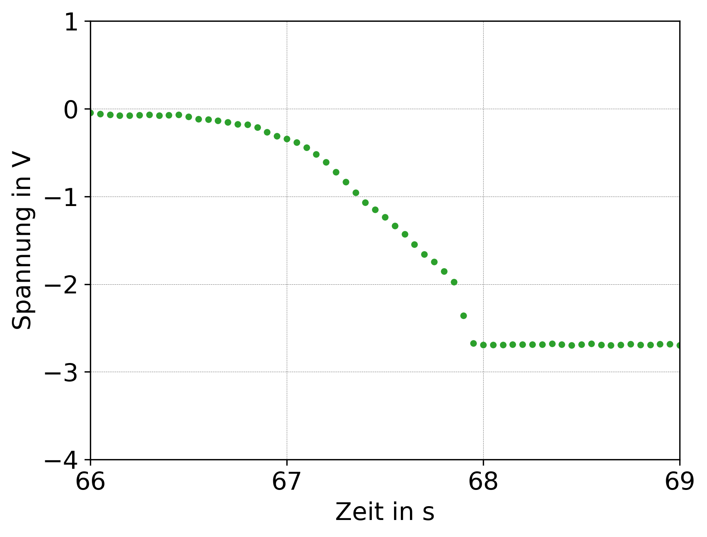  
             

<a name="kraftsensor"></a>
### 5.2 Force sensor
A force measurement is to be carried out using a load cell. It is checked whether  
the voltage applied to the load cell increases linearly with the attached mass, as  
expected.

The schematic structure is shown below:  
*Fig. 37*: **force sensor** schematic structure  
                      
The load cell used can be rebuilt according to [these instructions](https://github.com/GuenterQuast/PhyPiDAQ/blob/master/doc/Bauanleitung_Kraftsensor.pdf).
           
First, the load cell is supplied with an operating voltage of U=5V and screwed  
to a device so that weights can be attached to it. The voltage difference between  
the two outputs of the load cell is a measure of the applied force. Since this  
difference is typically in the mV range, the voltage is amplified using the  
instrumentation amplifier. The output of the instrumentation amplifier is connected  
to input A0 of the ADC. Since the necessary gain factor is unknown, it is initially  
set small and then increased during the measurement until the signal is in a  
suitable value range. Since the polarity of the voltage is also unknown, a  
reference voltage is tapped and connected to the associated connection of the  
instrumentation amplifier. 

This shifts the output voltage by the value of the reference voltage so that  
negative voltages can be shifted to positive voltages. Approx. 2-3V can be used,  
whereby the exact value of the reference voltage is irrelevant, as this voltage is  
then subtracted again. To do this, the reference voltage is applied to input A1 of  
the ADC and A0 - A1 selected as the output.  

Once the setup is complete, the measurement can be started and the amplification  
factor selected with different masses so that a voltage is visible. The gain factor  
here is A=18. While the measurement is in progress, pieces of weight up to  
500 g are hung on the load cell in 50 g increments. In addition, the voltage is  
taken up if no mass is attached.  
The measured values ​​are then exported and the stresses are assigned to the  
respective attached masses. By averaging the voltage values ​​over time during the  
time when the respective piece of mass was attached, a voltage value can be  
assigned to each mass. This results in ten voltage values ​​for the ten pieces of  
mass. It can be seen that the voltage is proportional to the attached  
mass. The voltage that is measured without an attached mass is subtracted from  
the other voltages as an offset voltage. After determining the compensation  
function, this load cell can be used as a scale for masses of up to 500 g.  

*Fig. 37*: The voltage of the load cell increases with increasing force. The  
offset voltage that is applied without an attached mass is subtracted from the  
remaining voltage values. The measured values ​​are compatible with a straight line  
through the origin.
                      
             
The regression can either be carried out directly in *PhyPiDAQ* with the  
*ChanCalib* function, or the values are exported and then transferred to Excel,  
Python, etc. to be further processed.

Config:

*kraftsensor.daq:*
```yaml
DeviceFile: config/kraft_ADS1115Config.yaml   # 16 bit ADC, I2C bus
ChanLabels: ['Spannung']            # names for channels 
ChanUnits: ['V']         # units for channels 
ChanColors: [darkblue]      # channel colours in display

Interval: 0.05                 # logging interval         
NHistoryPoints: 20000          # number of points used in history buffer, time=NHistoryPoints*Interval = 2000*0.05 = 100 seonds
DisplayModule: DataGraphs     # text, bar-graph, history and xy-view
Title: "Data from File"       # display title
DataFile:   null              #  null to disable 
CSVseparator: '   '            # field separator, set to ';' for German Excel   
```

*kraft_ADS1115Config.yaml:*
```yaml
DAQModule: ADS1115Config  
ADCChannels: [0]
DifModeChan: [true]
Gain: [1]
sampleRate: 860
```


<a name="photoeffekt"></a>
### 5.3 Photo effect

The photo effect is examined in more detail below. The resulting counter-voltage  
should be measured for six different wavelengths in the range from *λ = 360 nm* to  
λ=590 nm. Then the ratio *h/e*, where *h* is Planck's quantum and *e* is  
the elementary charge, should be determined. 

A mercury lamp is used as the light source because it also emits light in the UV  
range. The light beam is bundled with lenses and reduced to the respective  
wavelength with interference filters. When the photons hit the cathode, electrons   
are released and a positive excess charge is created on the initially neutrally  
charged plate. If electrons hit the opposite anode, it is negatively charged. The  
separation of charges between the anode and the cathode creates an increasing  
electric field, which slows down further electrons that fly from the cathode to  
the anode. In equilibrium, the breaking force is so great that even electrons  
no longer arrive at the anode with maximum kinetic energy. The voltage between the  
cathode and anode is then maximum. The maximum voltage then corresponds to the  
counter voltage.

The measuring method used here contains a capacitor connected in parallel to the  
photocell, which is charged by the photovoltage. The tension that arises  
corresponds to the counter-tension. This method has the advantage that a rather  
complex and laborious setting of the photocurrent can be dispensed with. As a  
result, this test can be carried out in a very short time and with high accuracy. 


On the hardware side, the voltage is measured with the electrometer, since a large  
internal resistance is required here in order not to falsify the measurement. A  
commercially available multimeter is therefore unsuitable. The circuit structure  
can be seen in the following figure:

*Fig. 38*: **Photoeffect** schematic structure
                    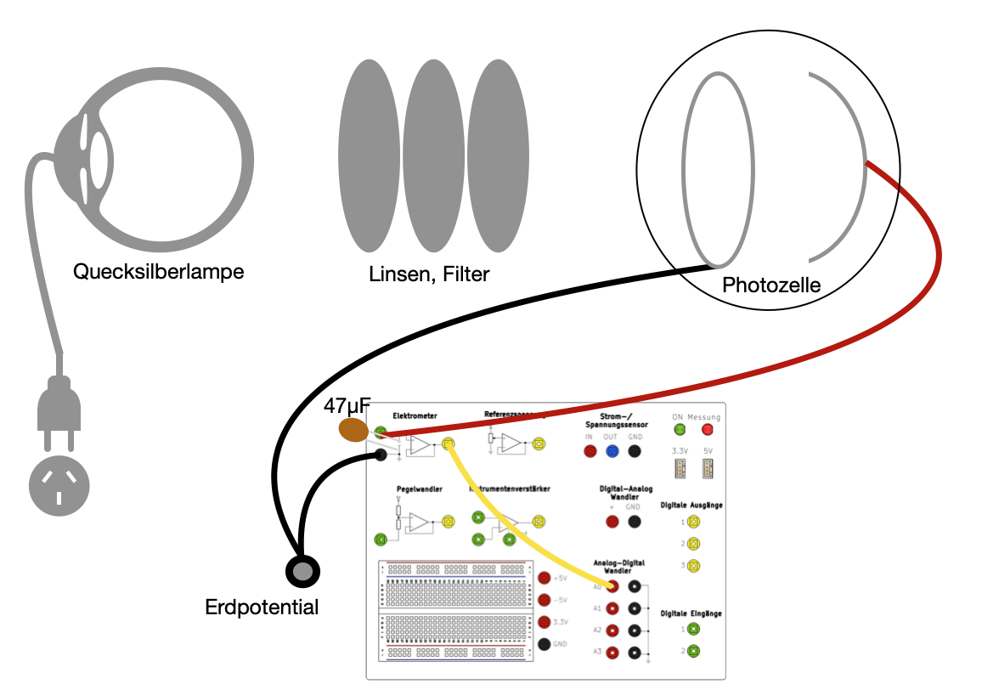  
The capacitor with *C=47µF* may have to be adjusted if the charging is too fast  
or too slow.


The following config can be used in *PhyPiDAQ*. (The plots below were created by  
exporting the values from *PhyPiDAQ* as *.csv* and then reading them into a  
Python script. This can be done just as well for the intermediate level, for  
example, with an Excel table or something similar.)  
*photoeffekt.daq:*
```yaml
DeviceFile: config/photoeffekt_ADS1115Config.yaml   # 16 bit ADC, I2C bus
ChanLabels: ['Voltage']            # names for channels 
ChanUnits: ['V']         # units for channels 
ChanColors: [darkblue]      # channel colours in display

Interval: 0.05                 # logging interval         
NHistoryPoints: 20000          # number of points used in history buffer, time=NHistoryPoints*Interval = 2000*0.05 = 100 seonds
DisplayModule: DataGraphs     # text, bar-graph, history and xy-view
Title: "Data from File"       # display title
DataFile:   null              #  null to disable 
CSVseparator: '   '            # field separator, set to ';' for German Excel   
```

*photoeffekt_ADS1115Config.yaml:*
```yaml
DAQModule: ADS1115Config  
ADCChannels: [0]
DifModeChan: [false]
Gain: [1]
sampleRate: 860
```
The measurement can now be started and the counter voltage is displayed, which  
results from the charging of the capacitor by the photo effect. The capacitor is  
connected to ground again for discharging.  

To calculate the ratio *h/e*, the energy balance is first drawn up. The  
incident light with the wavelength *λ* has the frequency *ν=λc* and the  
energy *E<sub>light</sub>=hν*. After deducting the work function, the released  
electrons have the kinetic energy *E<sub>kin</sub>=E<sub>light</sub>-E_A*. For the energy  
of the electric field, *E<sub>field</sub>=U*e* applies, where *U* is the counter  
voltage and *e* is the elementary charge. In the stationary case, the energy of  
the electric field is the same as the kinetic energy, *E<sub>field</sub>=E<sub>kin</sub>*, so  
that when inserted, *U·e=hν−E_A* results. For the voltage *U*,  
*U=h/eν+eA* applies. The ratio *h/e* corresponds to the slope in the *U*-*ν*  
diagram in the figure below. The y-axis intercept corresponds to the work  
function *E_A*, with a negative sign indicating that this work has to be done.  
The deviation of *(h/e)<sub>measured</sub>* from the literature value of  
*h/e=4.14·10^(−15) Js/C* is 3.5%, which indicates a very precise measurement and the set  
goal of measuring in the percentage range fulfilled. The work function for a  
potassium cathode is *E_A = 2.25 eV*. The y-intercept corresponds to  
*|U| = 1. 97V*. Since no other effects such as contact stresses are taken into account here,  
the determination of the work function with this method is basically only possible  
with greater uncertainties.  
Although a detailed calculation is not carried out at this point and the y-axis  
intercept is extrapolated far away from the fitted measured values, the magnitude  
of the extrapolated work function still agrees well with the expected one. The  
photocurrent can also be calculated from the capacitor charge in the figure below.  
It can be seen that this is in the pico range. The current was smallest at 590 nm,  
which is evident from the relatively slow charging.

*Fig. 39*: **Photo effect** Charging of a capacitor on a vacuum photocell for different wavelengths of the incident light
                    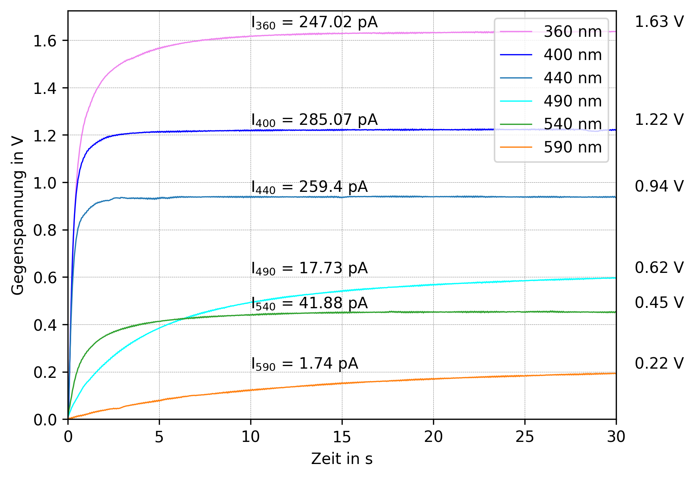  
             
*Fig. 40*: **Photoeffect** Saturation voltage versus frequency of light.  The slope of the straight line, obtained via linear regression, corresponds to the ratio *h/e*. 
                    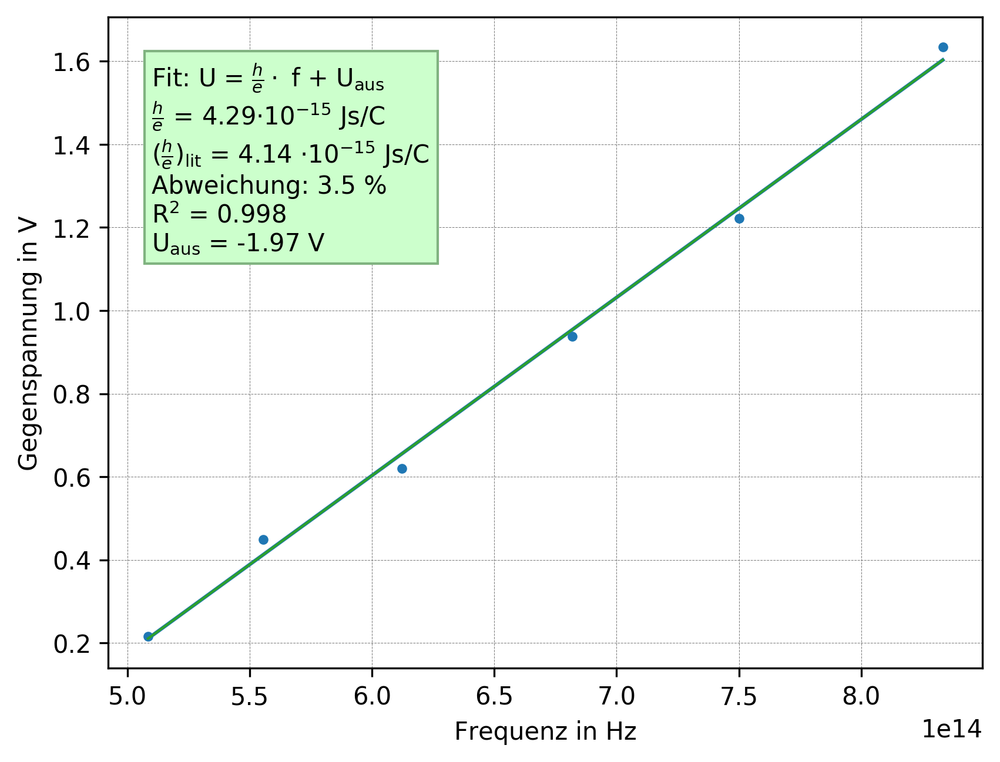  


