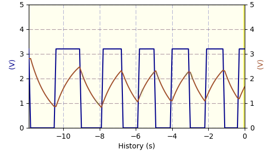
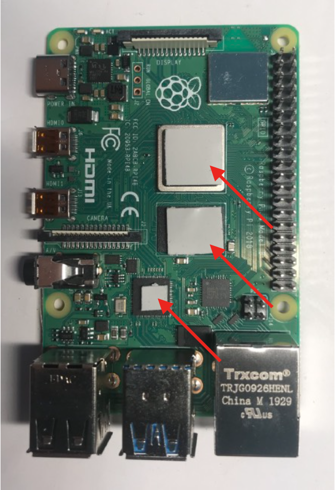
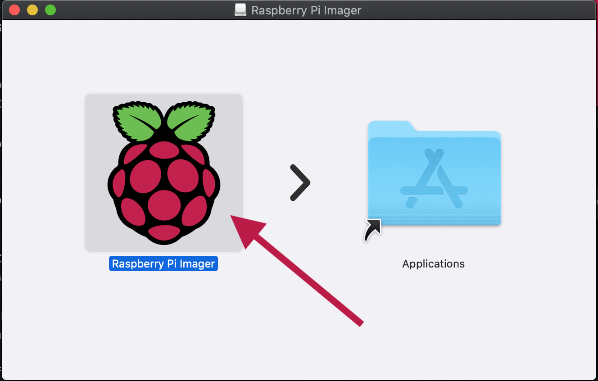

# PhyPiDAQ Dokumentation (für Lehrkräfte)

In dieser Anleitung wird der gesamte Workflow von PhyPiDAQ, begonnen von der Installation bis hin zur Auswertung von Versuchen beschrieben.

- [Was ist PhyPiDAQ ?](#wasistphypidaq)
- [Was brauche ich und wie baue ich das zusammen ?](#wasbraucheichundwiebaueichdaszusammen)
	- [Bestellliste](#bestellliste)
	- [Bauanleitung](#bauanleitung)
		- [Platine löten](#platineloeten)
		- [Koffer bauen](#kofferbauen)
- [Wie setze ich den Raspberry Pi auf und installiere PyPiDAQ?](#wiesetzeichdenraspberrypiaufundinstalliereichphypidaq)
    - [Wie setze ich den Raspberry Pi auf ?](#wiesetzeichdenraspberrypiauf)
    - [Wie installiere ich PhyPiDAQ ?](#wieinstalliereichphypidaq)
- [Wie bediene ich die PhyPiDAQ Software ?](#wiebedieneichdiephypidaqsoftware)
    - [Starten und Startoberfälche](#startenundstartoberflaeche)
    - [Konfigurationsdatei](#konfigurationsdatei)
    - [Messung starten](#messungstarten)
- [Wie führe ich damit Versuche durch ?](#wiefuehreichdamitversuchedurch)
	- [Elektrostatik](#elektrostatik)
	- [Kraftsensor](#kraftsensor)
	- [Photoeffekt](#photoeffekt)


<a name="wasistphypidaq"></a>

## 1. Was ist PhyPiDAQ ? 
PhyPiDAQ ist ein Projekt zur transparenten, einfach verständlichen Datenerfassung mit einem Raspberry Pi. Die Software enthält grundlegende Funktionen zur Datenaufnahme und -visualisierung wie Datenlogger, Balkendiagramm, XY- oder Oszilloskopanzeige und Datenaufzeichnung auf die Festplatte zur anschließenden Auswertung.

Die Bedienoberfläche ist so gestaltet, dass vorgefertigte Templates für viele Sensoren benutzt werden können, um diese somit einfach und schnell auszulesen. Darüber hinaus bietet sie aber auch die Möglichkeit, die einzelnen Parameter wie Abtastrate, Intervall, Achsenbeschriftung, Differentieller Modus, Funktionen zur direkten Umrechnung und viele mehr zu verändern. Die Einstellungen lassen sich bequem abspeichern und wieder aufrufen, sodass ein Demonstationsversuch schnell gezeigt werden kann.

Es wird bereits eine Vielzahl unterschiedlicher Sensoren, wie verschiedene Analog-Digital-Wandler, Stromsensoren, Klimadatensensoren, Gammadetektoren etc. unterstützt. Hierbei wurde auf weit verbreitete und preiswerte Sensoren gesetzt, welche eine hohe Genauigkeit aufweisen, die für Schulversuche mehr als ausreichend ist.

Die Sensoren können einzeln mittels sogenannter Jumper-Kabeln mit dem Raspberry Pi verbunden werden, oder es kann die eigens für PhyPiDAQ entworfene Platine verwendet werden, auf welcher die Sensoren fest angebracht werden. Dadurch kann der Verkabelungsaufwand auf ein Mindestmaß reduziert werden und Versuche können auch schnell in der 5-Minuten-Pause aufgebaut werden. Mit maßgeschneiderten 3D-gedruckten Modellen kann alles geräumig in einem Organizer-Koffer befestigt werden.  

 *Abb. 1*:  Darstellung der Zeitabhängigkeit von zwei Signalquellen  
              (Kondensatorspannung an Rechteckspannung) an einem AD-Wandler  
                      

*Abb. 2*:  Messkoffer mit Raspberry Pi, Vorschaltplatine und eingebautem Display  
                      

<a name="wasbraucheichundwiebaueichdaszusammen"></a>  

## 2. Was brauche ich und wie baue ich das zusammen ?  
Die Software ist quelloffen und kann auf dieser Github-Seite heruntergeladen  werden.  
Die ausführliche Installation wird [hier](#wiesetzeichdenraspberrypiauf)   beschrieben.

Für den Messkoffer werden die folgenden Bauteile benötigt:

<a name="bestellliste"></a>

### 2.1 Bestellliste


| Beschreibung  | Bestellnummer | Menge |Zulieferer|Einzelpreis in Euro|Gesamtpreis in Euro|
| ------------- |:-------------:|:-:|:--------:|-|-|
| **für die Steckplatte:** |  |  |  |  |  |
| Miniatur-Buchse, 2mm schwarz | MBI 1 SW | 9 | Reichelt | 0,79 | 7,11 |
| Miniatur-Buchse, 2mm rot | MBI 1 RT | 8 | Reichelt | 0,79 | 6,32 |
| Miniatur-Buchse, 2mm grün | MBI 1 GN | 8 | Reichelt | 0,79 | 6,32 |
| Miniatur-Buchse, 2mm gelb | MBI 1 GE | 9 | Reichelt | 0,79 | 7,11 |
| Miniatur-Buchse, 2mm blau | MBI 1 BL | 3 | Reichelt | 0,79 | 2,37 |
| Arduino - Grove Universal- Buchse, 4-Pin (10er Set) | GRV CONNEC4PIN | 1 | Reichelt | 1,25 | 1,25 |
| Standard LED Grün 5 mm | RND 135-00122 | 1 | Reichelt | 0,06 | 0,06 |
| Standard LED Rot 5 mm | RND 135-00126 | 1 | Reichelt | 0,06 | 0,06 |
| Breadboard 400 Löcher | RND 255-00005 | 1 | Reichelt | 1,90 | 1,90 |
| Buchsenleiste 2,54 mm, 1x20 | MPE 115-1-020 | 4 | Reichelt | 1,20 | 4,80 |
| Filament für 3D Drucker |  | 120g |  |  |  |
|  |  |  |  |  |  |
| **für die Platine:** |  |  |  |  |  |
| PCB Platine "PhyPiDAQ" | https://aisler.net/p/ABFAPVWM | 1 | Aisler | ca. 10 Euro| ca. 10 Euro |
| Operationsverstärker, 1-fach, DIP-8 | CA 3140 DIP | 1 | Reichelt | 0,99 | 0,99 |
| Instrumentationsverstärker, 1-fach, DIP-8 | AD 623 ANZ | 1 | Reichelt | 6,35 | 6,35 |
| Seven-Darlington-Arrays, DIP-16 | ULN 2003A | 1 | Reichelt | 0,30 | 0,30 |
| Operationsverstärker, 2-fach, DIP-8 | MCP 6042-I/P | 2 | Reichelt | 0,66 | 1,32 |
| DC-DC 5V Wandler | TMA 0505D | 1 | Reichelt | 5,50 | 5,50 |
| Analog/Digital Konverter ADS1115 | RPI ADC 4CH | 1 | Reichelt | 3,30 | 3,30 |
| Gleichrichterdiode| UF 4003 | 8 | Reichelt | 0,05 | 0,40 |
| Level Shifter | DEBO LEV SHIFTER | 1 | Reichelt | 4,15 | 4,15 |
| INA219 Strom-/ Spannungssensor | DEBO SENS POWER | 1 | Reichelt | 2,80 | 2,80 |
| Digital-Analog-Konverter | 802236543 - 62 | 1 | Conrad | 5,89 | 5,89 |
| Widerstand 10 kOhm, 1% | VI MBA 02040C1002 | 6 | Reichelt | 0,05 | 0,3 |
| Widerstand 1 kOhm, 0.1% | ARC MRA0207 1M B | 2 | Reichelt | 0,37 | 0,74 |
| Widerstand 47 Ohm, 1% | VI MBB 02070C4709 | 6 | Reichelt | 0,03 | 0,18 |
| Widerstand 100 Ohm, 1% | VI MBB 02070C1000 | 1 | Reichelt | 0,04 | 0,04 |
| Keramik-Kondensator 10 nF | KERKO 10N | 1 | Reichelt | 0,06 | 0,06 |
| Keramik-Kondensator 100 nF | KERKO 100N | 4 | Reichelt | 0,06 | 0,24 |
| Keramik-Kondensator 100 pF | KERKO 100P | 4 | Reichelt | 0,05 | 0,20 |
| Elektrolyt-Kondensator 47 μF | M-A 47U 100 | 4 | Reichelt | 0,21 | 0,84 |
| Elektrolyt-Kondensator 10 μF | KS-A 10U 16 | 4 | Reichelt | 0,11 | 0,44 |
| Punkt- Streifenrasterplatine | H25PS200 | 1 | Reichelt | 2,60 | 2,60 |
| IC Sockel 16 Pole | MPE 001-1-016-3 | 1 | Reichelt | 0,35 | 0,35 |
| IC-Sockel 14 Pole | MPE 001-1-014-3 | 1 | Reichelt | 0,29 | 0,29 |
| IC Sockeel 8 Pole | MPE 001-1-008-3 | 4 | Reichelt | 0,26 | 1,04 |
| Präzisionspotentiometer | 64Y-100K | 2 | Reichelt | 0,21 | 0,42 |
| Flachbandkabel | RPI T-COBBLER P | 1 | Reichelt | 3,60 | 3,60 |
|  |  |  |  |  |  |
| **für Gehäuse und Raspberry Pi:** |  |  |  |  |  |
| Raspberry Pi 4, 2 GB RAM | RASP PI 4 B 2GB RAM | 1 | Reichelt | 49,00 | 49,00 |
| Raspberry Pi Ladegerät | GOO 56746 | 1 | Reichelt | 8,50 | 8,50 |
| Display (optional) | RPI LCD 10.1HDMI | 1 | Reichelt | 102,10 | 102,10 |
| Netzteil Display | HNP 15-090L6 | 1 | Reichelt | 9,99 | 9,99 |
| Power supply | DEBO BREAD POWER | 1 | Reichelt | 4,50 | 4,50 |
| Speicherkarte 32GB | SDSQUAR 032GGN6MA | 1 | Reichelt | 7,95 | 7,95 |
| USB Hub | DESKHUB 60- SW | 1 | Reichelt | 6,00 | 6,00 |
| HDMI Kabel | RPI M-HDMI HDMI | 1 | Reichelt | 4,50 | 4,50 |
| Filament für 3D Drucker |  | 170 g |  |  |  |
| Tastatur mit Mauspad | LOGITECH K400PRO | 1 | Reichelt | 29,95 | 29,95 |
| USB A USB C Kabel | GOOBAY 55467 | 1 | Reichelt | 2,40 | 2,40 |
| Kühlgehäuse Raspberry Pi passiv | 2140237 - 62 | 1 | Conrad | 15,49 | 15,49 |
| Jumper Kabel | 096853 - 62 | 1 | Conrad | 2,79 | 2,79 |
| Isolierband |  | 1 Rolle |  |  |  |
| Schrauben M2.5 20 mm |  | 4 |  |  |  |
| Schrauben M3 12 mm |  | 7 |  |  |  |
| Unterlegscheiben für M3 Schrauben |  | 14 |  |  |  |
| Pfostenstecker, 40-polig, mit Verrieglung, gew. | PSL 40W | 1 | Reichelt | 0,49 | 0,49 |
| Universalkoffer | 8519544 | 1 | Hornbach | 17,95 | 17,95 |
|  |  |  |  |  |  |
| **Zubehör:** |  |  |  |  |  |
| Messleitung 15 cm rot, 2mm | 1385668-62 | 2 | Conrad | 2,49 | 4,98 |
| Messleitung 15 cm grün, 2mm | 1385671-62 | 2 | Conrad | 2,49 | 4,98 |
| Messleitung 15 cm blau, 2mm | 1385669-62 | 2 | Conrad | 2,49 | 4,98 |
| Messleitung 15 cm schwarz, 2mm | 1385667-62 | 2 | Conrad | 2,49 | 4,98 |
| Messleitung 15 cm gelb, 2mm | 1385670-62 | 2 | Conrad | 2,49 | 4,98 |
| Messleitung 30 cm rot, 2mm | 1385676-62 | 2 | Conrad | 2,49 | 4,98 |
| Messleitung 30 cm schwarz, 2mm | 1385675-62 | 2 | Conrad | 2,49 | 4,98 |
| Adapterstecker, 2 mm Stecker / 4 mm Buchse, rot | MZS2RT | 2 | Reichelt | 1,45 | 2,90 |
| Adapterstecker, 2 mm Stecker / 4 mm Buchse, schwarz | MZS2SW | 2 | Reichelt | 1,45 | 2,90 |
| Adapterstecker, 4 mm Stecker / 2 mm Buchse, rot | MZS4RT | 2 | Reichelt | 2,30 | 4,60 |
| Adapterstecker, 4 mm Stecker / 2 mm Buchse, schwarz | MZS4SW | 2 | Reichelt | 2,30 | 4,60 |
|  |  |  |  |  |  |
| **Sonstiges:** |  |  |  |  |  |
| Sekundenkleber |  |  |  |  |  |
| Schrumpfschläuche |  |  |  |  |  |
|  |  |  |  |  |  |
| **Gesamt:** |  |  |  |  |  |
| ohne Display |  |  |  |  | 284,52 |
| mit Display |  |  |  |  | 401,11 |


<a name="bauanleitung"></a>
### 2.2 Bauanleitung


<a name="platineloeten"></a>
#### 2.2.1 Platine löten

Zunächst werden die Buchsenleisten (Reichelt, MPE 115-1-020) auf die passenden
Längen geknipst. Benötigt werden:
 3 x 1 Pin  
 7 x 2 Pins  
 1 x 3 Pins  
 5 x 4 Pins  
 3 x 5 Pins  
 4 x 6 Pins  
 1 x 10 Pins  
Diese werden an den entsprechenden durch Quadrate gekennzeichnete Bohrungen auf der Platine verlötet.
Die weiteren Bauteile werden entsprechend der Beschriftung auf der Platine ebenfalls verlötet. Bei den Elkos ist auf die Polarität zu achten - die weiß markierte Seite entspricht dem Minus-Pol. Widerstände und Kerkos haben keine ausgezeichnete Polarität. Die Halterungen für die ICs werden so eingelötet, dass die halbrunde Aussparung mit der Beschriftung übereinstimmt. Daran kann erkannt werden, wie herum der IC später eingesteckt werden muss.

In der Abbildung links sind zwei Plätze für Widerstände und zwei für Kondensatoren zu sehen, welche frei bleiben. Diese sind dafür vorgesehen, dass bei Störungen auf dem I²C-Bus Pull-Up Widerstände und Kondensatoren nach Masse eingebaut werden können. Zuerst sollten diese Plätze aber frei bleiben.

Zuletzt können die zu langen Füßchen auf der Rückseite abgeknipst werden. Die Bauteile werden auf die jeweilige Halterungen gesteckt. 

*Abb. 3*:  Löten, Schritt 1  
                      
*Abb. 4*:  Löten, Schritt 2: Die Buchsenleisten werden angebracht  
                      
*Abb. 5*:  Löten, Schritt 3: Die weiteren Bauteile werden angelötet. Die vier rot markierten Vorrichtungen werden freigelassen  
                      
*Abb. 6*:  Löten, Schritt 4: die fertige Platine  
                      

<a name="kofferbauen"></a>

#### 2.2.2 Koffer bauen

Hier wird beschrieben, wie die Hardware von PhyPiDAQ mit der Vorschaltplatine, einem optionalem Display und Funktastatur in einem Standard Organizer-Koffer befestigt werden kann, sodass alles geräumig, platzsparend und sicher untergebracht werden kann. 

Als Erstes werden die 3D-Modelle im Ordner Hardware/3D_Modelle gedruckt. Je nach Drucker kann es sich anbieten, die Modelle entsprechend zu rotieren und Stützstruktur zu verwenden. Mit PLA konnten gute Ergebnisse erzielt werden.
Wenn die gedruckten Modelle vorliegen, kann mit dem Kofferbau begonnen werden.

Zunächst werden die 30cm langen Breadboard Steckverbindungen (C*, 096853-62) einmal in der Mitte durchgeschnitten, sodass 15cm lange Kabel vorliegen. Es werden insgesamt 46 kurze Kabel benötigt. Die angeschnittene Seite wird jeweils abisoliert und mit den 32 2mm-Buchsen (R*, MBI1SW und andere Farben) verlötet und abisoliert. Die Füßchen einer roten (R*, RND 135-00126) und einer grünen LED (R*, RND 135-00122) werden ebenfalls mit den Kabeln verlötet und isoliert, sowie die beiden Grove- Buchsen (R*, GRV CONNEC4PIN) und zwei Pin-Header (R*, RPI HEADER 40).
*Abb. 7*:  Kofferbau, Schritt 1: Steckverbindungen vorbereiten  
                      

Nun wird das gedruckte Steckbrett mit einem 5mm Holz-Bohrer an den vorgesehenen Stellen durchgebohrt. Die eckigen Ausschnitte für die Grove- Anschlüsse und die Pin-Header können beispielsweise mit einem Handstück durchgebohrt werden.

Die 2mm-Buchsen können nun entsprechend der Abbildung links eingeführt und verschraubt werden. Die LEDs, Grove-Buchsen und Pin-Header werden mit Sekundenkleber an den vorgesehenen Löchern fixiert. Das Breadboard kann mit dem rückseitig angebrachten Klebestreifen befestigt werden. Die Beschriftungen
werden ausgedruckt und an die entsprechende Stelle geklebt.

*Abb. 8*:  Kofferbau, Schritt 2: gedruckte Steckplatte mit Kabeln ausstatten  
                      

*Abb. 9*:  Kofferbau, Schritt 3: Beschriftung an Steckplatte kleben  
                      

Während der Sekundenkleber aushärtet kann der Koffer bearbeitet werden.  
Zunächst wird das Loch des gedruckten Haltestabs mit einem 3mm Bohrer durchgebohrt. Anschließend wird dieser an der linken Innenseite des Koffers so festgebohrt, dass der Deckel mit leichtem Druck von dem Stab gehalten und somit ungewolltes Zuklappen verhindert wird. Als Schraube kann eine M3x16mm und Sicherungsmutter verwendet werden.

*Abb. 10*:  Kofferbau, Schritt 4: Haltestab anschrauben  
                      

Nun werden die Halterungen für die Platine und das Steckbrett am Boden angeschraubt. Die Platine wird hierzu eingespannt, sodass der Abstand der Halterungen zueinander korrekt ist. Der Abstand der Halterungen hinten und vorne im Koffer sollte 3,2 cm betragen und 6,5 cm nach links. Als Schrauben eignen sich M3x12mm, welche mit dem Kopf nach unten verschraubt werden, um die  Unterlage später nicht zu verkratzen.

*Abb. 11*:  Kofferbau, Schritt 5: Platine anschrauben  
                    

Die Bohrung für den USB-Hub (R*, DESKHUB 60- SW) wird mit einem 60 mm Bohrkranz an der rechten Seite des Koffers hinten gesetzt. Mit Heiß- oder  Sekundenkleber kann der USB-Hub nun in die Fassung geklebt werden. 

*Abb. 12*:  Kofferbau, Schritt 6: Loch für USB-Hub bohren  
                    

Weiter wird nun das mit dem Kabel verbundene Display im gedruckten Rahmen eingespannt und mit M3x10mm Schrauben am Deckel befestigt. Die Muttern zeigen zur Kofferinnenseite. Der Abstand des Displays nach unten beträgt maximal 5 cm, sodass die Kabel noch zum Controller reichen.  
Der Display-Controller wird mit den Kabeln versehen und die Bedieneinheit an der gedruckten Halterung mit M3x10mm Schrauben festgeschraubt. Der Controller kann nun eingeklickt werden. Die Halterung kann anschließend am Koffer entsprechend der Abbildung mit M3x12mm Schrauben befestigt werden. Der Abstand nach rechts sollte mindestens 6 cm betragen, sodass die Anschlüsse noch zugänglich sind. Bei einem Kabel ist der Platz am Controller nicht eindeutig.  Hier hilft die Farb-Codierung der Kabel: die roten Kabel stehen (meist) für  positive Spannungen. Mit der Beschriftung des Controllers kann somit der richtige Platz gefunden werden. 

*Abb. 13*:  Kofferbau, Schritt 7: Display Controller verkabeln  
                      
*Abb. 14*:  Kofferbau, Schritt 8: Display Controller anschrauben  
                      

Wenn der Sekundenkleber getrocknet ist kann die Steckplatte mit der Platine verbunden werden. Die Verbindungen sind nachfolgend dargestellt: 

*Abb. 15*:  Kofferbau, Schritt 9: Steckplatte mit Platine verkabeln  
                      

Nun kann der Raspberry Pi montiert werden. Dazu wird zunächst der Pi auf das  Display-Controller Gehäuse an die richtigen Stelle gehalten, um die Bohrlöcher  darauf zu setzen. Anschließend wird das Kühlgehäuse (C*, 2140237 - 62) auf dem Pi befestigt. Hierzu werden die drei Wärmeleitplättchen an den entsprechenden Stellen angebracht, wobei die Folien der Ober- und Unterseite jeweils zu  entfernen sind. Mit den Schrauben M2.5x25mm wird der Kühlkörper an der  Display-Controller Halterung festgeschraubt. Die Halterung mit dem Pi kann nun  am Koffer mit M3x12mm Schrauben angebracht werden.  

*Abb. 16*:  Kofferbau, Schritt 10: Raspberry Pi Kühlkörper anbringen  
                      
*Abb. 17*:  Kofferbau, Schritt 10: Raspberry Pi auf Display-Controller verschrauben  
                      
*Abb. 18*:  Kofferbau, Schritt 10: Display-Controller Gehäuse am Koffer befestigen  
                      

Zuletzt wird der Raspberry Pi über die Verlängerungs-Pins (R*, RPI HEADER 40)  mit dem 40-Pin-Kabel (C*, RPI T- COBBLER P) an der Platine befestigt. Die Netzteile für Platine und Display werden ebenfalls angeschlossen. Der USB-Hub wird mit dem Raspberry Pi verbunden. Das Dongle der Funk-Tastatur  (R*, LOGITECH K400PRO) wird in den USB Port des Pi gesteckt. Der HDMI-Port des  Raspberry Pi wird mit dem entsprechenden Adapter (R*, RPI M-HDMI HDMI) mit dem Display Controller verbunden. Der HDMI Adapter (R*, DELOCK 65391) wird in den  anderen Port des Raspberry Pi eingesteckt und kann in dem USB-Hub mit Kleber  fixiert werden, sodass ein weiteres externes Display angeschlossen werden  kann. Der Power- Port des Raspberry Pi wird mit dem Adapter (R*, GOOBAY 55467)  mit der Spannungsversorgung der Platine (R*, DEBO BREAD POWER) verbunden. Die  Tastatur kann beim Zuklappen des Deckels auf der Steckplatte verstaut werden.  Die Kabel und Adapter werden in den drei Fächern einsortiert.  

*Abb. 19*:  Koffer, alle Teile mit Display und Tastatur finden in dem Koffer Platz  
                      


<a name="wiesetzeichdenraspberrypiaufundinstalliereichphypidaq"></a>

## 3. Wie setze ich den Raspberry Pi auf und installiere PhyPiDAQ ?

Falls sich bereits ein Betriebssystem auf dem Raspberry Pi befindet, können  Sie direkt mit [3.2](#wieinstalliereichphypidaq) fortfahren. Falls nicht, wird dieses nun aufgesetzt.  

<a name="wiesetzeichdenraspberrypiauf"></a>

### 3.1 Wie setze ich den Raspberry Pi auf ?

Laden Sie auf einem beliebigen Rechner mit SD Karten-Slot zunächst *Raspberry Pi  Imager* von der offiziellen Seite https://www.raspberrypi.org/downloads/ herunter.  

Installieren Sie den *Raspberry Pi Imager*, indem Sie die heruntergeladene Datei  doppelklicken.  

*Abb. 20*:  Installation von Raspberry Pi Imager, Doppelklick auf die "Himbeere"  
                      

Es öffnet sich ein neues Fenster, in welchen Sie das zu installierende Betriebssystem  auswählen können, sowie die SD-Karte. Wählen Sie bei *Operating System*  *"Raspberry Pi OS (other)"* und dann *"Raspberry Pi OS Full"* aus.  

*Abb. 21*:  Auswahl des Betriebssystems  
                      

*Abb. 22*:  Auswahl des Betriebssystems  
                      

Stecken Sie nun die SD-Karte in den Slot des Rechners. Vergessern Sie sich  hierbei, dass sich die SD-Karte im beschreibbaren Modus befindet, indem Sie den kleinen Schieber am linken Rand des SD-Karten-Adapters nach oben schieben.

*Abb. 23*:  SD-Karte beschreibbar machen, Schieber in obere Stellung bringen  
                      

Im *Raspberry Pi Imager* können Sie nun bei *"SD Card"* per Klick Ihre SD-Karte  
auswählen.  

*Abb. 24*:  Auswahl der SD-Karte  
                      
                    
Mit einem Klick auf *"Write"* und anschließendem bestätigen können Sie schließlich  die SD-Karte bespielen, ggf. wird hierzu einmal nach dem Passwort gefragt.  Dieser Vorgang kann nun einige Minuten in Anspruch nehmen.  

*Abb. 25*:  Beschreiben der SD-Karte  
                      
                    
Wenn der Vorgang abgeschlossen ist befindet sich das Betriebssystem für den  Raspberry Pi auf der SD-Karte und diese kann in den Raspberry Pi eingesteckt  werden. Falls Sie sich nicht für die Koffervariante mit Display entschieden haben, verbinden Sie nun einen externen Monitor, und stellen Sie sicher, dass eine Maus und Tastatur angeschlossen ist. Verbinden Sie weiter ein Ethernet-Kabel, falls Sie keine Wlan-Verbindung verfügbar haben. Anschließend können Sie den Raspberry Pi mit dem Netzteil verbinden, er startet automatisch.  
Es werden nun verschiedene Pakete automatisch installiert, was ebenfalls  mehrere Minuten dauern kann. Ist das erfolgreich geschenen, so öffnet sich ein  Fenster, in welchem Sie grundlegende Systemeinstellungen wie Zeitzone, Land,  Tastaturlayout und Ihr Wlan-Netz einstellen, sofern das gewünscht ist. Das Aufsetzen des Pi ist damit abgeschlossen und wir können mit dem Installieren von *PhyPiDAQ* fortfahren.

<a name="wieinstalliereichphypidaq"></a>

### 3.2 Installation von PhyPiDAQ auf dem Raspberry Pi

**Beziehen des PhyPiDAQ Codes und einfache Installation**

Bitte beachten Sie , dass Ihr Raspberry Pi für die folgenden Schritte mit dem Internet verbunden sein muss. Öffnen Sie das Terminal, welches Sie in der Systemleiste oben links finden.

*Abb. 26*:  Terminal öffnen  
                      
                    

Installieren Sie zunächst *git*, mit welchem sich alle Dateien des Pakets  PhyPiDAQ* herunterladen lassen. Geben Sie hierzu folgendes in das Terminalfenster ein:
```bash
sudo apt-get install git
```

*Abb. 27*:  Befehl im Terminal eingeben  
                      
                    
Zur Installation von *PhyPiDAQ* geben Sie folgende Befehle ein. Kopieren Sie grundsätzlich Zeile für Zeile dieses Cods in das Terminal und bestätigen Sie jeden Befehl mit der Enter-Taste. Fügen Sie **NICHT** alle Zeilen auf einmal ein.

```bash
mkdir ~/git
cd ~/git
git clone https://github.com/GuenterQuast/PhyPiDAQ
cd ~/git/PhyPiDAQ
./installlibs.sh
cp ~/git/PhyPiDAQ/phypi.desktop ~/Desktop/
```
Damit ist die Installation schon abgeschlossen und *PhyPiDAQ* ist bereit für den ersten Einsatz. 
Falls Sie später die installierte Version aktualisieren wollen geben Sie folgendes in das Terminal ein (nicht notwendig bei Erstinstallation, da bereits die aktuelle Version heruntergeladen ist):

```bash
cd ~/git/PhyPiDAQ
git pull
./installlibs.sh
```

<a name="wiebedieneichdiephypidaqsoftware"></a>

## 4. Wie bediene ich die PhyPiDAQ Software ?
<a name="startenundstartoberflaeche"></a>

## 4.1 Starten und Startoberfälche

Zum Starten der Anwendung *PhyPiDAQ*, doppelklicken Sie auf dem Desktop auf das Icon **PhyPi**.  

*Abb. 28*:  PhyPiDAQ öffnen  
                      
                    
Sie werden gefragt, wie Sie es öffnen möchten, wählen Sie hier "*Ausführen*" aus.  
Es öffnen sich nun zwei Fenster: ein schwarzes Terminal Fenster, welches aktuelle Statusmeldungen und Log-Dateien anzeigt. Für die einfache Bedienung können Sie dieses Fenster ignorieren. Wichtig wird es erst, wenn Fehler angezeigt werden.  In diesem Fall zeigt das Terminal-Fenster den Fehlercode und Hinweise, welche auf das Problem hinzeigen und das Problem dadurch in der Regel schnell behoben  werden kann.  
Das wichtigere Fenster ist die Bedienoberfläche von *PhyPiDAQ*.  

*Abb. 29*:  Bedienoberfläche *PhyPiDAQ*  
                      

Im Reiter "*Control"*, in welchem Sie sich nach dem Öffnen befinden, ist der Startreiter. Von hier aus kann eine Messung gestartet werden, indem der Button rechts unten "*StartRun*" geklickt wird, was aber erst später probiert werden soll. Weiter lässt sich in diesem Reiter das sogenannte Arbeitsverzeichnis auswählen. Hier können Sie bestimmen, wo der konfigurierte Versuch abgespeichert werden soll. Eine übersichtliche Ordnerstruktur ist essentiell,  wenn *PhyPiDAQ* in mehrerern Schulklassen verwendet wird. Es wird daher sehr empfohlen, eine Struktur wie die Folgende zu verwenden:  

*Abb. 30*:  Ordnerstruktur  
                      
                    
Sie können neue Ordner im Dateimanager erstellen (ähnlich wie Windows  "Arbeitsplatz" oder Mac "Finder"), indem Sie mit der rechten Maustaste im  Fenster auf *"Neu"*->*"Ordner"* klicken.  

*Abb. 31*:  neuen Ordner erstellen  
                      
                    
Eine andere Möglichkeit ist die Eingabe des folgenden Befehls im Terminal,  welcher den Unterordner *"Klasse_12"* im Ordner *"Schule"* erstellt.  

```bash
mkdir /home/pi/PhyPi/Schule/Klasse_12
```
Sie wählen also in der Bedienoberfläche von PhyPiDAQ in Feld *"Work Dir:"* aus,  in welchem Ordner Sie das aktuelle Projekt speichern möchten.  Darunter, in *"DAQ config*" können Sie bereits gespeicherte Projekte öffnen.  Das ist besonders dann sinnvoll, wenn Sie bereits einen Versuch im Vorraus  getestet haben und im Unterricht vorführen möchten. Es wird dann das gespeicherte Projekt genauso wieder geöffnet und Sie können den Versuch sofort starten.  
Darunter, im Feld *"Name"* können Sie den Namen des Versuchs eingeben. Dieser wird als Teil des Dateinamens erscheinen. Wenn Sie auf *"Save Config"* klicken, speichern  Sie die Konfigurationsdatei ab. Die Datei wird dann "default.daq" heißen, falls  Sie bei *Name:* "default" hingeschrieben haben. Bei jedem Starten durch "StartRun"  wird eine zusätzliche Datei erzeugt mit Name, Uhrzeit und Datum, welche in dem  Verzeichnis abgespeichert wird, welches Sie bei "Work Dir" angegeben haben, z.B.  Schule / Klasse_12 / Photoeffekt.

**Aufgabe:** Erstellen Sie nun eine wie in Abb. 30 gezeigte Ordnerstruktur,  mit Ihren Schulklassen. Erstellen Sie in eine dieser Klassen einen Ordner mit dem Namen *"Testversuch"*. Anschließend wechseln Sie zur Bedienoberfläche von  *PhyPiDAQ* und wählen in *Work Dir* den eben erstellten *Testversuch* aus.  
Vergeben Sie nun den Name "Standardversuch" und speichern Sie das Projekt ab.  
Verifizieren Sie anschließend im Dateimanager, dass sich das erstellte Projekt  dort befindet.  

<a name="konfigurationsdatei"></a>

## 4.2 Konfigurationsdatei

Wir wollen uns nun mit dem zweiten Reiter, *"Configuration"*, vertraut machen.  
Klicken Sie auf den Reiter *"Configuration"*.  

*Abb. 32*:  Konfiguration
                      
Es ist nun ein Fenster zu sehen, in welchem sämtliche Parameter für den Versuch  
eingestellt werden können, wie beispielsweise:

- welchen Sensor verwende ich (DeviceFile)?
- welche maximalen Werte sollen im Diagramm angezeigt werden (ChanLimits)?
- sollen die Werte des Sensors direkt umrechnet werden (ChanFormula)?
- welche Achsenbeschriftung soll angezeigt werden (ChanLabels)?
- welche Einheiten sollen angezeigt werden (ChanUnits)?
- wie oft soll abgetastet werden (Interval)?  

und einige weitere ...  
Lassen Sie sich hier nicht abschrecken ! Diese Parameter stellen Möglichkeiten dar, wie ein Versuch erweitert oder perfektioniert werden kann. Es sind keinesfalls alle Parameter erforderlich - in der Regel reichen hierbei ungefähr  3-5 Zeilen aus. In der *"default"*-Config, welche in Abb. 32 zu sehen ist, sind lediglich alle Einstellmöglichkeiten aufgezeigt und durch ein "#" am Anfang  der jeweiligen Zeile auskommentiert.  

Wenn Sie Änderungen an der dieser Konfiguration vornehmen möchten, so müssen Sie zunächst oben rechts den *"Edit Mode"* aktivieren, indem Sie einmal daruf klicken.  
Dass Sie nun in der Datei schreiben können, wird durch das Feld davor angezeigt. Sie können nun direkt in der Oberfläche schreiben und auch hilfreiche, aus vielen anderen Programmen bekannte Tastenkombinationen wie 

- *Str+C* für das Kopieren von ausgewählten Zeichen 
- *Str+V* für das Einfügen der eben kopierten Zeichen 
- *Str+Z* für Rückgängig machen
- *Str+Shift+Z* für erneutes Rückgängig machen  

benutzen. 

Beginnen Sie immer damit, dass Sie der Oberfälche mitteilen, welchen Sensor  Sie auslesen möchten, indem Sie bei der entsprechenden Zeile am Anfang das "#"  entfernen.  

Wir wollen nun demonstrativ den Analog-Digital-Wandler ADS1115 auslesen und  ändern daher die Zeile

```yaml
#DeviceFile: config/ADS1115Config.yaml   # 16 bit ADC, I2C bus
```
in
```yaml
DeviceFile: config/ADS1115Config.yaml   # 16 bit ADC, I2C bus
```
um. Alle weiteren Einstellungen hier können Sie unverändert lassen, da bereits  automatisch für diesen Sensor passende Parameter gewählt werden. Für den  Sensor müssen aber ggf. noch Änderungen vorgenommen werden, da dieser beispielsweise vier Eingänge besitzt, aber ja nach Projekt nicht alle ausgelesen werden müssen. Klicken Sie hierzu nun auf *"reload device config"*, was Sie unten rechts finden. Es folgt eine Bestätigung, dass *PhyPiDAQ* nun den ausgewählten Sensor übernommen hat. 

<a name="sensorkonfiguration"></a>

## 4.2 Sensor-Konfiguration "Device-Config"

Klicken Sie nun oben auf den Reiter  *"Device Config"*. Es sind nun die Parameter des Sensors zu sehen.  

*Abb. 33*:  Konfiguration des Sensors
                      
                    
Hier ist die Syntax wieder die gleiche, das bedeutet:  

- Zeilen, die mit "#" beginnen, sind auskommentiert und haben keinen Einfluss auf das Programm  
- um Änderungen vorzunehmen müssen Sie in den "Edit-Mode" gehen, indem Sie oben rechts das Feld "Edit-Mode" anklicken.  

Sie haben nun die Wahl, welche Kanäle Sie auslesen möchten, was in "ADCChannels" bestimmt wird. Möchten Sie nur den Kanal 1 auslesen, so lautet die Zeile  

```yaml
ADCChannels: [0]
```
da bei null mit Zählen begonnen wird. Möchten Sie nur den Kanal 2 auslesen, so lautet die Zeile  

```yaml
ADCChannels: [1]
```
Sie können mehrere Eingänge gleichzeitig auslesen, indem Sie die einzelnen Kanäle  
durch Kommata trennen:
```yaml
ADCChannels: [0, 1, 2, 3]
```
Die anderen Parameter darunter können bei Bedarf genutzt werden, um zum Beispiel  einen Eingang von einem anderen zu subtrahieren. Folgen Sie hierzu den Hinweisen  in den entsprechenden Zeilen. Zu beachten ist, dass Sie, wenn Sie mehrere Kanäle auslesen wollen, auch die Parameter unten auf die jeweilige Anzahl an Kanälen angleichen müssen. Folgendes ist also nicht möglich und wird zu einer Fehlermeldung führen:
```yaml
# example of a configuration file for ADC ADS1115

DAQModule: ADS1115Config  

ADCChannels: [0, 1, 2, 3] # active ADC-Channels
DifModeChan: [false]      # enable differential mode for Channels
Gain: [2/3]               # programmable gain of ADC-Channel
sampleRate: 860           # programmable Sample Rate of ADS1115
```
Korrekt ist:
```yaml
# example of a configuration file for ADC ADS1115

DAQModule: ADS1115Config  

ADCChannels: [0, 1, 2, 3]         # active ADC-Channels
DifModeChan: [false, false, false, false]   # enable differential mode for Channels
Gain: [2/3, 2/3, 2/3, 2/3]                # programmable gain of ADC-Channel
sampleRate: 860             # programmable Sample Rate of ADS1115
```

Wir haben nun also den Sensor *ADS1115* mit vier Kanälen ausgewählt. Sie können  nun einen Namen unten vergeben und die Konfiguration abspeichern.  

Wenn Sie den Messkoffer verwenden, ist der Aanlog-Digital-Wandler bereite mit dem Raspberry Pi verbunden und der Aufbau ist messbereit. Falls Sie einen offenen Aufbau verwenden, verbinden Sie den Analog-Digital-Wandler mit dem Raspberry Pi mit vier Leitungen benötigt: GND und +5V für die Spannungsversorgung und SCL und SDA  für die *i2C*-Verbindung, überwelche der Sensor Daten an den Pi übermittelt.  

<a name="messungstarten"></a>

## 4.3 Messung starten

Anschließend können Sie den Button *"StartRun"* klicken. Es öffnet sich ein Fenster mit dem Diagramm und Sie können unten links mit einem Klick auf *"Run"*  die Messung starten. Herzlichen Glückwunsch, Sie haben Ihre erste Messung mit *PhyPiDAQ* getätigt !  

*Abb. 34*:  Auslesen von vier Kanälen mit einem Analog-Digital-Wandler  
                      
            
Es gibt nun zahlreiche Möglichkeiten, wie Sie *PhyPiDAQ* einsetzten können.  
Wichtig ist hier zum Einen die Möglichkeit, aufgenommene Daten zu speichern, was mit *"SaveData"* geschieht. Die Werte werden in dem im Arbeitsverzeichnis  (*"WorkDir"*) ausgewählten Ordner in dem zur Messung gehörenden Ordner gespeichert.  
Standardmäßig werden nur die ersten 12 Sekunden abgespeichert, was genau das  Intervall ist, welches im Display zu sehen ist. In der Konfiguration kann dies natürlich angepasst und verlängert werden, falls gewünscht. Das Datenformat ist  standardmäßig *".csv"*, was aber auch angepasst werden kann. 


<a name="wiefuehreichdamitversuchedurch"></a>
## 5. Wie führe ich damit Versuche durch ?
Wir sind nun soweit, dass wir eine Vielzahl unterschiedlicher Sensoren auslesen, live im Monitor grafisch plotten und die Werte exportieren können. Das eröffnet und unzählige Möglichkeiten, *PhyPiDAQ* im Unterricht einzusetzen. Es werden nun drei Beispielversuche beschreiben, damit Sie einmal sehen, wie der gesamte  Workflow von Anfang bis Schluss aussehen kann.  


<a name="elektrostatik"></a>
### 5.1 Elektrostatik

Im folgenden Versuch soll der Effekt Influenz dargestellt werden. Des Weiteren lässt sich derselbe Aufbau ebenfalls zur Demonstration eines Ladungslöffels verwenden.  
An das Elektrometer wird eine offene, runde Kondensatorplatte mit einem Durchmesser von d ≈ 5 cm angeschlossen. Die Masse des Messkoffers wird auf  das Erdpotential gezogen. Zwischen der Kondensatorplatte und der Erde wird ein  Kondensator mit der Kapazität von 1 nF angeschlossen. Der Ausgang des  Elektrometers wird mit dem Pegelwandler verbunden und dieser wiederum mit dem  
ADC. Somit können sowohl positive, als auch negative Spannungen ausgelesen werden.  

*Abb. 34*:  Aufbau Elektrostatik-Versuch  
                      
             
Wir befassen uns nun mit der Konfigurationsdatei.  Aus Gründen der Übersichtlichkeit sind nun überflüssige Kommentare und auskommentierte  Zeilen ggf. weggelassen.  

**elektrostatik.daq:**

```yaml
DeviceFile: config/myADS1115Config.yaml   # 16 bit ADC, I2C bus 
ChanLabels: ['Uc']            # names for channels 
ChanUnits: ['V']         # units for channels 
ChanColors: [darkblue]      # channel colours in display
ChanFormula:
  - 2*c0-5  # chan0
Interval: 0.1                 # logging interval         
DisplayModule: DataGraphs     # text, bar-graph, history and xy-view
Title: "Data from File"       # display title
```
**myADS1115Config.yaml:** 

```yaml  
# example of a configuration file for ADC ADS1115

DAQModule: ADS1115Config  

ADCChannels: [0]       # active ADC-Channels
DifModeChan: [false]   # enable differential mode for Channels
Gain: [1]              # programmable gain of ADC-Channel
sampleRate: 860        # programmable Sample Rate of ADS1115  
```
Den *Gain* in der vorletzten Zeile müssen Sie ggf. anpassen - jenachdem,  ob das angezeigte Signal zu klein oder zu groß ist.  
Softwareseitig wird die Funktion des Pegelwandlers folgendermaßen kompensiert:  U<sub>Kondensator</sub> = 2 · U<sub>gemessen</sub> − 5 V, was bei  *ChanFormula* bereits berücksichtigt ist. Bevor die Messung beginnt,  wird die Kondensatorplatte mit Hilfe eines Leiters mit dem Erdpotential  verbunden, sodass diese ungeladen ist. Wird nun ein geladener Körper der Kondensatorplatte angenähert, so bewirkt das elektrische Feld des geladenen Körpers eine Kraft auf die freien Elektronen der Kondensatorplatte, welche daraufhin - je nach Ladung des Körpers - zu diesem hin beziehungsweise von diesem weg beschleunigt werden (Influenz). Dieser Prozess wird dadurch beschränkt, dass durch die Ladungsverschiebung ein elektrisches Feld aufgebaut wird, welches der beschleunigenden Kraft entgegenwirkt. Die Ladungstrennung kann als elektrische Spannung gemessen werden, welche zwischen Erde und der Kondensatorplatte anliegt, also gerade auf der Eingangsseite des Elektrometers.  
Es ist anzumerken, dass für diesen Versuch zwingend ein Elektrometer mit einem  sehr großen Innenwiderstand erforderlich ist, da sonst der größere Stromfluss zwischen dem Eingang des Elektrometers und der Erde zu einem Ladungsausgleich an der Kondensatorplatte führt und der Effekt somit nicht sichtbar ist. Mit  einem herkömmlichen Multimeter ist der Effekt nicht sichtbar. 
Als Körper wird ein Kunststoffstab verwendet, welcher an einem Wollpullover gerieben wurde,  sodass dieser sich aufgeladen hat. Anschließend wird er der Kondensatorplatte angenähert, wobei der Abstand mehrmals variiert wird. Die aufgenommene Kurve in Abbildung unten zeigt den zeitlichen Verlauf der Spannung am Kondensator an.  
Die Veränderung der Spannung mit dem Abstand des Stabs ist gut zu erkennen.  Anhand des Vorzeichens der Spannung ist weiter zu erkennen, dass der Stab positiv geladen ist. 

*Abb. 35*:  **Influenz** Zeitlicher Verlauf der Spannung am Kondensator bei  mehrmaliger Veränderung des Abstandes zum geladenen Stab.  
                      
             


Nun folgt die Demonstration des Ladungslöffels. Hierzu wird eine Metallkugel  an einem Wollpullover gerieben und anschließend die entladene Kondensatorplatte damit berührt. In der Abbildung ist der Verlauf der Spannung zu sehen. Der Anstieg der Kondensatorspannung bei Berührung mit der Kugel lässt auf die Ladung  schließen. Mit ∆Q = C · ∆U, einer bekannten Kapazität von 1 nF und der Spannungsdifferenz von −2,7 V beträgt die übertragene Ladung −2,7 nC.

*Abb. 36*:  **Ladungslöffel** Zeitlicher Verlauf der Spannung am Kondensator bei Annäherung und Berührung mit einer geladenen Kugel. Bei ca. 66 s wird der Kondensator geerdet, sodass die Spannung 0 V beträgt. Bei Annäherung der geladenen Kugel steigt der Betrag der Spannung am Kondensator durch Influenz an. Bei Berührung der Kugel an der Kondensatorplatte (t ≈ 67,9 s) erreicht die Spannung einen konstanten Wert.  
                      
             

<a name="kraftsensor"></a>
### 5.2 Kraftsensor
Mithilfe einer Wägezelle soll eine Kraftmessung durchgeführt werden. Es  wird überprüft, ob die an der Wägezelle anliegende Spannung linear mit der angehängten Masse ansteigt, wie es erwartet wird.  

Der schematische Aufbau ist nachfolgend dargestellt:

*Abb. 37*:  **Kraftsensor** schematischer Aufbau
                      

Die verwendete Wägezelle kann nach [dieser Anleitung](https://github.com/GuenterQuast/PhyPiDAQ/blob/master/doc/Bauanleitung_Kraftsensor.pdf) nachgebaut werden. 
            

Zunächst wird die Wägezelle mit einer Betriebsspannung von *U=5V* versorgt und an eine Vorrichtung geschraubt, sodass Massestücke daran angehängt werden können. Die Spannungsdifferenz der beiden Ausgänge der Wägezelle ist ein Maß für die anliegende Kraft. Da dieser Unterschied typischerweise im *mV*-Bereich liegt, wird eine Verstärkung der Spannung mit dem Instrumentenverstärker vorgenommen. Der Ausgang des Instrumentenverstärkers wird mit dem Eingang A0 des ADC verbunden. Da der notwendige Verstärkungsfaktor unbekannt ist, wird dieser zunächst  klein eingestellt und während der Messung anschließend erhöht, bis sich das Signal in einem geeigneten Wertebereich befindet. Da die Polarität der Spannung ebenfalls unbekannt ist, wird eine Referenzspannung abgegriffen und mit dem dazugehörigen Anschluss des Instrumentenverstärkers verbunden. 
Diese verschiebt die Ausgangsspannung um den Wert der Referenzspannung, sodass negative Spannungen zu positiven Spannungen verschoben werden können. Es können ca. 2-3V verwendet werden, wobei der genaue Wert der Referenzspannung  unerheblich ist, da diese Spannung anschließend wieder abgezogen wird. Dazu wird die Referenzspannung an den Eingang A1 des ADC angelegt und A0 - A1 als Ausgabe gewählt.  

Ist der Aufbau abgeschlossen, so kann die Messung gestartet und mit verschiedenen Massen der Verstärkungsfaktor so gewählt werden, dass eine Spannung sichtbar ist. Der Verstärkungsfaktor beträgt hier *A = 18*. Bei laufender Messung werden nacheinander Massestücke bis 500 g in 50 g Schritten an die Wägezelle gehängt.  
Des Weiteren wird die Spannung aufgenommen, wenn kein Massestück angehängt ist.  Anschließend werden die Messwerte exportiert und die Spannungen den jeweiligen angehängten Massen zugeordnet. Durch zeitliches Mitteln der Spannungswerte während der Zeit, als das jeweilige Massestück angehängt war, kann jeder Masse ein Spannungswert zugeordnet werden. Es ergeben sich somit zehn Spannungswerte zu den  zehn Massestücken. Es ist zu erkennen, dass die Spannung proportional  zur angehängten Masse ist. Die Spannung, welche gemessen wird, ohne dass ein Massestück angehängt ist, wird als Offset-Spannung von den anderen Spannungen abgezogen. Nach Bestimmung der Ausgleichsfunktion kann diese Wägezelle somit als Waage für Massen bis 500 g eingesetzt werden.  

*Abb. 37*:  Die Spannung der Wägezelle steigt mit zunehmender Kraft an.  
Die Offset-Spannung, welche ohne ein angehängtes Massestück anliegt, wird von den restlichen Spannungswerten abgezogen. Die gemessenen Werte sind mit einer Ursprungsgeraden kompatibel.  
                      
             
Die Regression kann entweder direkt in *PhyPiDAQ* mit der Funktion *ChanCalib*  vorgenommen werden, oder die Werte werden exportiert und anschließend in Excel,  Python, ect. weiter verarbeitet.  

Konfigurtionsdatei **kraftsensor.daq:**

```yaml
DeviceFile: config/kraft_ADS1115Config.yaml   # 16 bit ADC, I2C bus
ChanLabels: ['Spannung']            # names for channels 
ChanUnits: ['V']         # units for channels 
ChanColors: [darkblue]      # channel colours in display

Interval: 0.05                 # logging interval         
NHistoryPoints: 20000          # number of points used in history buffer, time=NHistoryPoints*Interval = 2000*0.05 = 100 seonds
DisplayModule: DataGraphs     # text, bar-graph, history and xy-view
Title: "Data from File"       # display title
DataFile:   null              #  null to disable 
CSVseparator: '   '            # field separator, set to ';' for German Excel   
```

**kraft_ADS1115Config.yaml:**

```yaml
DAQModule: ADS1115Config  
ADCChannels: [0]
DifModeChan: [true]
Gain: [1]
sampleRate: 860
```

<a name="photoeffekt"></a>

### 5.3 Photoeffekt

Im Folgenden wird der Photoeffekt genauer untersucht. Es soll für sechs verschiedene Wellenlängen im Bereich von λ = 360 nm bis λ = 590 nm jeweils die sich ergebende Gegenspannung gemessen werden. Anschließend soll das Verhältnis *h/e*, wobei *h* das Plancksche Wirkungsquantum und *e* die Elementarladung ist, bestimmt werden.  

Als Lichtquelle wird eine Quecksilber-Lampe verwendet, da diese auch im UV-Bereich Licht emittiert. Mit Linsen wird der Lichtstrahl gebündelt und mit Interferenzfiltern die jeweilige Wellenlänge ausgewählt. Durch das Auftreffen der Photonen auf der Kathode werden Elektronen herausgelöst und auf der zunächst neutral geladenen Platte stellt sich ein positiver Ladungsüberschuss ein. Treffen Elektronen auf die gegenüberliegende Anode, so wird diese negativ geladen. Durch die Ladungstrennung zwischen Anode und Kathode entsteht ein ansteigendes elektrisches Feld, welches weitere Elektronen, die von der Kathode zur Anode fliegen, abbremst. Im Gleichgewicht ist die Bremskraft so groß, dass selbst Elektronen mit maximaler kinetischer Energie nicht mehr bei der Anode ankommen. Die Spannung zwischen Kathode und Anode ist dann maximal. Die maximale Spannung entspricht dann der Gegenspannung.  

Die Messmethode, die hier verwendet wird, enthält einen parallel zur Photozelle geschalteten Kondensator, der sich durch die Photospannung auflädt. Die Spannung, die sich einstellt, entspricht der Gegenspannung. Diese Methode hat den Vorteil,  dass auf eine eher aufwendige und mühselige Einstellung des Photostroms verzichtet werden kann. Dadurch kann dieser Versuch in sehr kurzer Zeit und mit hoher Genauigkeit bewerkstelligt werden.   

Hardwareseitig wird die Spannung mit dem Elektrometer gemessen, da hier ein  großer Innenwiderstand benötigt wird, um die Messung nicht zu verfälschen.  Ein handelsübliches Multimeter ist daher ungeeignet. Der Schaltaufbau ist in der nachfolgenden Abbildung zu sehen:

*Abb. 38*:  **Photoeffekt** schematischer Aufbau
                      
Der Kondensator mit *C=47µF* muss ggf. angepasst werden, falls die Aufladung zu schnell oder zu langsam erfolgt.             


In *PhyPiDAQ* kann folgende Config verwendet werden. (Die Plots weiter unten wurden erstellt, indem die Werte von *PhyPiDAQ* als *.csv* exportiert und anschließend in einem Python Script eingelesen wurden. Dies kann für die Mittelstufe beispielsweise genauso gut mit einer Exceltabelle oder ähnlichem erstellt werden.)

***photoeffekt.daq:**

```yaml
DeviceFile: config/photoeffekt_ADS1115Config.yaml   # 16 bit ADC, I2C bus
ChanLabels: ['Spannung']            # names for channels 
ChanUnits: ['V']         # units for channels 
ChanColors: [darkblue]      # channel colours in display

Interval: 0.05                 # logging interval         
NHistoryPoints: 20000          # number of points used in history buffer, time=NHistoryPoints*Interval = 2000*0.05 = 100 seonds
DisplayModule: DataGraphs     # text, bar-graph, history and xy-view
Title: "Data from File"       # display title
DataFile:   null              #  null to disable 
CSVseparator: '   '            # field separator, set to ';' for German Excel   
```

*photoeffekt_ADS1115Config.yaml:*
```yaml
DAQModule: ADS1115Config  
ADCChannels: [0]
DifModeChan: [false]
Gain: [1]
sampleRate: 860
```
Die Messung kann nun gestartet werden und die Gegenspannung wird dargestellt, welche sich  aus der Aufladung des Kondensators durch den Photoeffekt ergibt. Zum Entladen wird der Kondensator wieder mit Masse verbunden.  

Um das Verhältnis *h/e* zu berechnen, wird zunächst die Energiebilanz aufgestellt.  Das einfallende Licht mit der Wellenlänge *λ* hat die Frequenz *f = λc* und die Energie
 *E<sub>Licht</sub> = hf*. 
Die herausgelösten Elektronen haben nach Abzug der Austrittsarbeit die kinetische Energie
 *E<sub>kin</sub> = E<sub>Licht</sub> − E<sub>A</sub>*. 
Für die Energie des elektrischen Felds gilt  
*E<sub>Feld</sub> = U · e*,
wobei *U* die Gegenspannung und *e* die Elementarladung ist. 
Im  stationären Fall ist die Energie des elektrischen Feldes gleich groß wie die kinetische Energie *E<sub>Feld</sub> = E<sub>kin</sub>*, sodass sich eingesetzt 
*U·e=hν−E<sub>A</sub>* 
ergibt.  
Für die Spannung *U* gilt schließlich 
*U=h/e·f+eA*. 
Das Verhältnis *h/e* entspricht  der Steigung im *U*−*f*-Diagramm in der unteren Abbildung. 
Der y-Achsenabschnitt entspricht  der Austrittsarbeit *E<sub>A</sub>*, wobei ein negatives Vorzeichen dafür steht, dass diese  Arbeit aufgebracht werden muss. Die Abweichung von *(h/e)<sub>gemessen</sub>* zum Literaturwert  
von *h/e = 4,14 ·10−15 Js/C* beträgt 3,5%, für den betriebenen Aufwand also eine beachtliche Genauigkeit.
 Die Austrittsarbeit für eine Kalium-Kathode beträgt *E<sub>A</sub> = 2,25 eV*. 
Der y-Achsenabschnitt  entspricht *|U| = 1,97V*. Da hier keine weiteren Effekte wie zum Beispiel  Kontaktspannungen berücksichtigt werden, ist die Bestimmung der Austrittsarbeit mit diesem Verfahren grundsätzlich nur mit größeren Unsicherheiten möglich.  
Obwohl auf eine ausführliche Berechnung an dieser Stelle verzichtet wird und  der y-Achsenabschnitt weit weg von den gefitteten Messwerten extrapoliert wird, stimmt die Größenordnung der extrapolierten Austrittsarbeit trotzdem  gut mit der erwarteten überein. Weiter lässt sich aus der Kondensatoraufladung  in der Abbildung unten der Photostrom berechnen. Es ist zu sehen, dass dieser im  pA-Bereich liegt. Bei 590 nm Wellenlänge war der Strom am kleinsten, was sich an der verhältnismäßig langsamen Aufladung zeigt.

*Abb. 39*:  **Photoeffekt** Aufladung eines Kondensators an einer Vakuum-Photozelle für verschiedene Wellenlängen des einfallenden Lichts
                      
             
*Abb. 40*:  **Photoeffekt**  Gegenspannung gegen Frequenz des Lichts, aufgetragen mit linearer Regression. Die Geradensteigung entspricht dem Verhältnis *h/e*.  
                      


