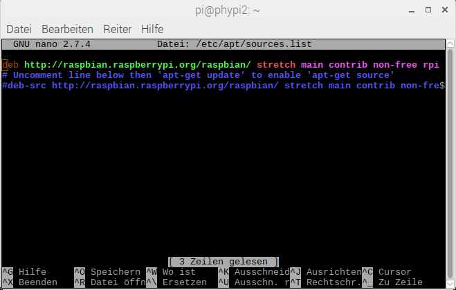
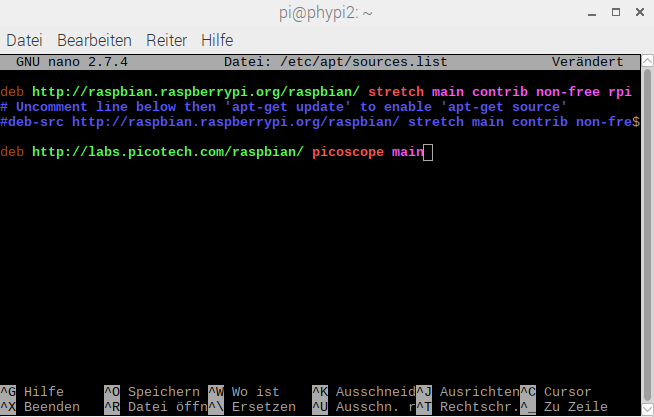

# PhyPiDAQ

#### Datenerfassung und Analyse für die Physikausbildung mit Raspberry Pi

Dieser Code in der Programmmiersprache *python3* bietet einige grundlegende Funktionen zur Datenerfassung und -visualisierung wie Datenlogger, Balkendiagramm, XY- oder Oszilloskopanzeige und Datenaufzeichnung auf Festplatte.

Neben den GPIO Ein- und Ausgängen des Raspberry Pi werden die Analog-Digital-Wandler ADS1115 und MCP3008 sowie USB-Oszilloskope (PicoScope der Firma picotech) als Eingabegeräte für analoge Daten sowie eine Reihe von digitalen Sensoren mit Protokollen wie I²C oder SPI unterstützt.

Das Paket bietet eine Abstraktionsschicht für Messgeräte und Sensoren, die an einen Raspberry Pi angeschlossen sind. Eigene Klassen für jedes Gerät bieten eine einfache, einheitliche Schnittstelle, die nur die Methoden `init(<config_dictionary>)`, `acquireData(buffer)`und `close()` enthalten. Einfache Beispiele mit minimalem Code veranschaulichen die Verwendung. Die grafische Benutzeroberfläche `phypi.py` und das Skript `run_phypi.py` bieten eine konfigurierbare Umgebung für komplexere Messprojekte.

 *Abb. 1*:  Darstellung der Zeitabhängigkeit von zwei Signalquellen an einem AD-Wandler  
 


## Schnellstart

Nach der Installation - siehe unten - steht eine Reihe von einheitlichen Klassen für die Datenerfassung, Visualisierung und Aufzeichnung aus dem Unterverzeichnis
`./phypidaq/` zur Verfügung. Jedes unterstützte Gerät benötigt eine spezifische Konfiguration, die aus Konfigurationsdateien im Unterverzeichnis `./config/` gelesen wird. Die Gesamtkonfiguration wird in Konfigurationsdateien vom Typ `.daq`
angegeben, die spezifizieren, welche Geräte und Anzeigemodule verwendet werden sollen, welche Ausleserate, Kalibrierungen oder analytische Formeln für aufgezeichnete Daten gelten sollen, oder auch Bereiche und Achsenbeschriftungen der grafischen Ausgabe.

Die grafische Benutzeroberfläche `phypi.py` hilft bei der Verwaltung der Konfigurationsoptionen und kann zum Starten der Datenerfassung verwendet werden.
In diesem Fall werden Konfigurationen und erzeugte Datendateien in einem dedizierten Unterverzeichnis in `$HOME/PhyPi` abgelegt. Der Name des Unterverzeichnisses wird von einem benutzerdefinierten Tag und dem aktuellen Datum und der Uhrzeit abgeleitet.

Die Datenerfassung kann auch über die Kommandozeile gestartet werden:

`run_phypi.py <config_file_name\>.daq`

Wenn keine Konfigurationsdatei angegeben ist, wird der Standardwert `PhyPiConf.daq` verwendet.

Das Unterverzeichnis `./examples/` enthält eine Reihe einfacher Python-Skripte, die die Verwendung der bereitgestellten Datenerfassungs- und Anzeigemodule mit minimalem Code veranschaulichen.


## Konfigurationsdateien für PhyPiDAQ

Mit dem Skript `run_phypi.py` können sehr allgemeine Messaufgaben ausgeführt werden, ohne eigenen Code schreiben zu müssen. Die Konfigurationsoptionen für Eingabegeräte und deren Kanäle sowie für die Anzeige- und Datenspeichermodule werden in einer globalen Konfigurationsdatei vom Typ `.daq` angegeben, die Verweise auf Gerätekonfigurationsdateien vom Typ `.yaml` enthält.

Generell entspricht die in den Konfigurationsdateien verwendete Syntax der Markup-Sprache *yaml*. Insbesondere kennzeichnet Text nach einem`#` -Zeichen erklärende Kommentare oder enthält alternative, auskommentierte Konfigurationsoptionen, die durch Löschen des `#` -Zeichens aktiviert werden können.

### Hauptkonfiguration 

Ein typisches, ausführlich kommentiertes Beispiel für die Hauptkonfigurationsdatei sieht wie folgt aus:

**Inhalt der Hauptkonfigurationsdatei `PhyPiConf.daq`**

```yaml
# Konfigurations-Optionen fuer PhyPiDAQ

# Konfigurationsdateien fuer Geraete
DeviceFile: config/ADS1115Config.yaml
#DeviceFile: config/MCP3008Config.yaml
#DeviceFile: config/PSConfig.yaml
#DeviceFile: config/MAX31865Config.yaml
#DeviceFile: config/GPIOCount.yaml
#DeviceFile: config/DS18B20Config.yaml
#DeviceFile: config/MAX31855Config.yaml
## ein Beispiel fuer mehrere Geraete
#DeviceFile: [config/ADS1115Config.yaml, config/ GPIOCount.yaml]

DisplayModule: DataLogger     # zeitlicher Verlauf der Messgroessen
# DisplayModule: DataGraphs   # text, Balkendiagramm, zeitlicher Verlauf und xy-Darstellung
Interval: 0.1                 # Datennahme-Intervall in Sekunden
XYmode:     false             # XY-Darstellung ein/aus 

# Angaben fuer jeden Kanal
ChanLabels: [(V), (V) ]          # Namen und/oder Einheiten fuer jeden Kanal 
ChanColors: [darkblue, sienna]   # Farbzuordnung in der Anzeige

# ggf. werden hier die Informationen aus der Geraete-Konfiguration ueberschrieben 
##ChanLimits: 
## - [0., 1.]   # chan 0
## - [0., 1.]   # chan 1
## - [0., 1.]   # chan 2

# ggf. Kalibration der Rohmessungen
#ChanCalib:
#  - null    oder  - <Faktor> or  - [ [ <wahre Werte> ], [ <Rohwerte> ] ] 
#  - 1.                       # chan0: ein einfacher Faktor fuer Kanal 0
#  - [ [0.,1.], [0., 1.] ]    # chan1: Interpolation [wahr]([roh] )
#  - null                     # chan2: Keine Kalibration

# Formel auf Werte anwenden
#ChanFormula:
#  - c0 + c1     # chan0 = Summe von Kanal 0 und 1
#  - c1          # chan1 : = Kanal 1 (Keine Aenderung)
#  - null        # chan2 : Keine Formel

# Name der Ausgabedatei im CSV-Format
#DataFile:   testfile.csv     # Dateiname
DataFile:   null              #   null falls keine Ausgebe gewuenscht
#CSVseparator: ';'            # Feld-Trenner auf ';' setzen, Vorgabe ist ','

```

### Gerätekonfigurationen 

Die Gerätekonfiguration für den sehr flexibel einsetzbaren Analog-Digital-Wandler **ADS1115** mit 16 Bit Auflösung und Ausleseraten bis zu 860 Hz gibt die aktiven Kanäle und deren Wertebereiche an.

**Inhalt der Konfigurationsdatei `ADS1115Config.yaml`**

```yaml
# Beispiel einer Konfiguration fuer den Analog-Digital-Wandler ADS1115

DAQModule: ADS1115Config    # relevantes phypidaq-Modul 

ADCChannels: [0, 3]         # aktive ADC-Kanaele
                        # moegliche Werte: 0, 1, 2, 3
                        #  in differentiellem Modus:
                            #    -  0 = ADCChannel 0 
                            #            minus ADCChannel 1
                            #    -  1 = ADCChannel 0 
                            #            minus ADCChannel 3
                            #    -  2 = ADCChannel 1 
                            #            minus ADCChannel 3
                            #    -  3 = ADCChannel 2 
                            #            minus ADCChannel 3

DifModeChan: [true, true] # differentiellen Modus einschalten  

Gain: [2/3, 2/3]          # programmierbarer Verstaerkungsfaktor
                          #   moegliche Werte:
                          #     - 2/3 = +/-6.144V
                          #     -   1 = +/-4.096V
                          #     -   2 = +/-2.048V
                          #     -   4 = +/-1.024V
                          #     -   8 = +/-0.512V
                          #     -  16 = +/-0.256V
sampleRate: 860           # programmierbare Datenrate des ADS1115
                          #    moegliche Werte: 
                          #    8, 16, 32, 64, 128, 250, 475, 860
   
```

Das **USB-Oszilloskop** PicoScope kann ebenfalls als Datenlogger eingesetzt werden. In diesem Fall wird über eine Anzahl von Messungen mit sehr hoher Ausleserate gemittelt. Wählt man z.B. ein Messintervall von 20 ms, so wird 50 Hz- Rauschen effizient herausgemittelt.

**Inhalt der Gerätekonfiguration `PSconfig.yaml`**

```yaml
# Konfiguration für PicoScope als Datenlogger

DAQModule: PSConfig  # relevantes phypidaq-Modul 

PSmodel: 2000a       # PicoScope Modell (PS2000a ist die Vorgabe) 

# Konfiguration der Kanäle 
picoChannels: [A, B]   #  Kanal A und B 
ChanRanges: [2., 2.]   # Wertebereich
ChanOffsets: [-1.95, -1.95] # analoger Offset, wir vor Anzeige addiert
ChanModes: [DC, DC]   # Kanal-Kopplung (DC oder AC)
sampleTime: 2.0E-02   # Dauer der Datenaufnahme
Nsamples: 100         # Zahl der Messungen

# trigger
trgActive: false  # Aufnahme ohne Oszilloskop-Trigger
trgChan: A

# Interner Signalgenerator 
frqSG: 0.    # aus 
  
```

Beispiele für andere Geräte, wie den Analog-Digital-Wandler MCP3008, für Ratenmessungen über die GPIO - Pins des Raspberry Pi oder Temperaturmessungen mit dem digitalen 1-Wire Thermometer DS18B20,  PT100-Sensoren am MAX31865 'Resistance-to-Digital Converter' oder mit Thermoelementen (Typ K) am MAX31855 'Thermocouple-to-Digital Converter' sind im Konfigurationsverzeichnis `./config/` enthalten, siehe `MCP3008Config.yaml` , `GPIOcount.yaml`, `DS18B20Config.yaml` , `MAX31865Config.yaml` oder`MAX31855Config.yaml`.

<div style="page-break-after: always;"></div>

## Installation von PhyPiDAQ auf dem Raspberry Pi

Dieses Paket basiert auf Code aus anderen Paketen, die die Treiber für die unterstützten Geräte bereitstellen:

- die Adafruit Python MCP3008 Bibliothek  
    <https://github.com/adafruit/Adafruit_Python_MCP3008>
- die Adafruit Python ADX1x15 Bibliothek  
    <https://github.com/adafruit/Adafruit_Python_ADS1x15>
- die Adafruit Python MAX31855 Bibliothek  
    <https://github.com/adafruit/Adafruit_Python_MAX31855>
- die w1thermsensor Bibliothek von Timo Furrer  
    <https://github.com/timofurrer/w1thermsensor>
- Komponenten des picoDAQ-Projekts  
    <https://github.com/GuenterQuast/picoDAQ>
- das  *python* Interface für die PicoScope Treiber des *pico-python*-Projekts  von Colin O'Flynn  
    <https://github.com/colinoflynn/pico-python>
- die C-Treiber aus dem Pico Technology Software Development Kit  
    <https://www.picotech.com/downloads>

Zur Vereinfachung der Installation werden Installationsdateien
für benötigte externe Pakete und für die Module dieses Pakets  
im *pip*-Wheel-Format im Unterverzeichnis *./whl*/ bereitgestellt .

Die Module zur Visualisierung hängen von *matplotlib.pyplot* , *Tkinter* und *pyQt5* ab, die ebenfalls installiert sein müssen.

Nach dem Einrichten Ihres Raspberry Pi mit dem aktuellen Debian-Release *stretch* sollten die folgenden Schritte in einem Konsolenfenster auf der Kommandozeile durchgeführt werden, um alle erforderlichen Pakete zu installieren:


```bash
sudo apt-get update
sudo apt-get upgrade
sudo apt-get install python3-scipy
sudo apt-get install python3-matplotlib
sudo apt-get install python3-pyqt5
sudo apt-get install libatlas-base-dev # wird benoetigt für neueste Version von numpy

sudo pip3 install pyyaml

# Beziehen des PhyPiDAQ Codes und aller Software-Abhaengigkeiten
mkdir git
cd git
git clone https://github.com/GuenterQuast/PhyPiDAQ
cd PhyPiDAQ/whl
sudo pip3 install *.whl
```

Um die PicoTech-Treiber für PicoScope USB-Geräte zu installieren, muss das picotech-raspbian-Repository hinzugefügt werden:

1. Öffnen Sie die  Datei /etc/apt/sources.list über die Kommandozeile mit `sudo nano /etc/apt/sources.list`.   
2. Navigieren Sie mit den Pfeiltasten in die nächste frei Zeile und ergänzen Sie den Eintrag `deb http://labs.picotech.com/raspbian/ picoscope main` in der Datei  /etc/apt/sources.list.   
3. Speichern Sie die Datei /etc/apt/sources.list mit `Strg + O` und `Enter`.
4. Schließen Sie die Datei /etc/apt/sources.list mit `Strg + X`.

<div style="page-break-after: always;"></div>

Nachdem Sie das PicoTech-Repository hinzugefügt haben, sollten die folgenden Schritte auf der Kommandozeile durchgeführt werden.

```bash
sudo apt-get update
wget -O - http://labs.picotech.com/debian/dists/picoscope/Release.gpg.key | sudo apt-key add -
sudo apt-get install libps2000
sudo apt-get install libps2000a

# Benutzer pi Zugriff auf den USB-Port ermoeglichen
sudo usermod -a -G tty pi
```

**Starten Sie Ihren Raspberry Pi nach der Installation neu!**

### Didaktische Anmerkungen

Schüler oder Studierende zu Beginn mit dem vollen Umfang des Pakets *PhyPiDAQ* zu konfrontieren, ist aus didaktischer Sicht wenig angebracht. Stattdessen wird empfohlen, ein Arbeitsverzeichnis zu erstellen und benötigte Beispiele von dort in ein eigenes Arbeitsverzeichnis zu kopieren. Dies wird durch folgende Befehle erreicht:


```bash
# Erzeugen eines Arbeitsverzeichnissen PhyPi und Kopieren von Beispielen und Konfigurationsdateien in das neu erzeugte Verzeichnis.
cd ~/git/PhyPiDAQ
./install_user.sh

# klickbares Symbol auf dem Desktop zum Zugang zu phypi
cp ~/git/PhyPiDAQ/phypi.desktop ~/Desktop
```

Um versehentliches Überschreiben von Dateien im Paket *PhyPiDAQ* zu vermeiden, sollte eine Verschiebung in den Systembereich in Erwägung gezogen werden, z. B. nach 
/usr/local/:

```bash
sudo mv ~/git/PhyPiDAQ /usr/local/
```

Die Pfade in *~/Desktop/phipi.desktop* müssen dann ebenfalls entsprechend angepasst werden. Dies wird am einfachsten durch Klicken mit der rechten Maustaste auf das *phipi*-Symbol erreicht. Im sich dann öffnenden Menu den Dialog "Eigenschaften" wählen und alle Pfade von  *~/git/*  ->  */usr/local/* ändern.

## Übersicht über Dateien im Paket PhyPiDAQ 

### Programme 

- `run_phypi.py`  
    Datennahme und Anzeige wie in Konfigurationsdateien angegeben (Vorgabe `PhyPiConf.daq` und *.yaml*-Dateien im Verzeichnis *config/*)
- `phypi.py`  
    graphische Oberfläche zum Editieren der Konfiguration und Starten des Skripts `run_phypi.py`

<div style="page-break-after: always;"></div>

### Module

- `phypidaq/__init__.py`  
   Initialisierung für das Paket *phypidaq*

- `phypidaq/_version_info.py`  
    Versionsinformation für das Paket *phypidaq*

- `phypidaq/ADS1115Config.py`  
    Klasse zur Handhabung des Analog-Digital-Wandlers ADS1115

- `phypidaq/DS18B20Config.py`  
    Klasse zur Handhabung des digitalen Thermometers DS18B20

- `phypidaq/MCP3008Config.py`  
    Klasse zur Handhabung des Analog-Digital-Wandlers MCP3008

- `phypidaq/GPIOCount.py`   
    Klasse zur Ratenmessung an GPIO-Pins

- `phypidaq/MAX31855Config.py`  
    Klasse zur Handhabung des Thermolement-nach-digital-Wandlers MAX31855

- `phypidaq/MAX31865Config.py`  
    Klasse zur Handhabung des Widerstand-nach-digial-Wandlers MAX31865

- `phypidaq/PSConfig.py`  
    Klasse für PicoScope USB-Oszilloskope

- `phypidaq/mpTkDisplay.py`  
    Hintergrund-Prozess zur Datenvisualisierung

- `phypidaq/DataLogger.py`  
    Klasse zur Anzeige von Datenverlauf und xy-Diagrammen

- `phypidaq/DataGraphs.py`  
    allgemeine Klasse zur Anzeige von Balkendiagrammen, Datenverläufen und xy-Diagrammen

- `phypidaq/DataRecorder.py`  
    Speichern von Daten im CSV-Format

### Konfigurationsdateien

- `PhyPiConf.daq`  
     Haputkonfigurationsdatei, hängt von Dateien im Unterverzeichnis *config/* ab
- `config/ADS1115Config.yaml`
- `config/DS18B20Config.yaml`
- `config/GPIOCount.yaml`
- `config/MAX31855Config.yaml`
- `config/MAX31865Config.yaml`
- `config/MCP3008Config.yaml`
- `config/PSConfig.yaml`

<div style="page-break-after: always;"></div>

### Beispiele

- `examples/read_analog.py`  
    sehr minimalistisches Beispiel zum Auslesen eines Kanals von einem Analog-Digital-Wandler
- `examples/runOsci.py`  
    Oszillographenanzeigen wie in *.yaml*-Datei zur Konfiguration angegeben (Vorgabe `PSOsci.yaml`)
- `examples/poissonLED.py`  
    erzeugt ein zufälliges Signal an GPIO-Pin gemäß Poisson-Prozess 
- `examples/FreqGen.py`  
    erzeugt Signal fester Frequenz an GPIO-Pin


### Dokumentation

- `doc/Kurs_digitale_Messwerterfassung_mit_PhyPiDAQ.md  (.pdf)`  
    Einführungskurs für Schüler zum Messen mit dem Raspberry Pi
- `doc/Einrichten_des_Raspberry_Pi.md (.pdf)`   
    Aufsetzen des Raspberry Pi für dieses Projekt
- `doc/Komponenten_fuer_PhyPi.md (.pdf)`   
    empfohlene Komponenten für dieses Projekt

