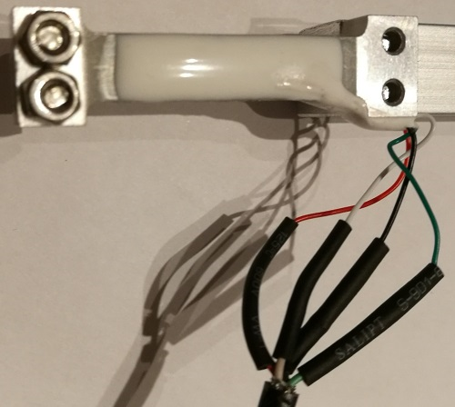

# Bauanleitung eines Kraftsensors auf Basis der Wägezelle TAL221

## 1. Montage der Anschlussleitung an der Wägezelle
1. Schneiden Sie das USB-Kabel in gewünschter Länge als Anschlusskabel für den Kraftsensor ab und entfernen Sie die Ummantelung an einem Ende auf einer Länge von ca. 2 cm.

   

2. Schneiden Sie die Anschlussleitungen der Wägezelle so ab, dass noch ca. 3 bis 4 cm der Leitungslänge übrig bleiben.

3. Isolieren Sie alle Leitungen jeweils auf einer Länge von ca. 3 mm ab und verzinnen Sie diese mit dem Lötkolben.

4. Stülpen Sie für jede Leitung ein kurzes Stück Schrumpfschlauch (&Oslash; 2,4 mm) über das freie Leitungsende der Wägezelle und verbinden Sie durch Löten die gleichfarbigen Leitungen der Wägezelle und des USB-Kabels.

   

5. Schieben Sie den Schrumpfschlauch über die Lötstelle und schrumpfen Sie diesen mit einem Fön auf.

6. Wiederholen Sie den Vorgang für die anderen drei Anschlussleitungen.

   

   7. Schieben Sie ein ca. 5 cm langes Stück Schrumpfschlauch (&Oslash; 6,4 mm) über die zusammengelöteten Leitungen und schrumpfen Sie diesen mit dem Fön auf.

   

## 2. Anschlüsse für Breadboard vorbereiten

1. Zerschneiden Sie Breadboarleitungen in den Farben der Leitungen des USB-Kabels, sodass Sie Stücke zu je ca. 4 cm Länge zuzüglich des Anschlusspins erhalten und isolieren sie die Enden auf einer Länge von ca. 3 mm ab.

2. Gehen Sie beim Zusammenlöten der Breadboardleitungen mit dem USB-Kabel in gleicher Weise vor wie beim Anschluss an der Wägezelle, sodass Sie als Ergebnis Anschlussleitungen wie nachfolgend dargstellt erhalten.

   

## 3. Fertigung Sensorhalter

Den Vierkantstab (12 x 12 mm) entsprechend der nachfolgenden Zeichnung ablängen und mit zwei Bohrungen für die Befestigung des Sensors am Sensorhalter versehen.

## 3. Montage der Wägezelle am Sensorhalter

1. Schrauben Sie die Wägezelle mit Linsenkopfschrauben M3 x 16 am Sensorhalter fest.

2. Befestigen Sie das Anschlusskabel mit zwei Kabelbindern am Sensorhalter. Die zwei Kabelbinder dienen als Zugentlastung für die Anschlussleitungen der Wägezelle.

3. Biegen Sie mit einer Spitzzange aus dem Kupferdraht der 6 mm&sup2; Leitung eine Aufhängeöse und kleben Sie diese anschließend mit Zweikomponentenklebstoff in die Wägezelle ein.

4. Nachfolgend ist der fertig montierte Kraftsensor dargstellt.

