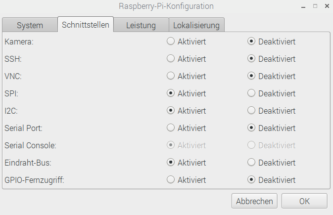
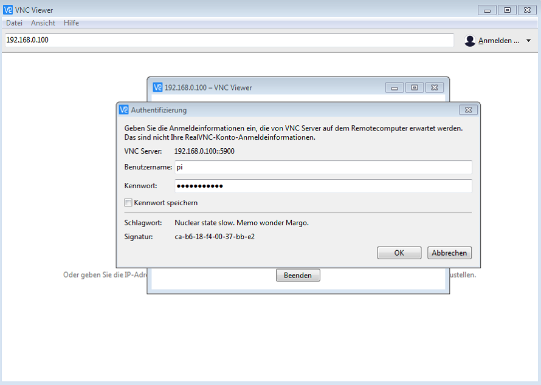

# Einrichten des Raspberry Pi
Die nachfolgende Anleitung befasst sich mit den Vorarbeiten, die vor der Erstinbetriebnahme des Raspberry Pi durchgeführt werden müssen. Das Vorbereiten der Micro-SD-Karten sollte beim Einsatz in der Schule möglichst gesammelt einmal im Vorfeld durchgeführt werden, sodass mit den Schülern direkt gestartet werden kann. Die Anleitung ist sehr ausführlich gehalten. Durch Hervorhebungen ist die Anleitung so gestaltet, dass diese auch durch Überfliegen verständlich ist.

## 1. Micro-SD-Karte mit Raspian Betriebssystem beschreiben
Für die Inbetriebnahme des Raspberry Pi ist es notwendig, das zugehörige **Betriebssystem Raspian** auf die Micro-SD-Karte zu schreiben. Nachfolgend sind die durchzuführenden Schritte aufgeführt:

1. Rufen Sie über den [Link](https://www.raspberrypi.org/downloads/)  die offizielle Downloadseite des Betriebssystems Raspian auf und laden Sie dieses herunter:

   - auf **Raspian** klicken.  
     

   - unter **RASPIAN STRETCH WITH DESKTOP** auf **Download ZIP** klicken.  
     

2. Da das heruntergeladene Betriebssystem für den Raspberry als komprimierte ZIP-Datei vorliegt, muss diese vor dem Beschreiben der Micro-SD-Karte entpackt werden. Da es aufgrund der Dateigröße mit verschiedenen Programmen zum Entpacken von ZIP-Dateien zu Problemen kommen kann, wird empfohlen, diesen Schritt mit dem Programm **7Zip** durchzuführen. Sollte das genannte Programm  auf Ihrem PC nicht installiert sein, können Sie dieses über diesen [Link](https://www.7-zip.org/download.html) herunterladen und darauffolgend installieren.

   - **Entpacken** Sie die **ZIP-Datei** in ein Verzeichnis Ihrer Wahl. 

3. Um eine **startfähige Micro-SD-Karte** für den Raspberry zu erhalten, muss diese jetzt noch mit dem entpackten **Image des Betriebssystems** beschrieben werden:

   - **Laden** Sie den [Win32-Disk-Imager](https://sourceforge.net/projects/win32diskimager/) (alternativ [Etcher](https://etcher.io/) für andere Betriebssysteme als Windows) herunter und **installieren** Sie das Programm.

   - Führen Sie das Programm **Win32-Disk-Imager** aus. Wählen Sie die entpackte **Image-Datei** und die **Micro-SD-Karte** unter **Datenträger** aus. Starten Sie den **Schreibvorgang**.

   - Bestätigen Sie den Schreibvorgang mit **Yes**.   
       

     

   - Bestätigen Sie den erfolgreichen Schreibvorgang mit **OK**. Entnehmen Sie die **Micro-SD-Karte** sicher und stecken Sie diese in den **Micro-SD-Karten-Steckplatz** auf der **Unterseite** des Raspberry Pi.  
     

**Der Raspberry Pi ist jetzt bereit für die Erstinbetriebnahme!**  

## 2. Erstinbetriebnahme
Für die Erstinbetriebnahme wird der Raspberry Pi über die HDMI-Schnittstelle mit einem Bildschirm verbunden. Außerdem sind eine USB-Tastatur und eine USB-Maus anzuschließen.
Nachfolgend sind die einzelnen Schritte für die Inbetriebnahme aufgeführt:

 1. Falls noch nicht geschehen, die mit dem **Betriebssystem-Image** beschriebene **Micro-SD-Karte** in den dafür vorgesehenen **Micro-SD-Karten-Steckplatz** auf der Unterseite des Raspberry Pi stecken.
 2. Den **Bildschirm**, die **Tastatur** und die **Maus anschließen**.
 3. Den Raspberry Pi durch **Verbinden** mit der **Spannungsversorgung** auf dem Breadboard **starten**. Der Raspberry Pi hat keinen Ein- bzw. Ausschaltschalter, sondern wird durch Verbinden mit der Spannungsversorgung gestartet.

  4. Nachdem der Raspberry Pi gestartet ist und sich das Betriebssystem von der Micro-SD-Karte geladen hat, wird man mit dem Startbildschirm begrüßt und es wird die Grundkonfiguration durch Klicken auf **Next** gestartet.  

 5. Als erstes sind die Einstellungen für **Tastatur**, **Sprache** und **Zeitzone** wie in der nachfolgenden Abbildung dargestellt vorzunehmen und mit **Next** zu bestätigen.  
     

 6. Im nächsten Schritt ist ein **neues Passwort** für den Raspberry Pi zu vergeben  und mit **Next** zu bestätigen. Verwenden Sie nicht das Passwort raspberry! Dies ist das Standardpasswort aller Raspberry Pi und entsprechend unsicher.  
     

 7. **WLAN** wählen und mit **Next** bestätigen.  
     

 8. **WLAN-Passwort** eingeben und mit **Next** bestätigen.  
        

 9. Im nächsten Schritt muss das **Betriebssystem** durch Klicken auf **Next** **aktualisiert** werden (Internetverbindung notwendig).  
  
Der Aktualisierungsprozess kann unter Umständen einige Minuten in Anspruch nehmen.  
  
Bestätigen Sie die erfolgreiche Aktualisierung mit **OK**.  
  

 10. **Starten** Sie den Raspberry Pi über **Reboot** neu und beenden Sie damit die Grundkonfiguration des Raspberry Pi.  

 11. Für die Kommunikation des Raspberry Pi mit verschiedenen **Sensoren** sind noch Schnittstellen zu aktivieren. Hierzu rufen Sie über den Reiter **Einstellungen** die **Raspberry Pi Konfiguration** auf.  
  
 12. Aktivieren Sie unter **Schnittstellen SPI** und **I2C** und bestätigen die Konfiguration mit **OK**.  
  

## 3. Fernzugriff (VNC) einrichten
Es besteht die Möglichkeit, bequem von anderen Geräten wie einem Laptop, Tablet oder Smartphone auf den Raspberry Pi aus der Ferne zuzugreifen. So ist es nicht notwendig, für jeden Raspberry Pi einen Bildschirm, eine Tastatur und eine Maus bereitzustellen und das System kann mit einer Powerbank als Spannungsversorgung auch mobil eingesetzt werden.  
  
Damit ein Fernzugriff auf den Raspberry Pi erfolgen kann ist es notwendig, dass dieser sich in einem gemeinsamen WLAN mit dem entsprechenden Laptop etc. befindet. Hier bietet es sich an, einen kleinen, tragbaren WLAN-Router, wie den [tragbaren AC750-WLAN-Router TL-WR902AC](https://www.tp-link.com/de/products/details/TL-WR902AC.html) von tp-link zu verwenden. Dieser kann unabhängig vom Schulnetz betrieben werden und ist durch eine Spannungsversorgung über eine Powerbank mobil einsetzbar. Außerdem ist er sehr handlich und kann bei Bedarf mit dem LAN oder WLAN der Schule verbunden werden, um den Schülern den Zugang zum Internet zu ermöglichen. Um den Fernzugriff auf den Raspberry Pi zu ermöglichen, sind einige Konfigurationsschritte erforderlich, die im Folgenden aufgeführt sind.

### 3.1 Raspberry Pi für VNC konfigurieren 

 1. Rufen Sie über den Reiter **Einstellungen** die **Raspberry Pi Konfiguration** auf. 
   

 2. **Ändern** Sie den **Hostnamen** des Raspberry Pi bspw. in Raspi plus eine fortlaufende Nummer (Raspi1,...).  

 3. **Aktivieren** Sie unter **Schnittstellen** den **VNC**-Server des Raspberry Pi, über den später der Fernzugriff erfolgt und bestätigen Sie die Änderungen mit **OK**.  
    

 4. Die **erfolgreiche Aktivierung** des VNC-Servers lässt sich oben rechts auf dem Bildschirm durch das neu erschienene **VNC-Sysmbol** erkennen.  
    

### 3.2 Mobilen WLAN-Router konfigurieren
Grundsätzlich kann der Fernzugriff über jedes LAN oder WLAN erfolgen. Für die sichere und reproduzierbare Verbindung des Raspberry Pi mit dem jeweiligen Anzeigegerät ist es sinnvoll, jedem Raspberry Pi eine feste IP-Adresse zuzuweisen. Da die IP-Adressen in einem Netzwerk im Normalfall dynamisch vergeben werden und somit nach jedem Neustart variieren können, ist es notwendig, Vorkehrungen in der Konfiguration des WLAN-Routers vorzunehmen. Die Beschreibung der Konfiguration erfolgt am Beispiel des empfohlenen tragbaren WLAN-Routers TL-WR902AC.

 1. Verbinden Sie den **WLAN-Router** mit der **Spannungsversorgung** und starten Sie ihn damit.

 2. **Verbinden** Sie den Raspberry Pi, für den der Fernzugriff eingerichtet werden soll, mit dem **5G-WLAN**, dessen **Namen (SSID)** und **Passwort** auf der **Rückseite** des Routers aufgedruckt sind. Hierfür rechts oben auf dem Bildschirm auf das WLAN-Symbol klicken und das entsprechende Netzwerk auswählen. Das zugehörige Passwort wird darauffolgend abgefragt.

 3. **Verbinden** Sie sich sich über [http://tplinkwifi.net](http://tplinkwifi.net) mit dem **Router** und loggen Sie sich mit dem **Username: admin** und **Password: admin** ein.

 4. Um später unerwünschte Zugriffe auf die Konfiguration und damit Störungen zu vermeiden, sollten Sie nun den **Benutzernamen** und das **Passwort** ändern. Wählen sie hierzu **System Tools** und darauffolgend **Password** aus. Nun können Sie einen **neuen Benutzernamen** und ein **neues Passwort** vergeben und mit **Save** speichern. 

 5. Um nun eine **feste IP-Adresse** für den Raspberry Pi zu **vergeben**, wird zuerst über **DHCP** und den Unterpunkt **DHCP Clients List** eine Liste aller im mit dem Netzwerk verbundenen Geräte aufgerufen. Hier erscheint auch der Raspberry Pi  mit dem Hostnamen, der im Vorfeld bei der Konfiguration vergeben wurde. **Kopieren** Sie die **MAC-Adresse** des Raspberry Pi.  

 6. Rufen Sie nun den Unterpunkt **Address Reservation** auf und **reservieren** Sie eine **feste IP-Adresse für den Raspberry Pi**. Klicken Sie hierzu **Add New**.  
  

 7. Fügen Sie die zuvor kopierte **MAC-Adresse** ein, vergeben Sie **aufsteigend von 192.168.0.100** IP-Adressen für den verwendeten Raspberry Pi und wählen Sie unter Status **Enabled** aus. Bestätigen Sie den Vorgang mit **Save**.  
  
Ab dem nächsten Neustart des Routers wird dem Raspberry Pi nun die reservierte IP-Adresse zugewiesen, sodass er unter dieser zuverlässig im Netzwerk erreichbar ist.

 8. Versehen Sie den Raspberry Pi mit einem **Aufkleber**, auf dem der **Hostname** und die **IP-Adresse** vermerkt sind.

9. Reservieren Sie in gleicher Weise **feste IP-Adressen** für **alle weiteren Raspberry Pi**, die verwendet werden sollen und loggen Sie sich anschließend aus.  

### 3.3 VNC-Viewer auf dem Anzeigegerät  einrichten
Um den Fernzugriff auf den Raspberry Pi vom jeweiligen Anzeigegerät zu ermöglichen, ist ein VNC-Viewer auf diesem notwendig. Im Folgenden wird die Installation und Einrichtung des VNC-Viewers **REALVNC** gezeigt, der für alle gängigen Betriebssysteme verfügbar ist.  

1. **Laden** Sie sich den [REALVNC-Viewer](https://www.realvnc.com/de/connect/download/viewer/windows/) **herunter** und **installieren** Sie diesen auf dem Anzeigegerät. Bei Verwendung von **Tablets** oder **Smartphones** erfolgt der Download über den **App Store** bzw. den **Google Play Store**. Die nachfolgende Einrichtung bezieht sich auf einen Windows PC. Sie erfolgt aber in allen Systemen in ähnlicher Form.  

2. **Installieren** Sie den **VNC-Viewer** und **öffnen** Sie diesen.  

3. Geben Sie in die Suchzeile **VNC Server-Adresse eingeben oder suchen** die **IP-Adresse** des zu verbindenden **Raspberry Pi** ein und bestätigen mit **Enter**.  

4. **Authentifizieren** Sie sich mit dem **Benutzer pi** und dem jeweiligen **Passwort** und bestätigen Sie mit **OK**.  

 5. Jetzt haben Sie über VNC **Fernzugriff** auf den **Raspberry Pi** und können komfortabel vom jeweiligen **Anzeigegerät** aus auf dem Raspberry Pi arbeiten.  

 6. Wenn Sie nun wieder auf die **Hauptseite** des VNC-Viewers wechseln, können Sie über **Rechtsklick** auf die gerade angelegte Verbindung und Auswahl des Unterpunktes **Eigenschaften** der Verbindung noch einen **Namen** (zuvor festgelegter Hostname des Raspberry Pi) zuweisen und mit **OK** bestätigen.  

Auf diese Weise lassen sich über die festgelegten IP-Adressen für jeden Raspberry Pi Verbindungen anlegen, die sich durch **Doppelklick** auf die jeweilige **Verbindung starten** lassen.

## 4. Bildschirmauflösung an das Anzeigegerät anpassen
Da bei einer Verbindung des Anzeigegeräts über **VNC** mit dem Raspberry Pi die **Bildschirmauflösung nicht automatisch angepasst** wird, muss diese so festgelegt werden, dass **angenehm** gearbeitet werden kann.

 1. Öffnen Sie oben links die **Kommandozeile**.   
  
 2. Wechseln Sie mit dem nachfolgenden Befehl `sudo raspi-config` in die **Konfiguration** des Raspberry Pi.  
  

 3. Wählen Sie Punkt 7 **Advanced Options** aus.  
  

 4. Wählen Sie Punkt A5 **Resolution** aus.  
  

 5. Unter den aufgeführten **Auflösungen** ist nun eine Auflösung zu **wählen** und mit **OK** zu bestätigen.  Die zu wählende Auflösung richtet sich nach dem verwendeten Anzeigegerät und sollte so festgelegt werden, dass an diesem angenehm gearbeitet werden kann. Für einen Laptop mit 14 Zoll Bildschirmdiagonale bietet sich bspw. die Auflösung **DMT Mode 85 1280x720 60Hz 16:9** an.  
  

6. Beenden Sie die Konfiguration über **Finish**.  
  

7. Anschließend muss der Raspberry Pi über **Ja** neu gestartet werden, um die vorgenommene Änderung wirksam zu machen.  
  

## 5. Installation PhyPiDAQ
Die Installation von **PhyPiDAQ** erfolgt über die **Kommandozeile** (siehe 4.). Dazu folgen Sie bitte der Anleitung in der [README_de.md](../README_de.md) bzw. [README_de.pdf](../README_de.pdf) unter dem Punkt ***Installation von PhyPiDAQ auf dem Raspberry Pi***.

## 6. Systemabbild als Backup und für die Installation mehrerer Raspberry Pi mit identischer Konfiguration
Um nicht für jeden einzurichtenden Raspberry Pi alle Konfigurationsschritte durchführen zu müssen und eine Sicherung des konfigurierten Zustandes vorzunehmen, ist es sinnvoll, ein Systemabbild (Image) zu erzeugen und zu sichern. Da die meisten Lehrer und Schulen mit Windows Computern arbeiten, wird das Vorgehen anhand dieses Betriebssystems erläutert.

 1. Stecken Sie die **Micro-SD-Karte**, von der das Systemabbild erzeugt werden soll, in den vorgesehen **Steckplatz** Ihres Computers oder in einen entsprechenden USB-Adapter. 
 2. **Führen** Sie den **Win32-Disk-Imager** aus und legen Sie eine **Image-Datei** an. Wählen Sie unter **Datenträger** die **Micro-SD-Karte** aus und starten sie das Erzeugen des Systemabbilds über **Lesen**.  
  

 3. Das Erzeugen des Systemabbilds nimmt einige Minuten in Anspruch. Bestätigen Sie das erfolgreiche Erzeugen des Systemabbilds mit **OK**. Sie können nun Micro-SD-Karten mit diesem Systemabbild beschreiben und sich so eine bestimmte Konfiguration eines Raspberry Pi klonen bzw. einen Raspberry Pi auf diesen Zustand zurücksetzen.  
  

## 7. Systemabbild auf Micro-SD-Karte schreiben
Nachfolgend wird beschrieben, wie Sie ein gesichertes **Systemabbild (Image)** auf eine Micro-SD-Karte **schreiben** können. Dies ist auch dann  sinnvoll, wenn Sie weitere Raspberry Pi mit **identischer Grundkonfiguration** verwenden wollen. Hier bietet es sich an, ein zuvor erstelltes **Systemabbild** (siehe 6.) eines einzelnen Raspberry Pi auf eine entsprechende Anzahl an **Micro-SD-Karten** zu **klonen**, um sich den Aufwand des mehrmaligen Konfigurierens zu ersparen. 

 1. Starten Sie den **Win32-Disk-Imager**. Wählen Sie das zuvor gesicherte **Systemabbild** unter **Image-Datei** und die zu beschreibende **Micro-SD-Karte** unter **Datenträger** aus. Starten Sie daraufhin den Schreibvorgang über **Schreiben**.
 2. Entfernen Sie die **Micro-SD-Karte** sicher, stecken Sie diese in den **Micro-SD-Karten-Steckplatz** auf der **Unterseite** des Raspberry Pi und starten Sie den Raspberry Pi.  
 3. Wenn Sie einen Raspberry Pi nur auf einen zuvor gesicherten Systemzustand zurücksetzen wollen, sind Sie an dieser Stelle fertig. Wollen Sie hingegen ein **Systemabbild klonen** und auf einem anderen Raspberry Pi verwenden, muss noch der **Hostname** geändert werden **(siehe 3.1)**. Wenn Sie von einem anderen Gerät über VNC auf den Raspberry Pi zugreifen wollen, sollten Sie dem geklonten Raspberry Pi außerdem in der **Konfiguration des WLAN-Routers** eine **feste IP-Adresse** zuweisen **(siehe 3.2)**.