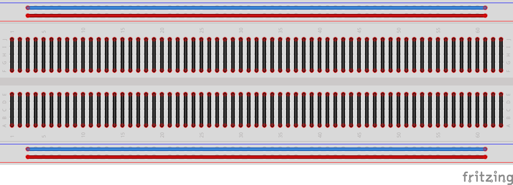
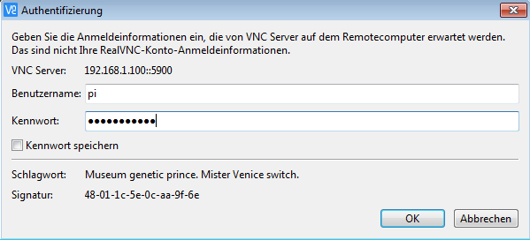
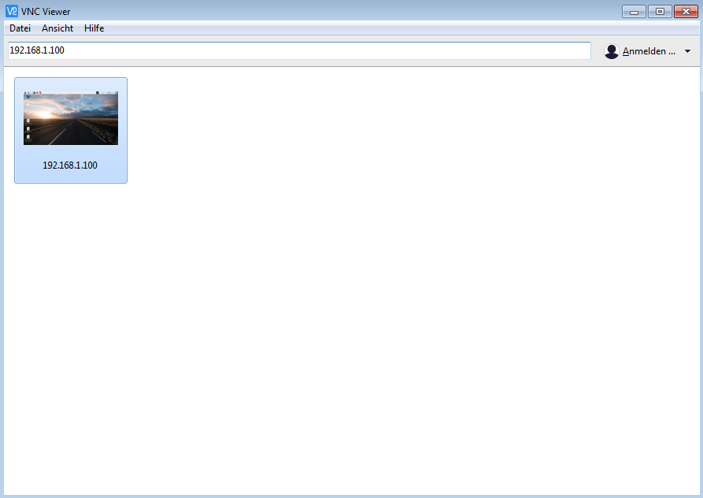
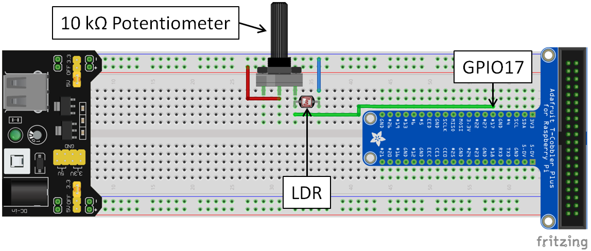
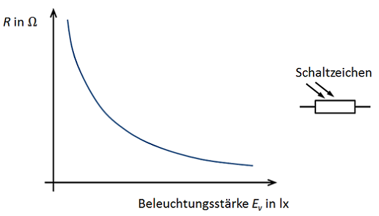
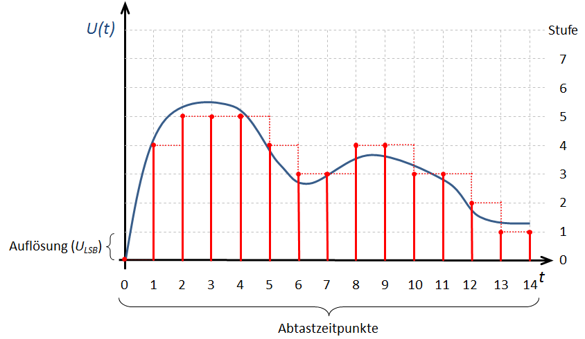
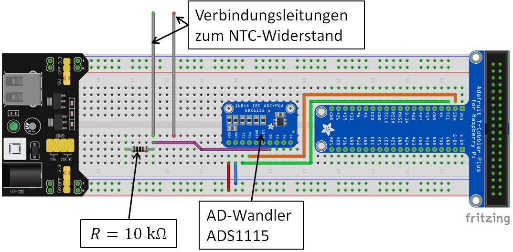

# 1. Übersicht Komponenten
Hier entsteht eine Übersichtsseite mit Bildern aller relevanten Komponenten:  
**Widerstand**  
**Fotowiderstand LDR**  
**NTC-Widerstand**  
**Potentiometer**  
**Raspberry Pi**  
**Breadboard**  
**Breadboard Leitungen**  
**Flachbandkabel**


# 2. Digitale Messtechnik

Digitale Messtechnik begegnet uns im Alltag überall. Die digitale Temperaturanzeige am Gefrierschrank, eine Pulsuhr beim Sport, eine digitale Küchenwaage oder die Einparkhilfe beim Auto...unsere Welt wäre eine andere ohne digitale Messtechnik!

<span style="color:#5882FA; font-size: 12pt">Aufgabe 1: </span> Nennen Sie drei weitere Geräte oder Anwendungen, in denen digitale Messtechnik vorkommt und nennen Sie die physikalische Größe, die dabei gemessen wird.


|  |Gerät / Anwendung| physikalische Größe|
|--|--------------------------|---------------------------|
|1.|                               |                                |
|2.|                               |                                |
|3.|                               |                                |

# 3. Das Breadboard und die LED

### Einführung 
In den nächsten Stunden befassen wir uns damit, wie man digitale Messwerte erfassen und verarbeiten kann. Wir nutzen dabei ein Breadboard, auf dem wir die Schaltungen stecken sowie LEDs als Leuchtmittel. Zunächst schauen wir uns an, wie diese einzusetzen sind.

### Die LED


In unserem Projekt verwenden wir keine Glühlampen, sondern LEDs, wenn wir etwas optisch anzeigen wollen. **LED** ist die Abkürzung für  **L**ight **E**mitting **D**iode, was auf Deutsch so viel bedeutet wie Licht emittierende bzw. aussendende Diode. Um die LED zum Leuchten zu bringen, kann diese im Gegensatz zu einer Glühlampe nicht einfach an eine Spannungsversorgung angeschlossen werden.
Es sind **zwei Dinge** zu beachten:

  1. Die LED muss immer mit einem **Widerstand (Vorwiderstand) in Reihe** betrieben werden, da sie sonst zerstört wird.
  2. Die LED ist eine Diode und kann in Durchlass- oder in Sperrrichtung angeschlossen werden. Sie hat also eine **Anode** (Pluspol) und eine **Kathode** (Minuspol). Soll die **LED leuchten**, muss sie in Durchlassrichtung geschaltet werden, d.h. die **Anode** muss am **höheren Potential** angeschlossen werden. 

### Das Breadboard
Auf dem Breadboard bauen wir unsere Schaltungen auf. Um die Schaltungen stecken zu können ist es wichtig zu wissen, wie das Breadboard aufgebaut ist.
In der nachfolgenden Abbildung sind die elektrisch verbundenen Steckkontakte durch Linien gekennzeichnet.  

<span style="color:#5882FA; font-size: 12pt">Aufgabe 1: </span> In welcher der nachfolgend abgebildeten Schaltungen leuchtet die LED? Begründe.  

**Schaltung 1:**
  
**Schaltung 2:**


  

**Schaltung 3:**


&nbsp;
------


&nbsp;
------


&nbsp;
------


&nbsp;

# 4. Was bedeutet digitales Messen?  

Bevor wir richtig loslegen können, müssen wir uns zuerst damit befassen, wie der Raspberry Pi mit seiner Umwelt kommuniziert. Der Raspberry Pi verfügt über **GPIO**-Pins (**g**eneral **p**urpose **i**nput/**o**utput). Über diese kann er mit seiner Umgebung kommunizieren. Die GPIO-Pins sind durchnummeriert und über das bunte, mehrfarbige Flachbandkabel mit dem Breadboard verbunden. Es gibt zum einen Pins zur Spannungsversorgung mit 5V und 3,3V sowie GND (0V) und klassische GPIO-Pins, die zur Kommunikation dienen. Jeder Pin kann die digitalen **Zustände 1 (true = wahr) oder 0 (false = falsch)** annehmen und sowohl als **Eingang (input)** als auch als **Ausgang (output)** des Raspberry Pi verwendet werden. 

Damit wir über die GPIO-Pins mit dem Raspberry Pi kommunizieren können, müssen wir zuerst untersuchen, wie der Raspberry Pi zwischen den beiden Zuständen 0 und 1 unterscheidet. Dazu bauen wir nun eine Schaltung auf und schreiben unser erstes kleines Programm. 

### GPIO-Pin


**Material:**

 + 10 k&Omega; Potentiometer
 + Breadboard mit Spannungsversorgung und Netzteil
 + Breadboard-Leitungen in verschiedenen Farben
 + Voltmeter
 + Raspberry Pi
 + Flachbandkabel

**Durchführung:**

<span style="color:#5882FA; font-size: 12pt ">1. </span>Stecken Sie die Schaltung gemäß des  nachfolgenden Schaltplans und der Abbildung des Schaltungsaufbaus auf dem Breadboard und schließen Sie das Netzteil an die Spannungsversorgung des Breadboards an.  
Mit Hilfe des Potentiometers kann die elektrische Spannung am Eingangspin GPIO17 in einem Bereich zwischen 0 und 3.3V eingestellt werden. Das Voltmeter wird über die beiden Leitungen zu den Bananenbuchsen so angeschlossen, dass die Spannung zwischen dem Schleifer (dem mittleren Pin) des Potentiometers und GND (0V) gemessen werden kann.


<span style="color:#5882FA; font-size: 12pt ">2. </span>Für alle, die am Raspberry Pi mit Bildschirm, Tastatur und Maus arbeiten wollen (wer stattdessen mit dem VNC-Viewer per Fernzugriff arbeiten möchte, kann direkt zu Schritt 3 übergehen): Schließen Sie Bildschirm, Tastatur und Maus an den Raspberry Pi an.

<span style="color:#5882FA; font-size: 12pt ">3. </span>Nun müssen wir den Raspberry Pi über das Flachbandkabel mit dem Breadboard verbinden. Der Raspberry Pi hat keinen Ein-/Ausschalter, sondern wird einfach durch Verbinden mit der Spannungsversorgung gestartet. 


<span style="color:#5882FA; font-size: 12pt ">4. </span>Für alle, die mit dem VNC-Viewer per Fernzugriff arbeiten möchten (wer stattdessen mit Bildschirm etc. direkt am Raspberry Pi arbeitet, kann direkt zu Schritt 5 übergehen):  
Wenn der Raspberry Pi gestartet ist, können wir uns vom Laptop (oder einem anderen Anzeigegerät) aus über den VNC-Viewer mit dem Raspberry Pi verbinden:

+ Als erstes den VNC-Viewer aufrufen.

  

+ Als nächstes oben in die Zeile die IP-Adresse des verwendeten Raspberry Pi eingeben (steht auf einem Zettel auf dem Raspberry Pi) und mit Enter bestätigen. 

+ Nun wird über das WLAN mit dem Raspberry Pi eine Verbindung aufgebaut und es sollte das nachfolgend dargestellte Fenster auftauchen. Hier muss nur noch der der Benutzername pi und das Kennwort (steht auf dem Raspberry Pi) angegeben werden und die Verbindung mit OK gestartet werden.

  

+ Wenn alles richtig angegeben wurde, sieht man jetzt die Bildschirmansicht des Raspberry Pi und kann über den VNC-Viewer mit dem Raspberry Pi arbeiten.

  

+ Für das nächste Mal ist die Verbindung jetzt schon angelegt und kann zukünftig mit einem Doppelklick auf das Bildschirmsymbol mit der passenden IP-Adresse gestartet werden.

  

<span style="color:#5882FA; font-size: 12pt ">5. </span>Um herauszufinden, welchen Zustand der GPIO-Pin 17 hat und uns diesen Zustand anzeigen zu lassen, schreiben wir nun unser erstes kleines Programm:

- Dazu öffnen wir als erstes die Kommandozeile, über die wir direkt über Befehle mit dem Raspberry Pi kommunizieren können.

  

- Durch eingeben des Befehls ```mkdir MeineProgramme``` und bestätigen mit **Enter** erzeugen wir ein neues Verzeichnis "Meine Programme", in dem wir unsere Programme speichern.

- Mit dem Befehl ```cd MeineProgramme```  und bestätigen mit **Enter** wechseln wir dann in dieses Verzeichnis.

- Jetzt können wir in unserem Verzeichnis mit dem Befehl ```idle digital.py```  eine Datei für unser erstes Programm erzeugen.

- In diese Datei (also nicht in die Kommandozeile) schreiben wir unseren ersten Programmcode:

  Alles was im Programm hinter einem Hashtag # - Symbol steht ist ein erklärender Kommentar zur Programmzeile davor und keine Aufforderung zu twittern.

  ```python
  import RPi.GPIO as GPIO # Wir importieren die Bibliothek GPIO.
  import time # Wir importieren die Bibliothek "time".
  GPIO.setmode(GPIO.BCM) # Wir geben an, wie die GPIO-Pins nummeriert sind.
  GPIO.setup(17, GPIO.IN) # GPIO-Pin 17 wird als Eingang festgelegt.
  
  while True: # Dauerschleife (alles eingerueckte danach wird wiederholt).
  	print("Status GPIO17:") # Wir geben den Text "Status GPIO17:" aus.
  	print(GPIO.input(17)) # Wir geben den Zustand des GPIO-Pin 17 aus.
  	time.sleep(0.1) # Wir warten 0.1 s (Raspberry Pi "schlaeft").
  ```

<span style="color:#5882FA; font-size: 12pt ">6. </span>Bevor wir unser Programm starten können, müssen wir die Datei noch speichern und schließen.


<span style="color:#5882FA; font-size: 12pt ">7. </span>Mit ```python3 digital.py``` starten wir über die Kommandozeile unser Programm und bekommen jetzt alle 0,1 Sekunden den Zustand des GPIO-Pins 17 angezeigt. 

<span style="color:#5882FA; font-size: 12pt ">8. </span>Drehen Sie am Potentiometer und verändern Sie damit die Spannung am GPIO-Pin 17. Notieren Sie Ihre Beobachtungen.


&nbsp;
------


&nbsp;
------


&nbsp;
------


&nbsp;

<span style="color:#5882FA; font-size: 12pt ">9. </span>Alles was eingerückt (nach Zeile 6) in unserer Dauerschleife ```while(True):```  steht, wird jetzt immer weiter wiederholt. Wenn wir unser Programm beenden wollen, müssen wir also unsere Dauerschleife unterbrechen. Dafür drücken wir gleichzeitig ```Strg + c```.

<span style="color:#5882FA; font-size: 12pt ">10. </span>Formulieren Sie einen Merksatz: Was muss für die Spannung zwischen dem GPIO-Pin 17 und GND (0V) gelten, wenn der GPIO-Pin 17 den Zustand 1 (true) bzw. 0 (false) besitzt?


&nbsp;
------


&nbsp;
------


&nbsp;
------


&nbsp;
------


&nbsp;

<span style="color:#5882FA; font-size: 12pt ">11. </span>Was bedeutet also digitales Messen?
Wählen Sie aus den folgenden Begriffen die passenden aus und vervollständigen Sie den Lückentext.

abzählbare, analog, digital, false, kontinuierliche, ganzzahlige, GPIO-Pin, Raspberry Pi, true, stufenlose

Digitales Messen bedeutet, dass Messwerte in Stufen erfasst werden. Ein digitaler _ _ _ _ _ _ _ _ _ _ _ _ _ ist digital, da er nur eine _ _ _ _ _ _ _ _ _ _ _ _ _ und _ _ _ _ _ _ _ _ _ _ _ _ _ Anzahl an Zuständen annehmen kann. Er kann entweder den Zustand 0 ( _ _ _ _ _ _ _ _ _ _ _ _ _  ) oder den Zustand 1 ( _ _ _ _ _ _ _ _ _ _ _ _ ) annehmen.

# 5. Lichtautomatik (Hell-Dunkel-Sensor)
Nun wissen wir, wie der Zustand eines GPIO-Pins festgelegt ist und können das nutzen, um unseren ersten eigenen digitalen Sensor zu bauen.  
Jeder kennt bei neueren Autos die Lichtautomatik, die das Licht automatisch anschaltet, wenn es draußen dunkel wird oder wenn man in einen Tunnel fährt. Die Beleuchtung von Zugängen zu Häusern oder die Beleuchtung von Wegen ist ebenfalls häufig mit einer Lichtautomatik ausgestattet. Um zu verstehen, wie so etwas funktionieren kann, bauen wir nun unsere eigene Lichtautomatik. 

### Schaltungsentwurf und Realisierung

**Material:**

 + 10 k&Omega; Widerstand
 + Fotowiderstand (LDR Typ5516)
 + weiße LED
 + Breadboard mit Spannungsversorgung und Netzteil
 + Breadboard-Leitungen in verschiedenen Farben
 + Voltmeter
 + Raspberry Pi
 + Flachbandkabel

**Durchführung:**

<span style="color:#5882FA; font-size: 12pt ">1. </span>Stecken die abgebildete Schaltung gemäß des nachfolgenden Schaltplans und der Abbildung des Schaltungsaufbaus auf dem Breadboard und schließen Sie Spannungsversorgung und Netzteil an.  


  

<span style="color:#5882FA; font-size: 12pt ">2. </span>Öffnen Sie die Kommandozeile und wechseln Sie mit ```cd MeineProgramme``` in das Verzeichnis "MeineProgramme". Starten Sie nun mit ```sudo python digital.py``` das zuvor erstellte Programm.
Dunkeln Sie den Fotowiderstand (LDR) mit der Hand ab. Wechseln Sie mehrfach zwischen abgedunkteltem und hellem Zustand ab und notieren Sie Ihre Beobachtungen.


&nbsp;
------


&nbsp;
------


&nbsp;
------


&nbsp;

<span style="color:#5882FA; font-size: 12pt ">3. </span>Wie kommt es zu dem beobachteten Verhalten? Schauen wir uns dazu den Fotowiderstand LDR (**L**ight **D**ependent **R**esistor) genauer an:  
  
Formulieren Sie auf Grundlage der Abbildung einen Merksatz, wie sich der ohmsche Widerstand des Fotowiderstands in Abhängigkeit von der Beleuchtungsstärke verhält.


&nbsp;
------


&nbsp;
------


&nbsp;
------

&nbsp;

<span style="color:#5882FA; font-size: 12pt ">4. </span>Noch einmal zurück zu unserer Beobachtung aus 3. Wie kommt es zu diesem Verhalten?
Dazu müssen wir uns die verwendete Schaltung genauer anschauen. Wir haben einen einfachen Spannungsteiler (Reihenschaltung aus zwei Widerständen) verwendet.  
Die Widerstände werden vom selben Strom *I* durchflossen, sodass der Spannungsteiler die Gesamtspannung *U<sub>ges</sub>* im Verhältnis der Widerstände aufteilt, d.h. das Verhältnis zwischen den Spannungen *U<sub>1</sub>* und *U<sub>2</sub>* ist gleich dem Verhältnis zwischen den Widerständen.

Die Widerstände werden vom selben Strom *I* durchflossen, sodass der Spannungsteiler die Gesamtspannung *U<sub>ges</sub>* im Verhältnis der Widerstände aufteilt, d.h. das Verhältnis zwischen den Spannungen *U<sub>1</sub>* und *U<sub>2</sub>* ist gleich dem Verhältnis zwischen den Widerständen *R<sub>1</sub>* und *R<sub>2</sub>*:  
$$
\frac{U_1}{U_2}=\frac{R_1}{R_2}
$$
Genauso kann auch über das Verhältnis des Teilwiderstands (*R<sub>1</sub>* oder *R<sub>2</sub>*) zum Gesamtwiderstand (*R<sub>ges</sub>* = 				*R<sub>1</sub>* + *R<sub>2</sub>*), auf das Verhältnis zwischen der Teilspannung (*U<sub>1</sub>* oder *U<sub>2</sub>*) und der Gesamtspannung *U<sub>ges</sub>* geschlossen werden.  
$$
\frac{U_1}{U_{ges}}=\frac{R_1}{R_{ges}}=\frac{R_1}{R_1+R_2}
$$
 bzw.  
$$
\frac{U_2}{U_{ges}}=\frac{R_2}{R_{ges}}=\frac{R_2}{R_1+R_2}
$$
Allgemein lässt sich für den Spannungsteiler festhalten, dass sich die Spannungen wie die zugehörigen Widerstände verhalten.  

Vervollständigen Sie auf Grundlage der Zusammenhänge für den Spannungsteiler und der Kennlinie aus drittens den nachfolgenden Merksatz:

Je größer die Beleuchtungsstärke, desto  _ _ _ _ _ _ _ _ wird der Widerstand *R<sub>2</sub>* des Fotowiderstands.  Die Spannung *U<sub>1</sub>* wird dadurch _ _ _ _ _ _ _ _und die Spannung *U<sub>2</sub>*, die am GPIO-Pin 17 anliegt, _ _ _ _ _ _ _ _ . 

Was hat das nun mit dem Zustand des GPIO-Pins 17 zu tun, also damit, ob uns eine 0 oder eine 1 angezeigt wird? 

Schauen wir uns dazu ein Beispiel an: Der Fotowiderstand hat im beleuchteten Fall einen Widerstand von *R<sub>2</sub>* = 2 k&Omega; und im abgedunkelten Fall einen Widerstand von *R<sub>2</sub>* = 30 k&Omega;. Was bedeutet das für die Spannung *U<sub>2</sub>* am GPIO-Pin 17 und den Zustand des Pins? Bearbeiten Sie hierzu folgende Aufgabe.

**beleuchteter Fall:**

Welche Spannung liegt am GPIO-Pin 17 an? Berechnen Sie. 


&nbsp;


&nbsp;


&nbsp;


&nbsp;

Welchen Zustand besitzt der GPIO-Pin 17 in diesem Fall? Begründen Sie.


&nbsp;
------


&nbsp;
------


&nbsp;
------


&nbsp;

**abgedunkelter Fall:**

Welche Spannung liegt am GPIO-Pin 17 an? Berechnen Sie. 


&nbsp;


&nbsp;


&nbsp;


&nbsp;

Welchen Zustand besitzt der GPIO-Pin 17 in diesem Fall? Begründen Sie.


&nbsp;
------


&nbsp;
------


&nbsp;
------


&nbsp;

<span style="color:#5882FA; font-size: 12pt ">5. </span>Wir haben also aus einem Fotowiderstand und einem zweiten Widerstand einen einfachen Sensor gebaut, mit dem wir nach der Digitalisierung zwischen hell und dunkel unterscheiden können. Damit wir eine Lichtautomatik haben, fehlt uns noch eine Beleuchtung, die abhängig von unserem Sensor ein- bzw. ausgeschaltet wird. Dafür ergänzen wir unsere Schaltung um eine weiße LED (Polung beachten) mit Vorwiderstand, die wir an den GPIO-Pin 27 anschließen.


<span style="color:#5882FA; font-size: 12pt ">6. </span>Jetzt müssen wir nur noch unser Programm anpassen, sodass die LED abhängig vom Zustand des GPIO-Pins 17 an- bzw. ausgeschaltet wird.

- Wir öffnen die Kommandozeile und wechseln mit dem Befehl ```cd MeineProgramme```  und Enter in unser Verzeichnis MeineProgramme.

- Jetzt können wir in unserem Verzeichnis mit dem Befehl ```idle lichtautomatik.py```  eine Datei für unser neues Programm erzeugen.

- In diese Datei (also nicht in die Kommandozeile) schreiben wir unseren Programmcode für die Lichtautomatik:

  ```python
  import RPi.GPIO as GPIO # Wir importieren die Bibliothek GPIO.
  import time # Wir importieren die Bibliothek "time".
  GPIO.setmode(GPIO.BCM) # Wir geben an, wie die GPIO-Pins nummeriert sind.
  GPIO.setup(17, GPIO.IN) # GPIO-Pin 17 wird als Eingang festgelegt.
  GPIO.setup(27, GPIO.OUT) # GPIO-Pin 27 wird als Ausgang festgelegt.
  
  while True: # Dauerschleife (alles eingerueckte danach wird wiederholt).
  	statusGPIO17 = GPIO.input(17) # Wir fragen den Zustand von GPIO-Pin 17 ab
      if statusGPIO17 == 1: # Wenn (if) der Zustand 1 ist, dann...
          GPIO.output(27, GPIO.HIGH) # ...schalten wir die LED ein.
  	if statusGPIO17 == 0: # Wenn (if) der Zustand 0 ist, dann...
          GPIO.output(27, GPIO.LOW) # ...schalten wir die LED aus.
  	time.sleep(0.1) # Wir warten 0.1 s (Raspberry Pi "schlaeft").
  ```

  Das Programm sieht unserem ersten Programm sehr ähnlich. Für die LED brauchen wir aber einen GPIO-Pin, der als Ausgang geschaltet ist. Dessen Zustand wir also im Programm bestimmen können und mit dem wir die LED ein- bzw. ausschalten können. Der GPIO-Pin kann auch wieder die Zustände 1 (HIGH = 3,3 V = LED-EIN) und 0 (LOW = 0 V = LED-AUS)  annehmen.

- Nun speichern wir unser Programm und schließen es.

- Anschließend können wir es über die Kommandozeile mit dem Befehl ```python3 lichtautomatik.py``` starten und unsere Lichtautomatik testen. Beim Abdunkeln müsste die LED jetzt eingeschaltet werden.

- Wenn wir das Programm beenden wollen, können wir einfach wieder ```Strg + c``` drücken und unsere Dauerschleife wird gestoppt.

<span style="color:#5882FA; font-size: 12pt ">7. </span>Aufgrund unserer Beobachtungen der vergangenen Versuche lässt sich ein Grundprinzip der digitalen Messwerterfassung erkennen, das in der nachfolgenden Abbildung links dargestellt ist. Ergänzen Sie die allgemeine Darstellung mit den folgenden Begriffen aus dem Beispiel der Lichtautomatik:

beleuchtungsabhängiger Widerstand, Beleuchtungsstärke, GPIO-Pin, LED-Ein / LED-Aus, Spannungsteiler  


# 6. Wir bauen ein digitales Thermometer


Bevor wir gleich zum Thermometer kommen, müssen wir zuerst ein bisschen ausholen. Wenn die Person am Boden wissen möchte, wo genau sich ihr Freund befindet, hilft ihr die Antwort "Auf Stufe 10!" sicher mehr weiter als "In der Baumkrone!". 

Wir haben in diesem Beispiel auch digitale Werte:

- im Falle der Antwort "In der Baumkrone!" genau zwei ("In der Baumkrone" = 1, "Nicht in der Baumkrone" = 0).
- im Falle der Antwort "Auf Stufe 10!" genau so viele mögliche Werte, wie die Leiter Stufen hat.

Noch präziser wüsste die Person am Boden Bescheid, wenn die Leiter extrem viele dicht beieinander liegende Stufen hätte. Wir könnten die Höhe also noch besser auflösen (d.h. präziser angeben).

Was hat das aber jetzt mit unserem digitalen Thermometer zu tun? Im Beispiel unserer Lichtautomatik haben wir gesehen, dass wir mittels der GPIO-Pins eine Digitalisierung (0 und 1) vornehmen können. Für ein Thermometer wäre so eine Form der Digitalisierung jedoch nicht wirklich zufriedenstellend. Wir könnten ja nur zwei Werte unterscheiden (warm und kalt). Wir brauchen also etwas mit der Leiter Vergleichbares, das uns eine fein gestufte Digitalisierung ermöglicht, sodass wir Temperaturwerte ermitteln können.


### Die Analog-Digital-Wandlung (AD-Wandlung)



Der Analog-Digital-Wandler wandelt ein analoges in ein digitales Signal. Das heißt er wandelt ein kontinuierliches Signal mit unendlich vielen Signalwerten in eine Folge von Wertepaaren aus einem Zeitwert und einem Signalwert um. Es wird zu festen Zeitpunkten (Abtastung) je ein Signalwert erfasst. Die Signalwerte können dabei nur die Werte festgelegter Stufen (Quantisierung) annehmen. Dabei wird immer zur nächstgelegenen Stufe gerundet. 

Da die Signalwerte nur in Stufen erfasst werden können, entsteht bei der Analog-Digital-Wandlung immer ein Fehler, der Quantisierungsfehler. Dieser ist, wie beim Beispiel der Leiter, umso kleiner, je geringer der Abstand zwischen den Stufen (Auflösung  *U<sub>LSB</sub>* ) ist. Auch durch die Abtastung gehen uns Informationen verloren. Wir kennen immer nur zu diskreten Zeitpunkten den Signalwert und können über den Signalwert zwischen zwei Abtastzeitpunkten keine Aussage treffen.

<span style="color:#5882FA; font-size: 12pt">Aufgabe 1: </span>Beschriften Sie die beiden oben abgebildeten Signale mit den Begriffen "analoges Signal" bzw. "digitales Signal".

### Schaltungsentwurf

Nun aber zum Bau unseres digitalen Thermometers. Wie auch bei der Lichtautomatik kommt auch hier wieder ein veränderlicher Widerstand, der NTC-Widerstand, zum Einsatz. Dieser ist temperaturabhängig.

Betrachten wir zuerst seine Kennlinie.


<span style="color:#5882FA; font-size: 12pt">Aufgabe 2: </span> Formulieren Sie auf Grundlage der Abbildung einen Merksatz, wie sich der ohmsche Widerstand des NTC-Widerstands in Abhängigkeit von der Temperatur verhält.


&nbsp;
------


&nbsp;
------


&nbsp;
------


&nbsp;

<span style="color:#5882FA; font-size: 12pt">Aufgabe 3: </span>Ergänzen Sie die nachfolgende Schaltung so, dass sich die am Anschlusspin des AD-Wandlers anliegende elektrische Spannung *U<sub>2</sub>* erhöht, wenn die Temperatur steigt (Tipp: Spannungsteiler).


Mit der entworfenen Schaltung haben wir nun die Grundlage für unser Thermometer gelegt. Der Spannungsteiler mit dem NTC-Widerstand stellt uns ein temperaturabhängiges analoges Spannungssignal zur Verfügung. Nun müssen wir uns noch um die Digitalisierung dieses Spannungssignals und die Berechnung des Temperaturwerts kümmern.

### Realisierung des digitalen Thermometers

**Material:**

- 10 k&Omega; Widerstand
- NTC-Widerstand (**N**egative **T**emperature **C**oefficient) 
- AD-Wandler ADS1115
- Breadboard mit Spannungsversorgung und Netzteil
- Breadboard-Leitungen in verschiedenen Farben
- Raspberry Pi
- Flachbandkabel
- Wasserkocher
- Bechergläser
- Flüssigkeitsthermometer
- Glasstab zum Rühren

**Durchführung**:

<span style="color:#5882FA; font-size: 12pt ">1. </span>Ergänzen Sie den nachfolgenden Schaltungsaufbau auf dem Breadboard durch Leitungen, sodass der Spannungsteiler aus 10 k&Omega; Widerstand und NTC-Widerstand der oben entworfenen Schaltung entspricht.



<span style="color:#5882FA; font-size: 12pt ">2. </span>Bauen Sie die Schaltung auf dem Breadboard auf. Aus der nachfolgenden Tabelle kann entnommen werden, wie der AD-Wandler auf dem Breadboard anzuschließen ist.

| Anschlüsse AD-Wandler ADS1115 | Anschlüsse Breadboard / GPIO-Pin                           |
| ----------------------------- | ---------------------------------------------------------- |
| VDD                           | 5 V                                                        |
| GND                           | 0 V                                                        |
| SDL                           | GPIO-Pin SCL                                               |
| SDA                           | GPIO-Pin SDA                                               |
| A0                            | Spannungsteiler (zwischen 10 k&Omega;- und NTC-Widerstand) |

<span style="color:#5882FA; font-size: 12pt ">3. </span>Nun haben wir unsere Schaltung für das digitale Thermometer aufgebaut und können uns um ein Programm zur Auswertung kümmern:

- Dazu öffnen wir die Kommandozeile und wechseln mit ```cd MeineProgramme``` in unser Programmverzeichnis.

- Mit ```idle thermometer.py``` erstellen wir eine Datei für unser Thermometer-Programm.

- Nun können wir unseren Programmcode zur Auswertung erstellen:

  ```python
  import Adafruit_ADS1x15 # Wir importieren die Bibliothek für den AD-Wandler.
  import time # Wir importieren die Bibliothek "time".
  adWandler = Adafruit_ADS1x15.ADS1115() # Wir nennen unseren ADS1115 adWandler.
  
  while True: # Dauerschleife.
      adWert = adWandler.read_adc(0,2/3)  # Wir lesen den aktuellen Wert des AD-Wandlers am Anschluss A0 und speichern diesen in "adWert".
      print("Aktueller Wert AD-Wandler:") # Wir geben den Text "Aktueller Wert des Ad-Wandlers:" aus.
      print(adWert) # Wir geben den aktuellen Wert des AD-Wandlers aus.
      time.sleep(1) # Wir warten 1 s (Raspberry Pi "schlaeft").
  ```

  Unser Programm macht nun Folgendes: Es fragt den digitalisierten Signalwert am Anschluss A0 des AD-Wandlers ab und gibt diesen aus. Dann wartet es eine Sekunde und fragt anschließend den nächsten Wert ab, usw..

- Wir speichern unser Programm und schließen es.

- Jetzt können wir unser Programm über die Kommandozeile mit ```python3 thermometer.py``` starten.

- Notieren Sie den angezeigten Wert (ungefähr) bei Zimmertemperatur. Was passiert, wenn der NTC-Widerstand zwischen den Handflächen auf Handtemperatur gebracht wird? Notieren Sie Ihre Beobachtungen.


&nbsp;
------


&nbsp;
-------


&nbsp;

   - Danach unterbrechen wir unsere Dauerschleife und damit unser Programm wieder  mit ```Strg + c```.

<span style="color:#5882FA; font-size: 12pt ">4. </span>Eigentlich interessiert uns ja der Spannungswert am Anschluss A0 des AD-Wandlers, um aus diesem Wert eine Temperatur bestimmen zu können. Was haben die beobachteten Werte aber jetzt mit diesem Spannungswert zu tun? 

Die Werte geben Auskunft darüber, welche Stufe dem Signal am Anschluss A0 bei der Digitalisierung zugeordnet wurde. Wir müssen also diesen Wert noch einer Spannungsstufe zuordnen.

Dazu müssen wir zunächst einmal die Auflösung unseres AD-Wandlers kennen, also wissen, "wie hoch" eine einzelne Stufe ist. Unser AD-Wandler (ADS1115) verfügt über 32767 Stufen. Bei jeder Abtastung ordnet er dem analogen Signal am Anschluss A0 eine bestimmte Stufe zu. Jetzt müssen wir also nur noch wissen, welcher Spannungsdifferenz eine Stufe entspricht. Unser AD-Wandler (ADS1115) ist so programmiert, dass er Spannungswerte von 0 V bis 6,114 V digitalisieren kann.

- Berechnen Sie mit den gegebenen Informationen:

  Welcher Spannungsdifferenz entspricht eine Stufe ( &#8793; Auflösung &#8793; *U<sub>LSB</sub>*) ? Vervollständigen Sie dazu die nachfolgende Gleichung und berechnen Sie die Auflösung.


$$
  Auflösung = U_{LSB}=
$$


   - Wie wir feststellen ist dieser Wert sehr klein, sodass die zu messende Spannung in sehr kleinen Stufen aufgelöst werden kann.

   - Ergänzen Sie die fehlenden Werte in der nachfolgenden Tabelle.

     | Stufe | &#x27F9; | digitalisierte Spannung in V |
     | ----- | :------: | ---------------------------- |
     | 0     | &#x27F9; | 0                            |
     | 32767 | &#x27F9; | 6,114                        |
     | 1     | &#x27F9; |                              |
     | 518   | &#x27F9; |                              |
     | 16383 | &#x27F9; |                              |

   - Jetzt müssen wir noch unser Programm so ergänzen, dass wir nicht mehr den Wert der Stufe, sondern den Wert der digitalisierten Spannung angezeigt bekommen. Dazu müssen wir das nachfolgende Programm noch so ergänzen, dass in Zeile 4 die Auflösung berechnet wird und der Variablen "aufloesung" zugewiesen wird. Außerdem müssen wir noch in Zeile 6 die Berechnung des digitalisierten  Spannungswerts ergänzen. 

   - Ergänzen Sie das Programm thermometer.py entsprechend. Dazu wechseln wir mit ```cd MeineProgramme``` in das Programmverzeichnis und öffnen mit ```ìdle thermometer.py``` unsere Programmdatei. 

     <span style="color:crimson">Achtung: Beim Programmieren entspricht ein Punkt einem Komma ( also 6.114 &#8793;  6,114)! </span>

     ```python
     import Adafruit_ADS1x15 # Wir importieren die Bibliothek für den AD-Wandler.
     import time # Wir importieren die Bibliothek "time".
     adWandler = Adafruit_ADS1x15.ADS1115() # Wir nennen unseren ADS1115 adWandler.
     aufloesung = 6.114/32767 # Hier berechnen wir die Aufloesung.
     while True: # Dauerschleife.
         adWert = adWandler.read_adc(0,2/3) * aufloesung # Wir lesen den aktuellen Wert des AD-Wandlers und rechnen diesen in eine digitalisierte Spannung um.
         print("Aktueller Wert AD-Wandler:") # Wir geben den Text "Aktueller Wert des AD-Wandlers:" aus.
         print(adWert) # Wir geben den Wert der digitalisierten Spannung aus.
         print("V") # Wir geben die Einheit V aus.
         time.sleep(1) # Wir warten 1 s (Raspberry Pi "schlaeft").
     ```

   - Jetzt können wir unser Programm testen. Dazu speichern wir die Programmdatei und schließen diese. Danach können wir unser Thermometer-Programm mit ```python3 thermometer.py``` starten. 

   - Notieren Sie den ungefähren Spannungswert bei Zimmertemperatur. Was passiert, wenn der NTC-Widerstand zwischen den Handflächen auf Handtemperatur gebracht wird? Notieren Sie Ihre Beobachtungen.


&nbsp;
------


&nbsp;

<span style="color:#5882FA; font-size: 12pt ">5. </span>Auf unserem Weg zu einem digitalen Thermometer fehlt uns noch etwas. Der Raspberry Pi gibt uns bisher nur digitalisierte Spannungswerte aus. Wir müssen uns also noch darum kümmern, dass wir diese Spannungswerte in Temperaturen umrechnen können. Diesen Schritt nennt man Kalibrierung.

Bei der Kalibrierung müssen wir unsere digitalisierten Spannungswerte mit den zugehörigen Temperaturwerten verknüpfen. Wir erhalten so Wertepaare aus einem Spannungs- und einem Temperaturwert. Auf Grundlage dieser Wertepaare kann der Raspberry Pi dann aus den digitalisierten Spannungswerten die zugehörige Temperatur berechnen.


Führen wir also die Kalibrierung durch:

- Dazu nehmen wir im Bereich zwischen 20 °C und 50 °C in Intervallen von ca. 10 °C die zugehörigen digitalisierten Spannungswerte auf:

  Die benötigten Wassertemperaturen erhalten wir durch entsprechendes Mischen von Wasser aus dem Wasserkocher und dem Wasserhahn. Die Temperatur messen wir mit dem Flüssigkeitsthermometer. Füllen die nachfolgende Tabelle aus.

  |                      | 1.   | 2.   | 3.   | 4.   |
  | -------------------- | ---- | ---- | ---- | ---- |
  | Temperatur *T* in °C |      |      |      |      |
  | Spannung *U* in V    |      |      |      |      |

- Zeichnen Sie die Wertepaare in ein Diagramm ein und verbinden Sie die Messpunkte sinnvoll zu einer Kurve (nachfolgende Lücke).


&nbsp;


&nbsp;


&nbsp;


&nbsp;


&nbsp;


&nbsp;

- Lesen Sie aus dem Diagramm den ungefähr erwarteten digitalisierten Spannungswert für eine Temperatur von 35 °C ab und notieren Sie diesen.


&nbsp;
-----


&nbsp;

<span style="color:#5882FA; font-size: 12pt; ">6. </span>Die ermittelten Kalibrationswerte können wir nun nutzen, um mit der digitalisierten Messspannung des AD-Wandlers Temperaturwerte zu berechnen. Dabei gehen wir ähnlich vor wie beim sinnvollen Verbinden der Messwerte von Hand im Diagramm (vergleiche Aufgabe zuvor). 

Wir lassen den Raspberry Pi eine Funktion berechnen, deren Verlauf unsere Messpunkte möglichst günstig verbindet. Mit dieser Funktion können wir dann für jeden gemessenen digitalen Spannungswert die zugehörige Temperatur berechnen. Je mehr Wertepaare man für die Kalibrierung besitzt und je genauer diese bestimmt wurden, desto genauer sind auch die ermittelten Temperaturwerte.

Ergänzen wir also die Berechnung der Temperatur:

- Dazu öffnen wir wieder unser Programm thermometer.py (Zur Erinnerung: ```cd MeineProgramme``` und ```idle thermometer.py```)

- Nun können wir unser Programm um die Berechnung der Temperaturwerte ergänzen. Wir müssen für Wert1 bis Wert4 die Werte aus der Kalibrierung für Spannung bzw. für die Temperatur angeben (ohne Einheiten).

  ```python
  import Adafruit_ADS1x15 # Wir importieren die Bibliothek für den AD-Wandler.
  from scipy.interpolate import UnivariateSpline # Wir importieren die Bibliothek für die Interpolation.
  import time # Wir importieren die Bibliothek "time".
  
  adWandler = Adafruit_ADS1x15.ADS1115() # Wir nennen unseren ADS1115 adWandler.
  aufloesung = 6.114/32767 # Wir berechnen die Aufloesung des AD-Wandlers.
  U = [Wert1, Wert2, Wert3 , Wert4] # Spannungswerte aus der Kalibrierung.
  T = [Wert1, Wert2, Wert3 , Wert4] # Temperaturwerte aus der Kalibrierung.
  kalibFunkt = UnivariateSpline(U,T) # Wir berechnen die Kalibrierungsfunktion.
  
  while True: # Dauerschleife.
      adWert = adWandler.read_adc(0,2/3) * aufloesung # Wert Ad-Wandler.
      temperatur = kalibFunkt(adWert) # Wir berechnen aus der digitalisierten Spannung des AD-Wandlers die Temperatur.
      temperatur = round(float(temperatur),1) # Wir runden den Temperaturwert												# auf eine Nachkommastelle.
      print("Temperatur:") # Wir geben den Text "Temperatur" aus.
      print(temperatur) # Wir geben den Wert der Temperatur aus.
      print("°C") # Wir geben die Einheit °C aus.
      
      time.sleep(1) # Wir warten 1 s (Raspberry Pi "schlaeft").
  ```

- Wir speichern und schließen unsere Programmdatei wieder und starten das Programm mit ```python3 thermometer.py```.

- Nun können wir unser digitales Thermometer testen.

- Das Programm beenden wir wieder mit ```Strg + c```.

<span style="color:#5882FA; font-size: 12pt">Aufgabe 4: </span>Das im Beispiel der Lichtautomatik kennengelernte Grundprinzip der digitalen Messwerterfassung lässt sich auch auf unser digitales Thermometer übertragen.

Ergänzen Sie die fehlenden Begriffe für unser Beispiel des digitalen Thermometers.


