  


&nbsp;

&nbsp;

<center><span style="color:#5882FA; font-size: 40pt"> Einführungskurs <br>zur digitalen Messwerterfassung <br> mit dem Raspberry Pi <br> und PhyPiDAQ  </span></center>


| Übersicht über wichtige Komponenten                 |                                                              |
| --------------------------------------------------- | :----------------------------------------------------------: |
| AD-Wandler ADS1115                                  |           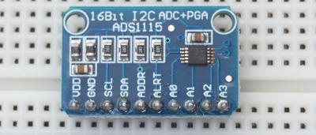           |
| Bananenbuchse mit angeschlossener Breadboardleitung |                  |
| Fotowiderstand (LDR Typ5516)                        |             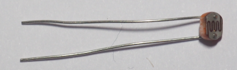             |
| Instrumentenverstärker AD623                        |  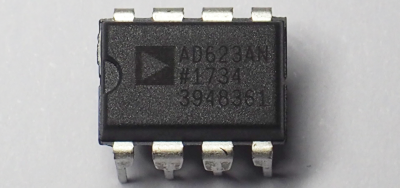  |
| Keramikkondensator 0,1 µF                           |              |
| Elektrolytkondensator 10 µF                         |               |
| Kraftsensor, Wägezelle TAL220B                      |        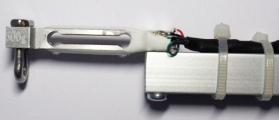         |
| NTC-Widerstand *R<sub>25</sub>* = 10 k&Omega;       |                          |
| Potentiometer 10 k&Omega;                           |        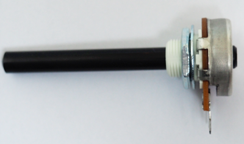        |
| Spannungsversorgung                                 |        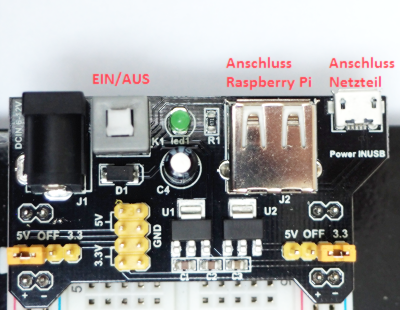         |
| Widerstand (Bsp. 10 k&Omega;)                       | Farbcode: <span style="color:SaddleBrown">braun</span>, schwarz, schwarz, <span style="color:red">rot</span>, <span style="color:SaddleBrown">braun</span> 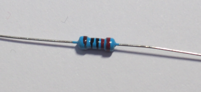 |

<div style="page-break-after: always;"></div>

# 1. Digitale Messtechnik

Digitale Messtechnik begegnet uns im Alltag überall. Die digitale Temperaturanzeige am Gefrierschrank, eine Pulsuhr beim Sport, eine digitale Küchenwaage oder die Einparkhilfe beim Auto...unsere Welt wäre eine andere ohne digitale Messtechnik!

<span style="color:#5882FA; font-size: 12pt">Aufgabe 1: </span> Nennen Sie drei weitere Geräte oder Anwendungen, in denen digitale Messtechnik vorkommt und nennen Sie die physikalische Größe, die dabei gemessen wird.


|  |Gerät / Anwendung| physikalische Größe|
|--|--------------------------|---------------------------|
|1.|                               |                                |
|2.|                               |                                |
|3.|                               |                                |

# 2. Das Breadboard und die LED

### Einführung 
In den nächsten Stunden befassen wir uns damit, wie man digitale Messwerte erfassen und verarbeiten kann. Wir nutzen dabei ein Breadboard, auf dem wir die Schaltungen stecken sowie LEDs als Leuchtmittel. Zunächst schauen wir uns an, wie diese einzusetzen sind.

### Die LED


In unserem Projekt verwenden wir keine Glühlampen, sondern LEDs, wenn wir etwas optisch anzeigen wollen. **LED** ist die Abkürzung für  **L**ight **E**mitting **D**iode, was auf Deutsch so viel bedeutet wie Licht emittierende bzw. aussendende Diode. Um die LED zum Leuchten zu bringen, kann diese im Gegensatz zu einer Glühlampe nicht einfach an eine Spannungsversorgung angeschlossen werden.
Es sind **zwei Dinge** zu beachten:

  1. Die LED muss immer mit einem **Widerstand (Vorwiderstand) in Reihe** betrieben werden, da sie sonst zerstört wird.
  2. Die LED ist eine Diode und kann in Durchlass- oder in Sperrrichtung angeschlossen werden. Sie hat also eine **Anode** (Pluspol) und eine **Kathode** (Minuspol). Soll die **LED leuchten**, muss sie in Durchlassrichtung geschaltet werden, d.h. die **Anode** muss am **höheren Potential** angeschlossen werden. 

### Das Breadboard
Auf dem Breadboard bauen wir unsere Schaltungen auf. Um die Schaltungen stecken zu können ist es wichtig zu wissen, wie das Breadboard aufgebaut ist.
In der nachfolgenden Abbildung sind die elektrisch verbundenen Steckkontakte durch Linien gekennzeichnet.  

<span style="color:#5882FA; font-size: 12pt">Aufgabe 1: </span> In welcher der nachfolgend abgebildeten Schaltungen leuchtet die LED? Begründe.  

**Schaltung 1:**


**Schaltung 2:**
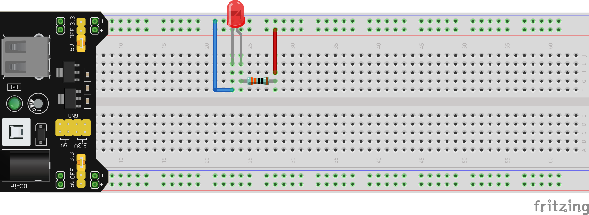


**Schaltung 3:**
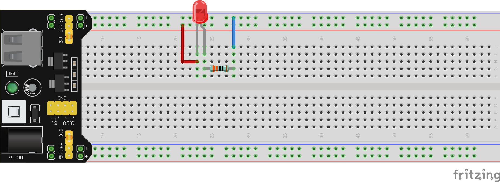


&nbsp;
------


&nbsp;
------


&nbsp;
------

&nbsp;

<div style="page-break-after: always;"></div>

# 3. Was bedeutet digitales Messen?  

Bevor wir richtig loslegen können, müssen wir uns zuerst damit befassen, wie der Raspberry Pi mit seiner Umwelt kommuniziert. Der Raspberry Pi verfügt über **GPIO**-Pins (**g**eneral **p**urpose **i**nput/**o**utput). Über diese kann er mit seiner Umgebung kommunizieren. Die GPIO-Pins sind durchnummeriert und über das bunte, mehrfarbige Flachbandkabel mit dem Breadboard verbunden. Es gibt zum einen Pins zur Spannungsversorgung mit 5V und 3,3V sowie GND (0V) und klassische GPIO-Pins, die zur Kommunikation dienen. Jeder Pin kann die digitalen **Zustände 1 (true = wahr) oder 0 (false = falsch)** annehmen und sowohl als **Eingang (input)** als auch als **Ausgang (output)** des Raspberry Pi verwendet werden. 

Damit wir über die GPIO-Pins mit dem Raspberry Pi kommunizieren können, müssen wir zuerst untersuchen, wie der Raspberry Pi zwischen den beiden Zuständen 0 und 1 unterscheidet. Dazu bauen wir nun eine Schaltung auf und schreiben unser erstes kleines Programm. 

### GPIO-Pin


**Material:**

 + 10 k&Omega; Potentiometer
 + Breadboard mit Spannungsversorgung und Netzteil
 + Breadboard-Leitungen in verschiedenen Farben
 + Voltmeter
 + Raspberry Pi
 + Flachbandkabel

**Durchführung:**

<span style="color:#5882FA; font-size: 12pt ">1. </span>Stecken Sie die Schaltung gemäß des  nachfolgenden Schaltplans und der Abbildung des Schaltungsaufbaus auf dem Breadboard und und schalten Sie nach einer Kontrolle des Schaltungsaufbaus die Spannungsversorgung des Breadboards an (grüne LED auf Spannungsversorgung leuchtet).   
Mit Hilfe des Potentiometers kann die elektrische Spannung am Eingangspin GPIO17 in einem Bereich zwischen 0 und 3.3V eingestellt werden. Das Voltmeter wird über die beiden Leitungen zu den Bananenbuchsen so angeschlossen, dass die Spannung zwischen dem Schleifer (dem mittleren Pin) des Potentiometers und GND (0V) gemessen werden kann.


<span style="color:#5882FA; font-size: 12pt ">2. </span>Für alle, die am Raspberry Pi mit Bildschirm, Tastatur und Maus arbeiten wollen (wer stattdessen mit dem VNC-Viewer per Fernzugriff arbeiten möchte, kann direkt zu Schritt 3 übergehen): Schließen Sie Bildschirm, Tastatur und Maus an den Raspberry Pi an.

<span style="color:#5882FA; font-size: 12pt ">3. </span>Nun müssen wir den Raspberry Pi über das Flachbandkabel mit dem Breadboard verbinden. Der Raspberry Pi hat keinen Ein-/Ausschalter, sondern wird einfach durch Verbinden mit der Spannungsversorgung gestartet. 


<div style="page-break-after: always;"></div>

<span style="color:#5882FA; font-size: 12pt ">4. </span>Für alle, die mit dem VNC-Viewer per Fernzugriff arbeiten möchten (wer stattdessen mit Bildschirm etc. direkt am Raspberry Pi arbeitet, kann direkt zu Schritt 5 übergehen):  
Wenn der Raspberry Pi gestartet ist, können wir uns vom Laptop (oder einem anderen Anzeigegerät) aus über den VNC-Viewer mit dem Raspberry Pi verbinden:

+ Als erstes den VNC-Viewer aufrufen.

  

+ Als nächstes oben in die Zeile die IP-Adresse des verwendeten Raspberry Pi eingeben (steht auf einem Zettel auf dem Raspberry Pi) und mit Enter bestätigen. 

+ Nun wird über das WLAN mit dem Raspberry Pi eine Verbindung aufgebaut und es sollte das nachfolgend dargestellte Fenster auftauchen. Hier muss nur noch der der Benutzername pi und das Kennwort (steht auf dem Raspberry Pi) angegeben werden und die Verbindung mit OK gestartet werden.

  

+ Wenn alles richtig angegeben wurde, sieht man jetzt die Bildschirmansicht des Raspberry Pi und kann über den VNC-Viewer mit dem Raspberry Pi arbeiten.

  

+ Für das nächste Mal ist die Verbindung jetzt schon angelegt und kann zukünftig mit einem Doppelklick auf das Bildschirmsymbol mit der passenden IP-Adresse gestartet werden.

  

<span style="color:#5882FA; font-size: 12pt ">5. </span>Um herauszufinden, welchen Zustand der GPIO-Pin 17 hat und uns diesen Zustand anzeigen zu lassen, schreiben wir nun unser erstes kleines Programm:

- Dazu öffnen zuerst über das **Ordnersymbol** oben links das Verzeichnis **PhyPi** und erstellen in diesem ein Verzeichnis **MeineProgramme**, in dem wir unsere Programme speichern. 

- Über die **Himbeere** (oben links) und den Reiter **Entwicklung** öffnen wir das Programm **Python 3 (IDLE)**.

- Jetzt müssen wir uns noch über **File** und **New File** eine Datei für unser erstes Programm erzeugen.

- In diese Datei schreiben wir unseren ersten Programmcode:

  Alles was im Programm hinter einem Hashtag # - Symbol steht ist ein erklärender Kommentar zur Programmzeile davor und keine Aufforderung zu twittern.

  ```python
  import RPi.GPIO as GPIO # Wir importieren die Bibliothek GPIO.
  import time # Wir importieren die Bibliothek "time".
  GPIO.setmode(GPIO.BCM) # Wir geben an, wie die GPIO-Pins nummeriert sind.
  GPIO.setup(17, GPIO.IN) # GPIO-Pin 17 wird als Eingang festgelegt.
  
  try: # Ausfuehren des Programmcodes, solange es keine Unterbrechung gibt.
  	while True: # Dauerschleife (alles eingerueckte danach wird wiederholt).
  		print("Status GPIO17:") # Wir geben den Text "Status GPIO17:" aus.
  		print(GPIO.input(17)) # Wir geben den Zustand des GPIO-Pin 17 aus.
  		time.sleep(0.1) # Wir warten 0.1 s (Raspberry Pi "schlaeft").
  except KeyboardInterrupt: # Wenn das Programm mit Strg + C unterbrochen wird,
  	GPIO.cleanup() # ... wird noch aufgerauemt.
  ```

<span style="color:#5882FA; font-size: 12pt ">6. </span>Bevor wir unser Programm starten können, müssen wir unsere Datei noch über **File** und **Save** unter dem Namen **digital.py** in unser Unterverzeichnis **MeineProgramme** im Verzeichnis **PhyPi** speichern.

<span style="color:#5882FA; font-size: 12pt ">7. </span>Mit **Run** oder `F5` starten wir unser Programm und bekommen jetzt alle 0,1 Sekunden den Zustand des GPIO-Pins 17 angezeigt. 

<span style="color:#5882FA; font-size: 12pt ">8. </span>Drehen Sie am Potentiometer und verändern Sie damit die Spannung am GPIO-Pin 17. Notieren Sie Ihre Beobachtungen.


&nbsp;
------


&nbsp;
------


&nbsp;
------


&nbsp;

<span style="color:#5882FA; font-size: 12pt ">9. </span>Alles was eingerückt (nach Zeile 7) in unserer Dauerschleife ```while(True):```  steht, wird jetzt immer weiter wiederholt. Wenn wir unser Programm beenden wollen, müssen wir also unsere Dauerschleife unterbrechen. Dafür drücken wir gleichzeitig ```Strg + c```.

<span style="color:#5882FA; font-size: 12pt ">10. </span>Formulieren Sie einen Merksatz: Was muss für die Spannung zwischen dem GPIO-Pin 17 und GND (0V) gelten, wenn der GPIO-Pin 17 den Zustand 1 (true) bzw. 0 (false) besitzt?


&nbsp;
------


&nbsp;
------


&nbsp;
------


&nbsp;
------


&nbsp;

<span style="color:#5882FA; font-size: 12pt ">11. </span>Was bedeutet also digitales Messen?
Wählen Sie aus den folgenden Begriffen die passenden aus und vervollständigen Sie den Lückentext.

abzählbare, analog, digital, false, kontinuierliche, ganzzahlige, GPIO-Pin, Raspberry Pi, true, stufenlose

Digitales Messen bedeutet, dass Messwerte in Stufen erfasst werden. Ein digitaler _ _ _ _ _ _ _ _ _ _ _ _ _ ist digital, da er nur eine _ _ _ _ _ _ _ _ _ _ _ _ _ und _ _ _ _ _ _ _ _ _ _ _ _ _ Anzahl an Zuständen annehmen kann. Er kann entweder den Zustand 0 ( _ _ _ _ _ _ _ _ _ _ _ _ _  ) oder den Zustand 1 ( _ _ _ _ _ _ _ _ _ _ _ _ ) annehmen.

<div style="page-break-after: always;"></div>

# 4. Lichtautomatik (Hell-Dunkel-Sensor)
Nun wissen wir, wie der Zustand eines GPIO-Pins festgelegt ist und können das nutzen, um unseren ersten eigenen digitalen Sensor zu bauen.  
Jeder kennt bei neueren Autos die Lichtautomatik, die das Licht automatisch anschaltet, wenn es draußen dunkel wird oder wenn man in einen Tunnel fährt. Die Beleuchtung von Zugängen zu Häusern oder die Beleuchtung von Wegen ist ebenfalls häufig mit einer Lichtautomatik ausgestattet. Um zu verstehen, wie so etwas funktionieren kann, bauen wir nun unsere eigene Lichtautomatik. 

### Schaltungsentwurf und Realisierung

**Material:**

 + 10 k&Omega; Potentiometer
 + 220 &Omega; Vorwiderstand für LED (Farbcode: rot, rot, schwarz, schwarz, braun)
 + Fotowiderstand (LDR Typ5516)
 + weiße LED
 + Breadboard mit Spannungsversorgung und Netzteil
 + Breadboard-Leitungen in verschiedenen Farben
 + Raspberry Pi
 + Flachbandkabel

**Durchführung:**

<span style="color:#5882FA; font-size: 12pt ">1. </span>Stecken Sie die abgebildete Schaltung gemäß des nachfolgenden Schaltplans und der Abbildung des Schaltungsaufbaus auf dem Breadboard und schalten Sie nach einer Kontrolle des Schaltungsaufbaus die Spannungsversorgung des Breadboards an.  

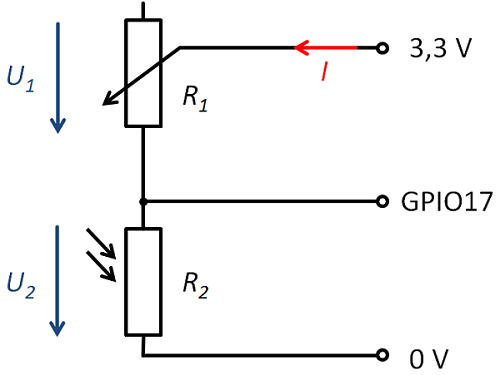


  

<span style="color:#5882FA; font-size: 12pt ">2. </span>Öffnen Sie wieder das Programm **Python 3 (IDLE)** und die zuvor erstellte Programmdatei **digital.py** im Verzeichnis **MeineProgramme**. Starten Sie nun mit **Run** oder `F5` das zuvor erstellte Programm.
Dunkeln Sie den Fotowiderstand (LDR) mit der Hand ab. Wechseln Sie mehrfach zwischen abgedunkteltem und hellem Zustand ab und notieren Sie Ihre Beobachtungen. Mit `Strg + C` können Sie das Programm wieder beenden.


&nbsp;
------


&nbsp;
------


&nbsp;
------

<span style="color:#5882FA; font-size: 12pt ">3. </span>Wie kommt es zu dem beobachteten Verhalten? Schauen wir uns dazu den Fotowiderstand LDR (**L**ight **D**ependent **R**esistor) genauer an:  
  

<div style="page-break-after: always;"></div>

Formulieren Sie auf Grundlage der Abbildung einen Merksatz, wie sich der ohmsche Widerstand des Fotowiderstands in Abhängigkeit von der Beleuchtungsstärke verhält.


&nbsp;
------


&nbsp;
------


&nbsp;
------

&nbsp;

<span style="color:#5882FA; font-size: 12pt ">4. </span>Noch einmal zurück zu unserer Beobachtung aus 3. Wie kommt es zu diesem Verhalten?
Dazu müssen wir uns die verwendete Schaltung genauer anschauen. Wir haben einen einfachen Spannungsteiler (Reihenschaltung aus zwei Widerständen) verwendet.  
Die Widerstände werden vom selben Strom *I* durchflossen, sodass der Spannungsteiler die Gesamtspannung *U<sub>ges</sub>* im Verhältnis der Widerstände aufteilt, d.h. das Verhältnis zwischen den Spannungen *U<sub>1</sub>* und *U<sub>2</sub>* ist gleich dem Verhältnis zwischen den Widerständen.

Die Widerstände werden vom selben Strom *I* durchflossen, sodass der Spannungsteiler die Gesamtspannung *U<sub>ges</sub>* im Verhältnis der Widerstände aufteilt, d.h. das Verhältnis zwischen den Spannungen *U<sub>1</sub>* und *U<sub>2</sub>* ist gleich dem Verhältnis zwischen den Widerständen *R<sub>1</sub>* und *R<sub>2</sub>*:  
$$
\frac{U_1}{U_2}=\frac{R_1}{R_2}
$$
Genauso kann auch über das Verhältnis des Teilwiderstands (*R<sub>1</sub>* oder *R<sub>2</sub>*) zum Gesamtwiderstand (*R<sub>ges</sub>* = 				*R<sub>1</sub>* + *R<sub>2</sub>*), auf das Verhältnis zwischen der Teilspannung (*U<sub>1</sub>* oder *U<sub>2</sub>*) und der Gesamtspannung *U<sub>ges</sub>* geschlossen werden.  
$$
\frac{U_1}{U_{ges}}=\frac{R_1}{R_{ges}}=\frac{R_1}{R_1+R_2}
$$
 bzw.  
$$
\frac{U_2}{U_{ges}}=\frac{R_2}{R_{ges}}=\frac{R_2}{R_1+R_2}
$$
Allgemein lässt sich für den Spannungsteiler festhalten, dass sich die Spannungen wie die zugehörigen Widerstände verhalten.  

Vervollständigen Sie auf Grundlage der Zusammenhänge für den Spannungsteiler und der Kennlinie aus drittens den nachfolgenden Merksatz:

Je größer die Beleuchtungsstärke, desto  _ _ _ _ _ _ _ _ wird der Widerstand *R<sub>2</sub>* des Fotowiderstands.  Die Spannung *U<sub>1</sub>* wird dadurch _ _ _ _ _ _ _ _und die Spannung *U<sub>2</sub>*, die am GPIO-Pin 17 anliegt, _ _ _ _ _ _ _ _ . 

Was hat das nun mit dem Zustand des GPIO-Pins 17 zu tun, also damit, ob uns eine 0 oder eine 1 angezeigt wird? 

Schauen wir uns dazu ein Beispiel an: Der Fotowiderstand hat im beleuchteten Fall einen Widerstand von *R<sub>2</sub>* = 2 k&Omega; und im abgedunkelten Fall einen Widerstand von *R<sub>2</sub>* = 30 k&Omega;. Was bedeutet das für die Spannung *U<sub>2</sub>* am GPIO-Pin 17 und den Zustand des Pins? Bearbeiten Sie hierzu folgende Aufgabe.

**beleuchteter Fall:**

Welche Spannung liegt am GPIO-Pin 17 an? Berechnen Sie. 


&nbsp;


&nbsp;


&nbsp;


&nbsp;

Welchen Zustand besitzt der GPIO-Pin 17 in diesem Fall? Begründen Sie.


&nbsp;
------


&nbsp;
------


&nbsp;
------


&nbsp;

**abgedunkelter Fall:**

Welche Spannung liegt am GPIO-Pin 17 an? Berechnen Sie. 


&nbsp;


&nbsp;


&nbsp;


&nbsp;

Welchen Zustand besitzt der GPIO-Pin 17 in diesem Fall? Begründen Sie.


&nbsp;
------


&nbsp;
------


&nbsp;
------

&nbsp;

<div style="page-break-after: always;"></div>

<span style="color:#5882FA; font-size: 12pt ">5. </span>Wir haben also aus einem Fotowiderstand und einem zweiten Widerstand einen einfachen Sensor gebaut, mit dem wir nach der Digitalisierung zwischen hell und dunkel unterscheiden können. Damit wir eine Lichtautomatik haben, fehlt uns noch eine Beleuchtung, die abhängig von unserem Sensor ein- bzw. ausgeschaltet wird. Dafür ergänzen wir unsere Schaltung um eine weiße LED (Polung beachten) mit Vorwiderstand (220 &Omega;) , die wir an den GPIO-Pin 27 anschließen.

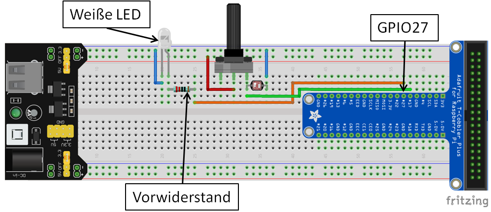

<span style="color:#5882FA; font-size: 12pt ">6. </span>Jetzt müssen wir nur noch unser Programm anpassen, sodass die LED abhängig vom Zustand des GPIO-Pins 17 an- bzw. ausgeschaltet wird.

- Wir öffnen wieder das Programm **Python 3 IDLE** und erzeugen dort eine Datei **lichtautomatik.py** für unser neues Programm, die wir im Verzeichnis **MeineProgramme** speichern.

- In diese Datei schreiben wir unseren Programmcode für die Lichtautomatik:

  ```python
  import RPi.GPIO as GPIO # Wir importieren die Bibliothek GPIO.
  import time # Wir importieren die Bibliothek "time".
  GPIO.setmode(GPIO.BCM) # Wir geben an, wie die GPIO-Pins nummeriert sind.
  GPIO.setup(17, GPIO.IN) # GPIO-Pin 17 wird als Eingang festgelegt.
  GPIO.setup(27, GPIO.OUT) # GPIO-Pin 27 wird als Ausgang festgelegt.
  try: # Ausfuehren des Programmcodes, solange es keine Unterbrechung gibt.
    while True: # Dauerschleife (alles eingerueckte danach wird wiederholt).
        statusGPIO17 = GPIO.input(17) # Abfrage des Zustands von GPIO-Pin 17
        if statusGPIO17 == 1: # Wenn (if) der Zustand 1 ist, dann...
            GPIO.output(27, GPIO.HIGH) # ...schalten wir die LED ein.
        if statusGPIO17 == 0: # Wenn (if) der Zustand 0 ist, dann...
            GPIO.output(27, GPIO.LOW) # ...schalten wir die LED aus.
        time.sleep(0.1) # Wir warten 0.1 s (Raspberry Pi "schlaeft").
  except KeyboardInterrupt: # Wenn das Programm mit Strg + C unterbrochen wird,
    GPIO.cleanup() # ... wird noch aufgerauemt.
  ```

  Das Programm sieht unserem ersten Programm sehr ähnlich. Für die LED brauchen wir aber einen GPIO-Pin, der als Ausgang geschaltet ist. Dessen Zustand wir also im Programm bestimmen können und mit dem wir die LED ein- bzw. ausschalten können. Der GPIO-Pin kann auch wieder die Zustände 1 (HIGH = 3,3 V = LED-EIN) und 0 (LOW = 0 V = LED-AUS)  annehmen.

- Nun speichern wir unser Programm und staren es mit **Run** oder `F5`. 

- Jetzte können wir unesere Lichtautomatik testen. Beim Abdunkeln müsste die LED jetzt eingeschaltet werden.

- Wenn wir das Programm beenden wollen, können wir einfach wieder ```Strg + c``` drücken und unsere Dauerschleife wird gestoppt.

<span style="color:#5882FA; font-size: 12pt ">7. </span>Aufgrund unserer Beobachtungen der vergangenen Versuche lässt sich ein Grundprinzip der digitalen Messwerterfassung erkennen, das in der nachfolgenden Abbildung links dargestellt ist. Ergänzen Sie die allgemeine Darstellung mit den folgenden Begriffen aus dem Beispiel der Lichtautomatik:

beleuchtungsabhängiger Widerstand, Beleuchtungsstärke, GPIO-Pin, LED-Ein / LED-Aus, Spannungsteiler  


<div style="page-break-after: always;"></div>

# 5. Wir bauen ein digitales Thermometer


Bevor wir gleich zum Thermometer kommen, müssen wir zuerst ein bisschen ausholen. Wenn die Person am Boden wissen möchte, wo genau sich ihr Freund befindet, hilft ihr die Antwort "Auf Stufe 10!" sicher mehr weiter als "In der Baumkrone!". 

Wir haben in diesem Beispiel auch digitale Werte:

- im Falle der Antwort "In der Baumkrone!" genau zwei ("In der Baumkrone" = 1, "Nicht in der Baumkrone" = 0).
- im Falle der Antwort "Auf Stufe 10!" genau so viele mögliche Werte, wie die Leiter Stufen hat.

Noch präziser wüsste die Person am Boden Bescheid, wenn die Leiter extrem viele dicht beieinander liegende Stufen hätte. Wir könnten die Höhe also noch besser auflösen (d.h. präziser angeben).

Was hat das aber jetzt mit unserem digitalen Thermometer zu tun? Im Beispiel unserer Lichtautomatik haben wir gesehen, dass wir mittels der GPIO-Pins eine Digitalisierung (0 und 1) vornehmen können. Für ein Thermometer wäre so eine Form der Digitalisierung jedoch nicht wirklich zufriedenstellend. Wir könnten ja nur zwei Werte unterscheiden (warm und kalt). Wir brauchen also etwas mit der Leiter Vergleichbares, das uns eine fein gestufte Digitalisierung ermöglicht, sodass wir Temperaturwerte ermitteln können.

<div style="page-break-after: always;"></div>

### Die Analog-Digital-Wandlung (AD-Wandlung)


Der Analog-Digital-Wandler wandelt ein analoges in ein digitales Signal. Das heißt er wandelt ein kontinuierliches Signal mit unendlich vielen Signalwerten in eine Folge von Wertepaaren aus einem Zeitwert und einem Signalwert um. Es wird zu festen Zeitpunkten (Abtastung) je ein Signalwert erfasst. Die Signalwerte können dabei nur die Werte festgelegter Stufen (Quantisierung) annehmen. Dabei wird immer zur nächstgelegenen Stufe gerundet. 

Da die Signalwerte nur in Stufen erfasst werden können, entsteht bei der Analog-Digital-Wandlung immer ein Fehler, der Quantisierungsfehler. Dieser ist, wie beim Beispiel der Leiter, umso kleiner, je geringer der Abstand zwischen den Stufen (Auflösung  *U<sub>LSB</sub>* ) ist. Auch durch die Abtastung gehen uns Informationen verloren. Wir kennen immer nur zu diskreten Zeitpunkten den Signalwert und können über den Signalwert zwischen zwei Abtastzeitpunkten keine Aussage treffen.

<span style="color:#5882FA; font-size: 12pt">Aufgabe 1: </span>Beschriften Sie die beiden oben abgebildeten Signale mit den Begriffen "analoges Signal" bzw. "digitales Signal".

<div style="page-break-after: always;"></div>

### Schaltungsentwurf

Nun aber zum Bau unseres digitalen Thermometers. Wie auch bei der Lichtautomatik kommt auch hier wieder ein veränderlicher Widerstand, der NTC-Widerstand, zum Einsatz. Dieser ist temperaturabhängig.

Betrachten wir zuerst seine Kennlinie.


<span style="color:#5882FA; font-size: 12pt">Aufgabe 2: </span> Formulieren Sie auf Grundlage der Abbildung einen Merksatz, wie sich der ohmsche Widerstand des NTC-Widerstands in Abhängigkeit von der Temperatur verhält.


&nbsp;
------


&nbsp;
------


&nbsp;
------


&nbsp;

<div style="page-break-after: always;"></div>

<span style="color:#5882FA; font-size: 12pt">Aufgabe 3: </span>Ergänzen Sie die nachfolgende Schaltung so, dass sich die am Anschlusspin des AD-Wandlers anliegende elektrische Spannung *U<sub>2</sub>* erhöht, wenn die Temperatur steigt (Tipp: Spannungsteiler).


Mit der entworfenen Schaltung haben wir nun die Grundlage für unser Thermometer gelegt. Der Spannungsteiler mit dem NTC-Widerstand stellt uns ein temperaturabhängiges analoges Spannungssignal zur Verfügung. Nun müssen wir uns noch um die Digitalisierung dieses Spannungssignals und die Berechnung des Temperaturwerts kümmern.

### Realisierung des digitalen Thermometers

**Material:**

- 10 k&Omega; Widerstand (Farbcode: braun, schwarz, schwarz, rot, braun)
- NTC-Widerstand (**N**egative **T**emperature **C**oefficient) *R<sub>25</sub>* = 10 k&Omega;
- AD-Wandler ADS1115
- Breadboard mit Spannungsversorgung und Netzteil
- Breadboard-Leitungen in verschiedenen Farben
- Raspberry Pi
- Flachbandkabel
- Wasserkocher
- Bechergläser
- Flüssigkeitsthermometer
- Glasstab zum Rühren

<div style="page-break-after: always;"></div>

**Durchführung**:

<span style="color:#5882FA; font-size: 12pt ">1. </span>Ergänzen Sie den nachfolgenden Schaltungsaufbau auf dem Breadboard durch Leitungen, sodass der Spannungsteiler aus 10 k&Omega; Widerstand und NTC-Widerstand der oben entworfenen Schaltung entspricht.


<span style="color:#5882FA; font-size: 12pt ">2. </span>Bauen Sie die Schaltung auf dem Breadboard auf. Aus der nachfolgenden Tabelle kann entnommen werden, wie der AD-Wandler auf dem Breadboard anzuschließen ist.

| Anschlüsse AD-Wandler ADS1115 | Anschlüsse Breadboard / GPIO-Pin                           |
| ----------------------------- | ---------------------------------------------------------- |
| VDD                           | 5 V                                                        |
| GND                           | 0 V                                                        |
| SDL                           | GPIO-Pin SCL                                               |
| SDA                           | GPIO-Pin SDA                                               |
| A0                            | Spannungsteiler (zwischen 10 k&Omega;- und NTC-Widerstand) |

<span style="color:#5882FA; font-size: 12pt ">3. </span>Nun haben wir unsere Schaltung für das digitale Thermometer aufgebaut und können uns um ein Programm zur Auswertung kümmern:

- Dazu öffnen wir wieder das Programm **Python 3 (IDLE)** und erstellen eine Programmdatei **thermometer.py**.

- Nun können wir unseren Programmcode zur Auswertung erstellen:

  ```python
  import Adafruit_ADS1x15 # Wir importieren die Bibliothek für den AD-Wandler.
  import time # Wir importieren die Bibliothek "time".
  adWandler = Adafruit_ADS1x15.ADS1115() # Wir nennen unseren ADS1115 adWandler.
  
  while True: # Dauerschleife.
      adWert = adWandler.read_adc(0,2/3)  # Wir lesen den aktuellen Wert des AD-Wandlers am Anschluss A0 und speichern diesen in "adWert".
      print("Aktueller Wert AD-Wandler:") # Wir geben den Text "Aktueller Wert des Ad-Wandlers:" aus.
      print(adWert) # Wir geben den aktuellen Wert des AD-Wandlers aus.
      time.sleep(1) # Wir warten 1 s (Raspberry Pi "schlaeft").
  ```

  Unser Programm macht nun Folgendes: Es fragt den digitalisierten Signalwert am Anschluss A0 des AD-Wandlers ab und gibt diesen aus. Dann wartet es eine Sekunde und fragt anschließend den nächsten Wert ab, usw..

- Wir speichern unser Programm und starten es mit **Run** oder `F5`.

- Notieren Sie den angezeigten Wert (ungefähr) bei Zimmertemperatur. Was passiert, wenn der NTC-Widerstand zwischen den Handflächen auf Handtemperatur gebracht wird? Notieren Sie Ihre Beobachtungen.


&nbsp;
------


&nbsp;
-------


&nbsp;

   - Danach unterbrechen wir unsere Dauerschleife und damit unser Programm wieder  mit ```Strg + c```.

<span style="color:#5882FA; font-size: 12pt ">4. </span>Eigentlich interessiert uns ja der Spannungswert am Anschluss A0 des AD-Wandlers, um aus diesem Wert eine Temperatur bestimmen zu können. Was haben die beobachteten Werte aber jetzt mit diesem Spannungswert zu tun? 

Die Werte geben Auskunft darüber, welche Stufe dem Signal am Anschluss A0 bei der Digitalisierung zugeordnet wurde. Wir müssen also diesen Wert noch einer Spannungsstufe zuordnen.

Dazu müssen wir zunächst einmal die Auflösung unseres AD-Wandlers kennen, also wissen, "wie hoch" eine einzelne Stufe ist. Unser AD-Wandler (ADS1115) verfügt über 32767 Stufen. Bei jeder Abtastung ordnet er dem analogen Signal am Anschluss A0 eine bestimmte Stufe zu. Jetzt müssen wir also nur noch wissen, welcher Spannungsdifferenz eine Stufe entspricht. Unser AD-Wandler (ADS1115) ist so programmiert, dass er Spannungswerte von 0 V bis 6,114 V digitalisieren kann.

- Berechnen Sie mit den gegebenen Informationen:

  Welcher Spannungsdifferenz entspricht eine Stufe ( &#8793; Auflösung &#8793; *U<sub>LSB</sub>*) ? Vervollständigen Sie dazu die nachfolgende Gleichung und berechnen Sie die Auflösung.


$$
  Auflösung = U_{LSB}=
$$


   - Wie wir feststellen ist dieser Wert sehr klein, sodass die zu messende Spannung in sehr kleinen Stufen aufgelöst werden kann.

   - Ergänzen Sie die fehlenden Werte in der nachfolgenden Tabelle.

     | Stufe | &#x27F9; | digitalisierte Spannung in V |
     | ----- | :------: | ---------------------------- |
     | 0     | &#x27F9; | 0                            |
     | 32767 | &#x27F9; | 6,114                        |
     | 1     | &#x27F9; |                              |
     | 518   | &#x27F9; |                              |
     | 16383 | &#x27F9; |                              |

   - Jetzt müssen wir noch unser Programm so ergänzen, dass wir nicht mehr den Wert der Stufe, sondern den Wert der digitalisierten Spannung angezeigt bekommen. Dazu müssen wir das nachfolgende Programm noch so ergänzen, dass in Zeile 4 die Auflösung berechnet wird und der Variablen `aufloesung` zugewiesen wird. Außerdem müssen wir noch in Zeile 6 die Berechnung des digitalisierten  Spannungswerts ergänzen. 

   - Ergänzen Sie das Programm **thermometer.py** entsprechend.

     <span style="color:crimson">Achtung: Beim Programmieren entspricht ein Punkt einem Komma ( also 6.114 &#8793;  6,114)! </span>

     ```python
     import Adafruit_ADS1x15 # Wir importieren die Bibliothek für den AD-Wandler.
     import time # Wir importieren die Bibliothek "time".
     adWandler = Adafruit_ADS1x15.ADS1115() # Wir nennen unseren ADS1115 adWandler.
     aufloesung = 6.114/32767 # Hier berechnen wir die Aufloesung.
     while True: # Dauerschleife.
         adWert = adWandler.read_adc(0,2/3) * aufloesung # Wir lesen den aktuellen Wert des AD-Wandlers und rechnen diesen in eine digitalisierte Spannung um.
         print("Aktueller Wert AD-Wandler:") # Wir geben den Text "Aktueller Wert des AD-Wandlers:" aus.
         print(adWert) # Wir geben den Wert der digitalisierten Spannung aus.
         print("V") # Wir geben die Einheit V aus.
         time.sleep(1) # Wir warten 1 s (Raspberry Pi "schlaeft").
     ```

   - Jetzt können wir unser Programm testen. Dazu speichern wir die Programmdatei und starten diese mit **Run** oder `F5`. 

   - Notieren Sie den ungefähren Spannungswert bei Zimmertemperatur. Was passiert, wenn der NTC-Widerstand zwischen den Handflächen auf Handtemperatur gebracht wird? Notieren Sie Ihre Beobachtungen.


&nbsp;
------


&nbsp;

<span style="color:#5882FA; font-size: 12pt ">5. </span>Auf unserem Weg zu einem digitalen Thermometer fehlt uns noch etwas. Der Raspberry Pi gibt uns bisher nur digitalisierte Spannungswerte aus. Wir müssen uns also noch darum kümmern, dass wir diese Spannungswerte in Temperaturen umrechnen können. Diesen Schritt nennt man Kalibrierung.

Bei der Kalibrierung müssen wir unsere digitalisierten Spannungswerte mit den zugehörigen Temperaturwerten verknüpfen. Wir erhalten so Wertepaare aus einem Spannungs- und einem Temperaturwert. Auf Grundlage dieser Wertepaare kann der Raspberry Pi dann aus den digitalisierten Spannungswerten die zugehörige Temperatur berechnen.


Führen wir also die Kalibrierung durch:

- Dazu nehmen wir im Bereich zwischen 20 °C und 50 °C in Intervallen von ca. 10 °C die zugehörigen digitalisierten Spannungswerte auf:

  Die benötigten Wassertemperaturen erhalten wir durch entsprechendes Mischen von Wasser aus dem Wasserkocher und dem Wasserhahn. Die Temperatur messen wir mit dem Flüssigkeitsthermometer. Füllen Sie die nachfolgende Tabelle aus.

  |                      | 1.   | 2.   | 3.   | 4.   |
  | -------------------- | ---- | ---- | ---- | ---- |
  | Temperatur *T* in °C |      |      |      |      |
  | Spannung *U* in V    |      |      |      |      |

- Zeichnen Sie die Wertepaare in ein Diagramm ein und verbinden Sie die Messpunkte sinnvoll zu einer Kurve (nachfolgende Lücke).


&nbsp;


&nbsp;


&nbsp;


&nbsp;


&nbsp;


&nbsp;


&nbsp;


&nbsp;


&nbsp;
- Lesen Sie aus dem Diagramm den ungefähr erwarteten digitalisierten Spannungswert für eine Temperatur von 35 °C ab und notieren Sie diesen.


&nbsp;
-----

&nbsp;

<div style="page-break-after: always;"></div>

<span style="color:#5882FA; font-size: 12pt; ">6. </span>Die ermittelten Kalibrationswerte können wir nun nutzen, um mit der digitalisierten Messspannung des AD-Wandlers Temperaturwerte zu berechnen. Dabei gehen wir ähnlich vor wie beim sinnvollen Verbinden der Messwerte von Hand im Diagramm (vergleiche Aufgabe zuvor). 

Wir lassen den Raspberry Pi eine Funktion berechnen, deren Verlauf unsere Messpunkte möglichst günstig verbindet. Mit dieser Funktion können wir dann für jeden gemessenen digitalen Spannungswert die zugehörige Temperatur berechnen. Je mehr Wertepaare man für die Kalibrierung besitzt und je genauer diese bestimmt wurden, desto genauer sind auch die ermittelten Temperaturwerte.

Ergänzen wir also die Berechnung der Temperatur:

- Dazu öffnen wir wieder unser Programm **thermometer.py**.

- Nun können wir unser Programm um die Berechnung der Temperaturwerte ergänzen. Wir müssen für Wert1 bis Wert4 die Werte aus der Kalibrierung für Spannung bzw. für die Temperatur angeben (ohne Einheiten). <span style="color:crimson">Achtung: Aufsteigende Reihenfolge der Werte anwenden! </span>

  ```python
  import Adafruit_ADS1x15 # Wir importieren die Bibliothek für den AD-Wandler.
  from scipy.interpolate import UnivariateSpline # Wir importieren die Bibliothek für die Interpolation.
  import time # Wir importieren die Bibliothek "time".
  
  adWandler = Adafruit_ADS1x15.ADS1115() # Wir nennen unseren ADS1115 adWandler.
  aufloesung = 6.114/32767 # Wir berechnen die Aufloesung des AD-Wandlers.
  U = [Wert1, Wert2, Wert3 , Wert4] # Spannungswerte aus der Kalibrierung.
  T = [Wert1, Wert2, Wert3 , Wert4] # Temperaturwerte aus der Kalibrierung.
  kalibFunkt = UnivariateSpline(U,T) # Wir berechnen die Kalibrierungsfunktion.
  
  while True: # Dauerschleife.
      adWert = adWandler.read_adc(0,2/3) * aufloesung # Wert Ad-Wandler.
      temperatur = kalibFunkt(adWert) # Wir berechnen aus der digitalisierten Spannung des AD-Wandlers die Temperatur.
      temperatur = round(float(temperatur),1) # Wir runden den Temperaturwert												# auf eine Nachkommastelle.
      print("Temperatur:") # Wir geben den Text "Temperatur" aus.
      print(temperatur) # Wir geben den Wert der Temperatur aus.
      print("°C") # Wir geben die Einheit °C aus.
      
      time.sleep(1) # Wir warten 1 s (Raspberry Pi "schlaeft").
  ```

- Wir speichern unsere Programmdatei wieder und starten das Programm mit **Run** oder `F5`.

- Nun können wir unser digitales Thermometer testen.

- Das Programm beenden wir wieder mit ```Strg + c```.

<div style="page-break-after: always;"></div>

<span style="color:#5882FA; font-size: 12pt">Aufgabe 4: </span>Das im Beispiel der Lichtautomatik kennengelernte Grundprinzip der digitalen Messwerterfassung lässt sich auch auf unser digitales Thermometer übertragen.

Ergänzen Sie die fehlenden Begriffe für unser Beispiel des digitalen Thermometers.

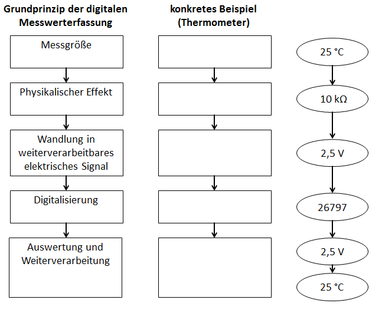

<div style="page-break-after: always;"></div>


# 6. Wir untersuchen die Lade- und Entladekurve eines Kondensators

**Material:**

- 1 k&Omega; Widerstand (Farbcode: braun, schwarz, schwarz, braun, braun)
- 100 k&Omega; Widerstand (Farbcode: braun, schwarz, schwarz, orange, braun)
- Elektrolytkondensator 10 μF
- Fotowiderstand (LDR Typ5516)
- AD-Wandler ADS1115
- Breadboard mit Spannungsversorgung und Netzteil
- Breadboard-Leitungen in verschiedenen Farben
- Raspberry Pi
- Flachbandkabel

**Durchführung:**

In dieser Aufgabe soll die Spannung beim Laden und Entladen eines Kondensators dargestellt werden. Dazu legen wir zunächst die Lade- bzw. Entladezeit für unsere Schaltung fest.

Das Produkt aus Widerstand und Kapazität ergibt **τ (Tau) = R* C** und wird die Zeitkonstante genannt. Mit dieser ist man in der Lage zu berechnen wann der Kondensator „voll“ geladen ist, oder zum Beispiel 63,2%, was genau einem **τ** entsprechen würde. In der Tabelle findest du noch mehr Werte für verschiedene τ‘s.

| τ (Tau) | Laden: Uc(t) [%]  | Entladen auf: Uc(t) [%] |
| --------| ------------------|-------------------------|
| 1τ      | 63,2              |36,8                     |
| 2τ      | 86,5              |13,5                     |
| 3τ      | 95,0              |5,0                      |
| 4τ      | 98,2              |1,8                      |
| 5τ      | 99,3              |0,7                      |

Man erkennt deutlich, dass nach 5τ der Kondensator nahezu voll geladen ist. Wir möchten in unserem Diagramm innerhalb von 10 Sekunden eine Lade- sowie eine Entladekurve darstellen.

Wieviel Sekunden entspricht also in unserem Fall 5τ, wieviel 1τ?
Notieren Sie Ihr Ergebnis in der Tabelle.

| τ      | t [s] |
| -------|-------|
| 1      |       |
| 5      |       |

Wir haben einen 10μF Elektrolytkondensator zur Verfügung. Wie groß müssen wir den Widerstand R1 wählen? Berechne. (Zur Auswahl: 1k&Omega; und 100k&Omega;)

R1 =

Nachfolgend ist die zu vermessende Reihenschaltung aus Widerstand R1 und Kondensator C1 dargestellt. Das Potential Uc(t) wollen wir über der Zeit t auftragen. Kannst du auf der nächsten Seite bereits mit Bleistift einen Kurvenverlauf mit Hilfe der Tabelle und der berechneten Werte einzeichnen?


Nun möchten wir die Kondensatorspannung Uc(t) mittels dem Analog-Digital-Wandler ADS1115 messen. Dieser wird über den I2C-BUS (Signal SDA und SCL) an den Raspberry Pi angebunden und mit Hilfe von PhyPiDAQ ausgelesen. Gleichzeitig schreiben wir ein kleines Stück Code, welches den Kondensator lädt während der LDR beleuchtet wird und wieder entlädt, wenn wenig Licht auf den LDR fällt.
Dazu bauen wir zunächst folgende Schaltung auf dem Breadboard auf: (Netzteil noch nicht einstecken oder Flachbandkabel entfernen!)


Nachdem wir sicher sind, dass alles korrekt aufgebaut ist wird das Netzteil und das Flachbandkabel eingesteckt. 

Nun gehen wir analog wie bei der bereits programmierten Lichtsteuerung (3.6) vor und möchten den LDR zur Steuerung des Lade- und Entladevorgangs nutzen. Dazu verwenden wir die bereits programmierte Datei wieder. 

Tipp: Die Tabulatortaste vervollständigt in der Konsole die Eingaben, sobald sie eindeutig sind!

• In der Konsole wechseln wir mit dem Befehl ```cd PhyPi/MeineProgramme/``` in das Arbeitsverzeichnis.
• Jetzt können wir mit dem Befehl ```ls``` den Inhalt des Ordners anzeigen und finden die Datei lichtautomatik.py wieder, welche wir mit ```cp lichtautomatik.py ladesteuerung.py``` kopieren. 
• Diese Datei öffnen wir nun mittels ```idle ladesteuerung.py```

Ändern Sie nun bei GPIO.setup(), sowie auch im weiteren Programm die Werte der GPIO’s ab, an die Sie den Ausgang (Ladesignal) und Eingang (LDR) angeschlossen haben. 

```python
import RPi.GPIO as GPIO 		# Wir importieren die Bibliothek GPIO.
import time 					# Wir importieren die Bibliothek "time".
GPIO.setmode(GPIO.BCM) 			# Wir geben an, wie die GPIO-Pins nummeriert sind.
GPIO.setup(17, GPIO.IN) 		# GPIO-Pin 17 wird als Eingang festgelegt.
GPIO.setup(26, GPIO.OUT) 		# GPIO-Pin 27 wird als Ausgang festgelegt.

while True: 					# Dauerschleife (alles eingerueckte danach wird wiederholt).
	statusGPIO17 = GPIO.input(17) 	# Wir fragen den Zustand von GPIO-Pin 17 ab
	if statusGPIO17 == 1: 			# Wenn (if) der Zustand 1 ist, dann...
	  GPIO.output(26, GPIO.HIGH) 		# ...schalten wir die LED ein.
	if statusGPIO17 == 0: 			# Wenn (if) der Zustand 0 ist, dann...
	  GPIO.output(26, GPIO.LOW) 		# ...schalten wir die LED aus.
	time.sleep(0.1) 				# Wir warten 0.1 s (Raspberry Pi "schlaeft").
```

Um das Programm zu starten tippen Sie ```python3 ladesteuerung.py``` und bestätigen mit Enter.  

Zum Beenden würde man nun ```Strg + c``` drücken, jedoch wollen wir parallel die Messung in PhyPiDAQ durchführen und starten daher PhyPiDAQ über das Symbol auf dem Desktop.

Stellen Sie nun den Y-Achsen Bereich auf 0 bis 3,3V ein. Gehen Sie dazu in ```Configuration -> PhyPiConfig``` und klicken Sie rechts oben auf ```Edit-Mode``` um den Inhalt des Textfeldes ändern zu können.

Ändere nun (ohne die Anführungszeichen)

​	"##ChanLimits: "

​	"- [0., 1.]   # chan 0"

​	"- [0., 1.]   # chan 1"

zu

​	"##ChanLimits: "

​	"- [0., 3.3]   # chan 0"

​	"- [0., 3.3]   # chan 1"

um den Y-Achsen-Bereich beider Kanäle auf 0 bis 3,3V einzustellen und klicke danach auf Save Config. Wechsle nun in den Tab Device Config und aktiviere den entsprechenden ADCChannel. Den Differentialmodus stellen wir auf false und die Samplerate bleibt bei 860.

Welchen Wert stellen wir für Gain ein um eine Optimale Messung durchführen zu können?

&nbsp;
-----

&nbsp;

Stelle den von den gewählten Wert ein und speichern Sie wiederum mit Save Config. Nun starten wir die Datenerfassung im Tab Control indem wir auf StartRun klicken. Überprüfe nun die Funktion der Schaltung und speichere mittels Pause und Save ein Bild der Kurve ab!

Das Schalten mittels der Helligkeitsänderung genau bei 5 Sekunden ist relativ schwierig. 
Wie könnte man die Umschaltung automatisieren? 

&nbsp;
-----

&nbsp;
-----

&nbsp;
Puffer: Falls noch Zeit ist, dann erstelle ein Duplikat deines Programms und programmiere die Änderung und beobachte das Ergebnis.


# 7. Wir bauen einen digitalen Kraftsensor

Wir alle kennen digitale Waagen aus der Küche oder aus dem Bad. Wie funktioniert aber eine solche Waage und wie können wir Komponenten aus einer handelsüblichen Küchenwaage nutzen, um einen digitalen Kraftsensor für Physikexperimente zu bauen?

<span style="color:#5882FA; font-size: 12pt">Aufgabe 1: </span> Geben Sie die physikalische Größe an, die bei einer Waage gemessen wird.


&nbsp;
------

Nachfolgend ist eine handelsübliche günstige Küchenwaage von innen zu sehen. Der längliche Aluminiumstab ist das Herzstück der Waage, eine sogenannte Wägezelle.


Wie funktioniert aber eine solche Wägezelle und wie können wir uns daraus einen digitalen Kraftsensor bauen?

Die Wägezelle besteht aus einem Federkörper (Doppelbiegebalken), dem Aluminiumstab mit den zwei überlappenden Bohrungen. Dieser verformt sich abhängig von der Größe der eingeleiteten Kraft, vergleichbar mit einer Schraubenfeder (z.B. in einem Federkraftmesser), die sich abhängig von der an ihr ziehenden Kraft verlängert bzw. verkürzt.


Nachfolgend ist eine Prinzipskizze einer solchen Wägezelle dargestellt, in der die durch die eingeleitete Kraft hervorgerufene Verformung stark übertrieben dargestellt ist. Wie bei den vorherigen Sensoren brauchen wir ein auswertbares elektrisches Signal, mit dessen Hilfe wir auf die Größe der eingeleiteten Kraft schließen können. Dazu müssen wir die kraftabhängige Verformung des Federkörpers elektrisch auswerten können. In einer solchen Wägezelle kommen sogenannte Dehnungsmessstreifen zum Einsatz, die aus einem gewundenen Widerstandsdraht mit zwei Anschlüssen bestehen und auf einer Trägerfolie aufgebracht sind. Vier dieser Dehnungsmessstreifen sind so auf dem Federkörper aufgeklebt, dass diese sich Krafteinwirkung gemeinsam mit dem Federkörper verformen.


Die folgende Abbildung zeigt zwei benachbarte, auf einer Wägezelle aufgeklebte Dehnungsmessstreifen. Man kann den gewundenen Widerstandsdraht (Messgitter) jeweils gut an den dicht beieinander liegenden waagerechten Linien erkennen.


<span style="color:#5882FA; font-size: 12pt">Aufgabe 2: </span> Streichen Sie unter Berücksichtigung der Prinzipskizze die falschen Aussagen durch.

Bei Krafteinwirkung werden die Dehnungsmessstreifen ***R<sub>1</sub>*** und ***R<sub>4</sub>*** *gedehnt / gestaucht*. Der Widerstandsdraht der Dehnungsmessstreifen wird also *länger und dünner / kürzer und dicker*. Die Länge des Drahtes ***L*** *vergrößert / verkleinert* sich also, während sich der Durchmesser ***D*** und damit die Querschnittsfläche ***A*** des Drahtes *vergrößert / verkleinert*.

Bei Krafteinwirkung werden die Dehnungsmessstreifen ***R<sub>2</sub>*** und ***R<sub>3</sub>*** *gedehnt / gestaucht*. Der Widerstandsdraht der Dehnungsmessstreifen wird also *länger und dünner / kürzer und dicker*. Die Länge des Drahtes ***L*** *vergrößert / verkleinert* sich also, während sich der Durchmesser ***D*** und damit die Querschnittsfläche ***A*** des Drahtes *vergrößert / verkleinert*.

<div style="page-break-after: always;"></div>

<span style="color:#5882FA; font-size: 12pt">Aufgabe 3: </span> 

Für den unbelasteten Dehnungsmessstreifen ergibt sich mit dem spezifischen Widerstand des Drahtes ***&rho;*** für den Widerstand ***R***:
$$
R=\rho\cdot\frac{L}{A}=\rho\cdot\frac{4 \cdot L}{D^2 \cdot \pi}
$$
Ergänzen Sie das folgende Schema mit Hilfe der Gleichung oben. Setzen Sie dazu folgende Begriffe passend ein: *gedehnt, gestaucht, größer, kleiner*


<div style="page-break-after: always;"></div>

### Schaltungsentwurf

Unser digitaler Kraftsensor folgt dem gleichen Grundprinzip der digitalen Messwerterfassung wie die Lichtautomatik oder das digitale Thermometer. 

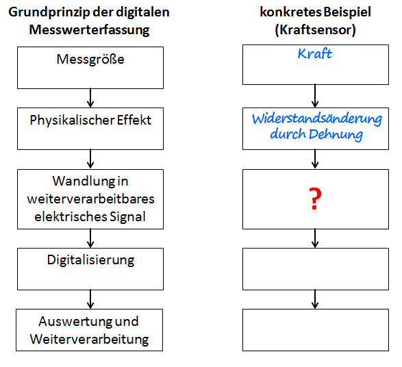

Zur Erinnerung: Unser Ziel ist es ja, Kräfte digital messen zu können. Durch die Dehnungsmessstreifen auf dem Federkörper der Wägezelle sind wir in der Lage, die durch die Krafteinwirkung verursachte Dehnung in eine Widerstandsänderung zu wandeln. Damit wir diese Widerstandsänderung digitalisieren können, müssen wir diese noch in ein weiterverarbeitbares elektrisches Signal wandeln, das wir mit unserem AD-Wandler digitalisieren können.

**Problem:** Die Widerstandsänderung der Dehnungsmessstreifen ist sehr klein. Mit einem Spannungsteiler wie beim digitalen Thermometer erhalten wir kein auswertbares Spannungssignal.

**Lösungsansatz:** Wir brauchen eine Schaltung, die empfindlich auf kleine Widerstandänderungen reagiert und diese in eine auswertbare Spannung wandelt. In der Messtechnik kommt dabei eine Brückenschaltung (Wheatstonesche Messbrücke) zum Einsatz.

Dazu benutzt man zwei parallele Spannungsteiler aus insgesamt vier Widerständen, die zusammen eine Brückenschaltung bilden.


<span style="color:#5882FA; font-size: 12pt">Aufgabe 4: </span> Berechnen Sie die Spannungsverhältnisse für die beiden Spannungsteiler für den Fall, dass die Wägezelle unbelastet ist und alle vier Widerstände *R<sub>1</sub>* = *R<sub>2</sub>* = *R<sub>3</sub>* = *R<sub>4</sub>* = *R* = 1000 &Omega; groß sind. Zur Erinnerung: Die Spannungen in einem Spannungsteiler verhalten sich immer wie die zugehörigen Widerstände. Damit ergeben sich für die Verhältnisse folgende Gleichungen:
$$
\frac{U_1}{U_2}=\frac{R_1}{R_{2}}
$$
bzw.
$$
\frac{U_3}{U_4}=\frac{R_3}{R_{4}}
$$
&nbsp;


&nbsp;


&nbsp;


&nbsp;


&nbsp;

<span style="color:#5882FA; font-size: 12pt">Aufgabe 5: </span> Notieren Sie: Was ergibt sich damit für die Spannungen *U<sub>1</sub>* , *U<sub>2</sub>* , *U<sub>3</sub>*  und *U<sub>4</sub>*, wenn die Gesamtspannung *U<sub>0</sub>* = 5 V beträgt?


&nbsp;


&nbsp;


&nbsp;


&nbsp;


&nbsp;

<span style="color:#5882FA; font-size: 12pt">Aufgabe 6: </span> Aus den Teilspannungen können wir nun mit Hilfe der Maschenregel (2. Kirchhoffsches Gesetz), die für uns relevante Messspannung *U<sub>M</sub>* berechnen. Dazu schauen wir uns die Masche aus *U<sub>2</sub>* , *U<sub>4</sub>*  und *U<sub>M</sub>* an (grüner Pfeil in der Abbildung der Schaltung).

Zur Erinnerung hier noch einmal die Maschenregel:  
Die Summe aller Teilspannungen längs einer geschlossenen Masche ist gleich null.

Stellen Sie mit Hilfe der Maschenregel die Gleichung für die Messspannung *U<sub>M</sub>* in Abhängigkeit von *U<sub>2</sub>* und *U<sub>4</sub>* auf.


&nbsp;


&nbsp;


&nbsp;

<span style="color:#5882FA; font-size: 12pt">Aufgabe 7: </span> Notieren Sie: Was gilt für die Messspannung *U<sub>M</sub>* mit den Ergebnissen für die Spannungen *U<sub>2</sub>* und *U<sub>4</sub>* aus Aufgabe 5? 


&nbsp;


&nbsp;


&nbsp;

<span style="color:#5882FA; font-size: 12pt">Aufgabe 8: </span> Denken wir noch einmal zurück an die Dehnungsmessstreifen auf der Wägezelle. Wirkt eine Kraft auf die Wägezelle, so werden die Dehnungsmessstreifen *R<sub>1</sub>* und *R<sub>4</sub>* gedehnt und ihr ohmscher Widerstand erhöht sich. Die Dehnungsmessstreifen *R<sub>2</sub>* und *R<sub>3</sub>* werden hingegen gestaucht und ihr ohmscher Widerstand verringert sich.

Beschreiben Sie, wie sich die Spannungen *U<sub>1</sub>* , *U<sub>2</sub>* , *U<sub>3</sub>*  und *U<sub>4</sub>* verändern, wenn eine Kraft auf die Wägezelle wirkt. Notieren Sie die Gleichungen, mit deren Hilfe Sie zu den Ergebnissen gekommen sind.


&nbsp;


&nbsp;


&nbsp;


&nbsp;


&nbsp;


&nbsp;

<span style="color:#5882FA; font-size: 12pt">Aufgabe 9: </span> Beschreiben Sie: Wie verändert sich mit den Ergebnissen aus Aufgabe 8 (belastete Wägezelle) die Messspannung *U<sub>M</sub>* gegenüber Aufgabe 7 (unbelastete Wägezelle)?


&nbsp;


&nbsp;


&nbsp;


&nbsp;

Unsere Erkenntnis aus den Aufgaben zuvor ist also, dass man mit Hilfe einer Brückenschaltung (Wheatstonesche Messbrücke) kleine Widerstandänderungen detektieren und in ein weiterverarbeitbares Spannungssignal wandeln kann. Ergänzen wir nun also unser Schema zum Grundprinzip der digitalen Messwerterfassung.

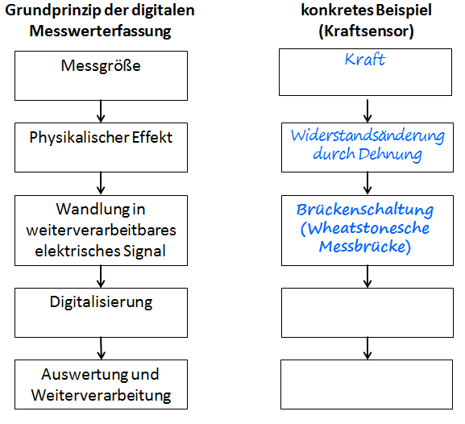

Auf unserem Weg zu einem digitalen Kraftsensor steht nun also die Digitalisierung an. Damit wir für die weiteren Schritte auf unsere Messergebnisse zugreifen können, nutzen wir das das Programm `phypi.py`. Hier haben wir die Möglichkeiten uns die digitalisierten Messwerte grafisch anzeigen zu lassen und können diese zur Auswertung abspeichern. Im Hintergrund laufen dabei dieselben Schritte ab, wie wir sie beim digitalen Thermometer in unseren eigenen Programmen durchgeführt haben.

<div style="page-break-after: always;"></div>

### Realisierung des digitalen Kraftsensors

**Material:**

- Kraftsensor, Wägezelle TAL220B
- AD-Wandler ADS1115
- Breadboard mit Spannungsversorgung und Netzteil
- Breadboard-Leitungen in verschiedenen Farben
- Raspberry Pi
- Flachbandkabel
- Instrumentenverstärker AD 623 ANZ
- 2 x 10 k&Omega; Widerstand (Farbcode: braun, schwarz, schwarz, rot, braun)
- 200 &Omega; Widerstand (Farbcode: rot, schwarz, schwarz, schwarz, braun)
- Keramikkondensator 0,1 µF
- Elektrolytkondensator 10 µF
- 5 x Massestück 100 g
- Schraubenfeder *D* = 10 N/m

**Durchführung:**

<span style="color:#5882FA; font-size: 12pt ">1. </span>Bauen Sie die nachfolgende Schaltung auf dem Breadboard auf. Aus den Tabellen kann entnommen werden, wie der AD-Wandler und die Wägezelle auf dem Breadboard anzuschließen ist. Zwischen der grünen und der weißen Messleitung können wir die Messspannung *U<sub>M</sub>* unserer Brückenschaltung messen.

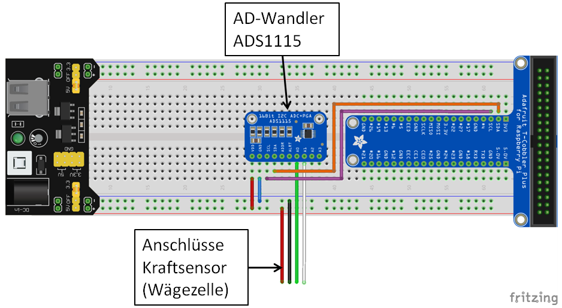

| Anschlüsse Wägezelle      | Anschlüsse Breadboard / GPIO-Pin |
| ------------------------- | -------------------------------- |
| rote Anschlussleitung     | 5 V                              |
| schwarze Anschlussleitung | 0 V                              |
| grüne Anschlussleitung    | A0 (AD-Wandler ADS1115)          |
| weiße Anschlussleitung    | A1 (AD-Wandler ADS1115)          |

| Anschlüsse AD-Wandler ADS1115 | Anschlüsse Breadboard / GPIO-Pin  |
| ----------------------------- | --------------------------------- |
| VDD                           | 5 V                               |
| GND                           | 0 V                               |
| SDL                           | GPIO-Pin SCL                      |
| SDA                           | GPIO-Pin SDA                      |
| A0                            | grüne Leitung der Wägezelle       |
| A1                            | weiße Signalleitung der Wägezelle |

<span style="color:#5882FA; font-size: 12pt ">2. </span> Befestigen Sie die Wägezelle an einem Stativ so, dass der auf der Stirnseite abgebildete Pfeil nach unten zeigt. Wir benutzen eine Wägezelle, die in Waagen bis 500 g eingesetzt wird. Diese hat im Gegensatz zur Wägezelle aus der 5 kg - Küchenwaage nicht nur zwei Bohrungen, sondern einen länglichen Schlitz zwischen den Bohrungen, sodass ebenfalls oben und unten Biegebalken entstehen. Diese Konstruktion ist nur notwendig, um eine höhere Empfindlichkeit zu ermöglichen, funktioniert aber genauso wie bei der Wägezelle oben. Das folgende Bild zeigt einen möglichen Aufbau (hier bereits mit Massestücken belastet). 

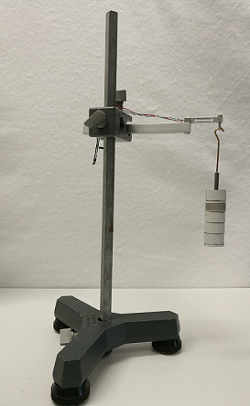

<div style="page-break-after: always;"></div>

<span style="color:#5882FA; font-size: 12pt ">3. </span>Wenn wir die Schaltung aufgebaut haben und die Wägezelle am Stativ angebracht haben, können wir unseren digitalen Kraftsensor das erste mal testen. Dazu starten wir das Programm "PhyPi" auf dem Desktop des Raspberry Pi mit einem Doppelklick.

<span style="color:#5882FA; font-size: 12pt ">4. </span> Jetzt können wir uns die mit Hilfe des AD-Wandlers die digitalisierte Messspannung *U<sub>M</sub>* anzeigen lassen. Dafür müssen wir zuerst noch den AD-Wandler passend konfigurieren. Dazu gehen wir über den Reiter Configuration auf die Device Config des ADS1115 und aktivieren den Edit Mode oben rechts.


<span style="color:#5882FA; font-size: 12pt ">5. </span>Da wir bereits wissen, dass die Widerstandsänderungen der Dehnungsmessstreifen und auch unserer Messspannung sehr klein sind, machen wir uns noch eine Eigenschaft des von uns verwendeten AD-Wandlers ADS1115 zunutze. Er ist in der Lage ein Eingangssignal mit einer Verstärkung von bis zu Faktor 16 zu verstärken. Außerdem müssen wir den AD-Wandler noch so konfigurieren, dass er die Spannungsdifferenz zwischen den Anschlüssen A0 und A1, also die Messspannung *U<sub>M</sub>* misst. Dazu passen wir die Konfigurationsdatei an:

1. Unter `ADCChannels:` in Zeile 5 geben wir in der eckigen Klammer mit `ADCChannels: [0]` an, welchen Kanal wir nutzen wollen.
2. Unter `DifModeChan:` in Zeile 16 geben wir in der eckigen Klammer mit `DifModeChan:[true]` an, dass wir die Differenz von A0 und A1 digitalisieren möchten.
3. Unter `Gain:` in Zeile 17 geben wir in der eckigen Klammer mit `Gain: [16]` an, dass wir das Eingangssignal mit dem Faktor 16 verstärken wollen.

<div style="page-break-after: always;"></div>

Nachfolgend ist die Konfiguration dargestellt, die sich daraus ergibt.

```yaml
# example of a configuration file for ADC ADS1115

DAQModule: ADS1115Config  

ADCChannels: [0]         # active ADC-Channels
                            # possible values: 0, 1, 2, 3
                              # when using differential mode:
                                #  -  0 = ADCChannel 0 
                                #          minus ADCChannel 1
                                #  -  1 = ADCChannel 0 
                                #          minus ADCChannel 3
                                #  -  2 = ADCChannel 1 
                                #          minus ADCChannel 3
                                #  -  3 = ADCChannel 2 
                                #          minus ADCChannel 3
DifModeChan: [true]   # enable differential mode for Channels
Gain: [16]                # programmable gain of ADC-Channel
                              # possible values for Gain:
                              #  - 2/3 = +/-6.144V
                              #  -   1 = +/-4.096V
                              #  -   2 = +/-2.048V  
                              #  -   4 = +/-1.024V
                              #  -   8 = +/-0.512V
                              #  -  16 = +/-0.256V
sampleRate: 860             # programmable Sample Rate of ADS1115
                              # possible values for SampleRate: 
                              # 8, 16, 32, 64, 128, 250, 475, 860
```

<span style="color:#5882FA; font-size: 12pt ">6. </span> In der PhyPi Config können wir noch Einstellungen für die grafische Ausgabe, das Messintervall und weitere Einstellungen für die Ausgabe der Messwerte angeben. Hier passen wir noch den dargestellten Wertebereich für die grafische Darstellung an, damit wir nur den für uns interessanten Wertebereich angezeigt bekommen.

1. Dazu löschen wir die beiden `##` vor `ChanLimits:` in Zeile 26, um die Einstellung des dargestellten Werteberichs zu aktivieren.
2. Da unsere Messspannung *U<sub>M</sub>* sehr klein und bei einer einwirkenden Kraft von oben positiv ist, lassen wir uns einen Bereich von - 1 mV bis 5 mV anzeigen. Dazu entfernen wir die beiden `##` in Zeile 27 und passen die Werte in der eckigen Klammer entsprechend an `- [-0.001, 0.005]`.

<div style="page-break-after: always;"></div>

```yaml
# Configuration Options for PhyPiDAQ 

# device configuration files 
DeviceFile: config/ADS1115Config.yaml  
#DeviceFile: config/MCP3008Config.yaml  
#DeviceFile: config/PSConfig.yaml         
#DeviceFile: config/MAX31865Config.yaml 
#DeviceFile: config/GPIOCount.yaml

## an example of multiple devices
#DeviceFile: [config/ADS1115Config.yaml, config/GPIOCount.yaml]  


DisplayModule: DataLogger
# DisplayModule: DataGraphs  # text, bar-graph, history and xy-view
Interval: 0.1                     # logging interval         
XYmode:     false                 # enable/disable XY-display


# channel-specific information
ChanLabels: [U, U]                 # names for channels 
ChanUnits: [V, V]                  # units for channels
ChanColors: [darkblue, sienna]    # channel colours in display

# eventually overwrite Channel Limits obtained from device config 
ChanLimits: 
 - [-0.001, 0.005]   # chan 0
## - [0., 1.]   # chan 1
## - [0., 1.]   # chan 2

# calibration of channel values
#  - null    or  - <factor> or  - [ [ <true values> ], [ <raw values> ] ]
#ChanCalib:
#  - 1.                          # chan0: simple calibration factor
#  - [ [0.,1.], [0., 1.] ]    # chan1: interpolation: [true]([<raw>] )
#  - null                      # chan2: no calibration

# apply formulae to calibrated channel values
#ChanFormula:
#  - c0 + c1  # chan0
#  - c1          # chan1
#  - null        # chan2 : no formula

# name of output file
DataFile:   null                  # file name for output file 
#DataFile:   testfile.csv         # file name for output file 
#CSVseparator: ';'
```
<div style="page-break-after: always;"></div>

<span style="color:#5882FA; font-size: 12pt ">7. </span> Über den Reiter Control, anschließendes Klicken auf StartRun und Bestätigen mit OK können wir nun PhyPiDAQ starten und uns die digitalisierte Messspannung über der Zeit anzeigen lassen.

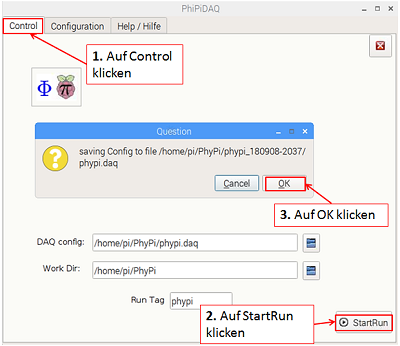

<span style="color:#5882FA; font-size: 12pt ">8. </span> Jetzt können wir durch Belasten und Entlasten der Wägezelle mit den Fingern testen, ob wir eine digitalisierte Messspannung angezeigt bekommen und ob sich diese wie erwartet verändert. 

Die nachfolgende Abbildung zeigt beispielhaft eine solche Messung.


<div style="page-break-after: always;"></div>

<span style="color:#5882FA; font-size: 12pt ">9. </span> **Problem:** Die sehr kleine Messspannung bringt mehrere Nachteile mit sich: Zum einen sind solch kleine Spannungssignale sehr störanfällig. Bereits kleine Störspannungen wirken sich massiv auf das Messergebnis aus. Zum anderen können wir die Messspannung nur schlecht auflösen (wir können nur wenige der Digitalisierungsstufen des AD-Wandlers nutzen).

**Lösungsansatz:** Wir verstärken die analoge Messspannung *U<sub>M</sub>*, bevor wir diese digitalisieren. Dadurch beeinflussen Störungen die Messspannung wesentlich weniger, wenn diese nach der Verstärkung auftreten. Für die Digitalisierung mit dem AD-Wandler ist für uns entscheidend, dass wir die Digitalisierungsstufen des AD-Wandlers gut ausnutzen, damit wir unsere Messspannung möglichst gut auflösen. Deshalb wählen wir eine Verstärkung, die so groß ist, dass wir den Messbereich des AD-Wandlers gut ausnutzen.

<span style="color:#5882FA; font-size: 12pt ">10. </span> **Der Instrumentenverstärker**: Für die Verstärkung verwenden wir einen sogenannten Instrumentenverstärker, der es uns ermöglicht unsere Messspannung mit einem einstellbaren Verstärkungsfaktor zu verstärken. Die Einstellung erfolgt durch einen Widerstand, der an den Instrumentenverstärker angeschlossen wird. In unserem Fall wählen wir einen Verstärkungsfaktor von 500, indem wir an den Instrumentenverstärker einen Widerstand von 200 &Omega; anschließen. Die Messspannung wird also 500 Mal größer als ohne Verstärkung. Der Instrumentenverstärker AD623 ist ein elektronisches Bauelement mit insgesamt acht Pins (Anschlüssen). In der nachfolgenden Abbildung ist die Pinbelegung für den Instrumentenverstärker AD623 dargestellt. Das Gehäuse des Instrumentenverstärkers hat an einer Seite eine Einkerbung. Die Pins sind so nummeriert, dass von oben gesehen der Pin links dieser Einkerbung die Nummer 1 und der Pin rechts von der Einkerbung die Nummer 8 bekommt. Die anderen Pins sind dann entsprechend durchnummeriert. Beim Einbau des Instrumentenverstärkers in eine Schaltung muss unbedingt darauf geachtet werden, dass die Pins des Instrumentenverstärkers korrekt angeschlossen werden.


<div style="page-break-after: always;"></div>

Aus der Tabelle kann entnommen werden, welche Funktionen die einzelnen Pins des Instrumentenverstärkers haben und wie dieses angeschlossen werden müssen.

| Pin (Anschluss) | Beschreibung                                                 |
| :-------------: | ------------------------------------------------------------ |
|        1        | - R<sub>G</sub>: Anschluss für den Widerstand zur Einstellung des Verstärkungsfaktors. |
|        2        | - IN: Negativer Anschluss des Messsignals (grüne Leitung des Kraftsensors). |
|        3        | + IN: Positiver Anschluss des Messsignals (weiße Leitung des Kraftsensors). |
|        4        | -V<sub>s</sub>: Negative Versorgungsspannung 0 V.            |
|        5        | REF: Über diesen Eingang kann eine Referenzspannung zum Messsignal addiert werden. |
|        6        | OUTPUT: Verstärkte Messspannung als Ausgangssignal.          |
|        7        | +V<sub>s</sub>: Positive Versorgungspannung 5 V.             |
|        8        | + R<sub>G</sub>: Anschluss für den Widerstand zur Einstellung des Verstärkungsfaktors. |

<span style="color:#5882FA; font-size: 12pt ">11. </span> Bauen Sie die nachfolgende Schaltung auf dem Breadboard auf. Achten Sie während des Aufbaus darauf, dass die Spannungsversorgung des Breadboards ausgeschaltet ist (grüne LED leuchtet nicht). Da die Schaltung komplizierter ist, sollte auf jeden Fall sehr gründlich kontrolliert werden, ob alle Bauelemente richtig angeschlossen sind, bevor die Spannungsversorgung des Breadboards eingeschaltet wird. Der AD-Wandler ADS-1115 und die Wägezelle sind im nachfolgenden Schaltplan nicht dargestellt. Die Anschlussbelegung dieser Komponenten kann den Tabellen unter dem Schaltplan entnommen werden.


| Anschlüsse Wägezelle      | Anschlüsse Breadboard / GPIO-Pin         |
| ------------------------- | ---------------------------------------- |
| rote Anschlussleitung     | 5 V                                      |
| schwarze Anschlussleitung | 0 V                                      |
| grüne Anschlussleitung    | +IN Instrumentenverstärker AD623 (Pin 3) |
| weiße Anschlussleitung    | -IN Instrumentenverstärker AD623 (Pin 2) |

| Anschlüsse AD-Wandler ADS1115 | Anschlüsse Breadboard / GPIO-Pin                     |
| ----------------------------- | ---------------------------------------------------- |
| VDD                           | 5 V                                                  |
| GND                           | 0 V                                                  |
| SDL                           | GPIO-Pin SCL                                         |
| SDA                           | GPIO-Pin SDA                                         |
| A0                            | OUTPUT Instrumentenverstärker AD623 (Pin 6)          |
| A1                            | 2,5 V (zwischen *R<sub>1</sub>* und *R<sub>2</sub>*) |


**Zusatzinformation zur Schaltung für Interessierte:**  
Die beiden Kondensatoren *C<sub>1</sub>* und *C<sub>2</sub>* sind dazu da, Störsignale in unserer Schaltung zu unterdrücken. Mit dem Spannungsteiler aus den Widerständen *R<sub>1</sub>* und *R<sub>2</sub>* halbieren wir die Versorgungsspannung von 5 V, sodass wir zwischen den beiden Widerständen eine Spannung von 2,5 V abgreifen können. Diese addieren wir über den Pin 5 des Instrumentenverstärkers zur verstärkten Messspannung. Dieser Schritt ist notwendig, da wir sonst sehr kleine Messspannungen und negative Messspannungen nicht verstärken könnten. Da wir diesen Offset von 2,5 V in unserem digitalisierten Wert der Messspannung nicht mehr haben möchten, ziehen wir die Spannung von 2,5 V im AD-Wandler wieder ab, indem wir die Spannung von 2,5 V zwischen den Widerständen des Spannungsteilers abgreifen und am Eingang A1 des AD-Wandlers anschließen. Durch die Konfiguration des AD-Wandlers sorgen wir dann dafür, dass dieser die Spannungs-differenz zwischen den Eingängen A0 und A1 digitalisiert und unsere digitalisierte Messspannung wieder um den Offset von 2,5 V bereinigt ist.

<span style="color:#5882FA; font-size: 12pt ">12. </span> Jetzt können wir unsere Schaltung testen und schauen, ob diese wie erwartet funktioniert und uns die verstärkte und digitalisierte Messspannung anzeigen lassen.

1. Dazu starten wir wieder das Programm PhyPi auf dem Desktop und wechseln über den Reiter **Configuration** und **PhyPi Config** in die Konfiguration des Messdatenerfassungssystems PhyPi.

2. Hier nehmen wir eine Änderung vor: Wir wählen eine andere Darstellung unserer Messwerte. Dazu deaktivieren wir zuerst das Display-Modul DataLogger in Zeile 14, indem wir diese Zeile mit Hilfe eines `#` auskommentieren (`#DisplayModule: DataLogger`). Stattdessen aktivieren wir das Display-Modul DataGraphs in Zeile 15, indem wir den `#` entfernen (`DisplayModule: DataGraphs`). Nun bekommen wir außer dem zeitlichen Verlauf unserer digitalisierten Messspannung auch deren aktuellen Wert in Textform und ein Balkendiagramm angezeigt.

```yaml
# Configuration Options for PhyPiDAQ 

# device configuration files 
DeviceFile: config/ADS1115Config.yaml  
#DeviceFile: config/MCP3008Config.yaml  
#DeviceFile: config/PSConfig.yaml         
#DeviceFile: config/MAX31865Config.yaml 
#DeviceFile: config/GPIOCount.yaml

## an example of multiple devices
#DeviceFile: [config/ADS1115Config.yaml, config/GPIOCount.yaml]  


# DisplayModule: DataLogger
DisplayModule: DataGraphs  # text, bar-graph, history and xy-view
Interval: 0.1                     # logging interval         
XYmode:     false                 # enable/disable XY-display


# channel-specific information
ChanLabels: [U, U]                 # names for channels 
ChanUnits: [V, V]                  # units for channels
ChanColors: [darkblue, sienna]    # channel colours in display

# eventually overwrite Channel Limits obtained from device config 
##ChanLimits: 
## - [0., 1.]   # chan 0
## - [0., 1.]   # chan 1
## - [0., 1.]   # chan 2

# calibration of channel values
#  - null    or  - <factor> or  - [ [ <true values> ], [ <raw values> ] ]
#ChanCalib: 
#  - 1.                          # chan0: simple calibration factor
#  - [ [0.,1.], [0., 1.] ]    # chan1: interpolation: [true]([<raw>] )
#  - null                      # chan2: no calibration

# apply formulae to calibrated channel values
#ChanFormula:
#  - c0 + c1  # chan0
#  - c1          # chan1
#  - null        # chan2 : no formula

# name of output file
DataFile:   null                  # file name for output file 
#DataFile:   testfile.csv         # file name for output file 
#CSVseparator: ';'

```

3. Außerdem müssen wir noch den AD-Wandler ADS1115 passend konfigurieren: Dazu wechseln wir über den Reiter **Device Config** in die Konfigurationsdatei des ADS1115.
4. Hier passen wir die Konfiguration für unsere Messung an:  Zum einen müssen wir den AD-Wandler so konfigurieren, dass dieser uns die Spannungsdifferenz zwischen den Anschlüssen A0 und A1, also unsere verstärkte Messspannung digitalisiert. Dazu ändern wir Zeile 5 in `ADCChannels:[0] ` und Zeile 16 in `DifModeChan: [true]`. Zum anderen passen wir die interne Verstärkung und damit den Messbereich des AD-Wandlers so an, dass wir den Messbereich möglichst gut ausnutzen. Dazu ändern wir Zeile 17 in `Gain:[2]`, sodass unsere Messspannung noch mal um den Faktor zwei verstärkt wird und wir Spannungen in einem Bereich von +2,048 V und -2,048 V digitalisieren können.

```yaml
# example of a configuration file for ADC ADS1115

DAQModule: ADS1115Config  

ADCChannels: [0]         # active ADC-Channels
                            # possible values: 0, 1, 2, 3
                              # when using differential mode:
                                #  -  0 = ADCChannel 0 
                                #          minus ADCChannel 1
                                #  -  1 = ADCChannel 0 
                                #          minus ADCChannel 3
                                #  -  2 = ADCChannel 1 
                                #          minus ADCChannel 3
                                #  -  3 = ADCChannel 2 
                                #          minus ADCChannel 3
DifModeChan: [true]   # enable differential mode for Channels
Gain: [2]                # programmable gain of ADC-Channel
                              # possible values for Gain:
                              #  - 2/3 = +/-6.144V
                              #  -   1 = +/-4.096V
                              #  -   2 = +/-2.048V  
                              #  -   4 = +/-1.024V
                              #  -   8 = +/-0.512V
                              #  -  16 = +/-0.256V
sampleRate: 860             # programmable Sample Rate of ADS1115
                              # possible values for SampleRate: 
                              # 8, 16, 32, 64, 128, 250, 475, 860
```

5. Nun können wir unseren Test starten: Dazu wechseln wir zu **Control** und starten die Messung mit **StartRun**. Mit den Fingern können wir nun sanft von oben oder unten auf den Kraftsensor drücken und testen, ob sich das Messsignal wie gewünscht verändert. Das Bild unten zeigt beispielhaft einen erfolgreichen Test.

   

<div style="page-break-after: always;"></div>

6. Wir können nun unser Schema zum Grundprinzip der digitalen Messwerterfassung um die Verstärkung der Messspannung durch den Instrumentenverstärker und die Analog-Digital-Wandlung ergänzen.

   

<span style="color:#5882FA; font-size: 12pt ">13. </span>  Nach der Digitalisierung haben wir nun eine digitalisierte Messspannung, aber keinen digitalisierten Wert der auf den Kraftsensor wirkenden Kraft. Uns fehlt also noch die Umrechnung und Weiterverabeitung unserer digitalisierten Messspannung. Um wirklich Kräfte zu messen, müssen wir unseren digitalen Kraftsensor also noch kalibrieren. Dazu nehmen wir für die Gewichtskraft verschiedener bekannter Massen die digitalisierte Messspannung auf.

Füllen Sie die nachfolgende Tabelle aus. Wiegen Sie dafür zunächst die benötigten Massestücke mit einer Laborwaage ab und tragen Sie das Messergebnis in die Tabelle ein. Berechnen Sie die zugehörige Gewichtskraft *F<sub>G</sub>* aus der gemessenen Masse *m* und der Gravitationsfeldstärke *g* = 9,81 m/s<sup>2</sup>.
$$
F_G=m\cdot g
$$
Um die Messspannung *U<sub>M</sub>*  zu ermitteln, führen Sie die Schritte 1. bis 11. für jede zu messende Masse aus.

|                                   | 0 g  | 100 g | 200 g | 300 g | 400 g |
| --------------------------------- | ---- | ----- | ----- | ----- | ----- |
| gemessene Masse  *m* in g         |      |       |       |       |       |
| Gewichtskraft *F* in N            |      |       |       |       |       |
| Messspannung *U<sub>M</sub>* in V |      |       |       |       |       |

1. Wir starten wieder das Programm **PhyPi** und nutzen die Konfiguration unserer eben durchgeführten Messung. Dazu klicken wir in der Zeile **DAQ config** auf das Ordnersymbol. 

   

2. Wir öffnen links oben **Persönliche Ordner** und wechseln dann in das Verzeichnis **PhyPi**. Im neuesten phypi-Ordner liegt die Konfiguration unseres Tests bzw. unserer letzten Messung. Mit einem Doppelklick auf die **.daq-Datei** laden wir diese Konfiguration in PhyPi.

3. Damit uns bei der Kalibrierung nur ein sinnvoller Wertebereich angezeigt wird, gehen wir über den Reiter **Configuration** wieder auf die **PhyPi Config** und aktivieren in Zeile 26 durch Entfernen der beiden `##` vor `ChanLimits` die Anzeigebereichseinstellung. Jetzt können wir durch Entfernen der beiden `## ` in der nachfolgenden Zeile einen Wertebereich für die Anzeige vorgeben `- [-0.5, 2.]   # chan 0`.

4. Damit wir nicht nur Daten angezeigt bekommen, sondern diese auch zur Auswertung gespeichert werden, müssen wir in Zeile 45 unter `DataFile: ` einen Dateinamen `kalibrierung_<hier verwendete Masse eintragen>.csv` anstatt `null` angeben. Unsere Messdaten werden dann im PhyPi-Verzeichnis im neuesten Ordner abgelegt.

5. Nun hängen wir das entsprechende Massestück an den Kraftsensor und achten darauf, dass dieses nicht pendelt, wenn wir die Messung beginnen.

6. Wir klicken auf den Reiter **Control** und starten die Messung mit **StartRun**.

7. Nach etwas mehr als 10 Sekunden beenden wir die Messung über **End**.

8. Jetzt können wir unsere aufgenommenen Messwerte für die Kalibrierung auswerten. Damit wir die Daten nachher zuordnen können, benennen wir den jeweils neuesten Ordner im Verzeichnis PhyPi in kalibrierung_&lt; jeweilige Masse &gt; um.

9. Nun lesen wir die Daten in das Tabellenkalkulationsprogramm **LibreOffice Calc** (ähnlich Excel) ein. Zunächst öffnen wir das Programm: Dazu klicken wir auf dem Startbildschirm links oben auf die **Himbeere**, dann auf **Büro** und auf **LibreOffice Calc**.

10. Wir öffnen unsere Messdaten aus dem eben umbenannten Ordner und lesen diese in LibreOffice Calc ein.

11. Nun können wir für unsere Kalibrierung den Mittelwert aus 100 Messwerten für die Messspannung *U<sub>M</sub>* berechnen und in unsere Tabelle oben übernehmen.  
    Berechnung eines Mittelwerts mit LibreOffice Calc:

    - Wir klicken auf eine beliebige leere Zelle in der Tabelle.

    - Wir berechnen mit `= MITTELWERT(A4:A103)` den Mittelwert aus den Zellen A4 bis A103.

    - Den errechneten Mittelwert für die Messspannung *U<sub>M</sub>* tragen wir nun in die Tabelle oben ein.  


<span style="color:#5882FA; font-size: 12pt ">14. </span> Nun können wir die Kalibrierung abschließen, indem wir PhyPi starten und als Basis für die Konfiguration die .daq-Datei unserer letzten Messung im PhyPi-Verzeichnis öffnen. Wir wechseln wieder in die PhyPi Config und können nun unsere Kalibrierung vornehmen:

1. Durch Entfernen der beiden `##` in Zeile 33 aktivieren wir die Kalibrierungsfunktion `ChanCalib:`.
2. In Zeile 32 fügen wir unsere Werte für die Gewichtskraft *F<sub>G</sub>* und die zugehörige Messspannung *U<sub>M</sub>* ein, mit deren Hilfe PhyPi dann eine Funktion für die gemessene Kraft in Abhängigkeit von der Messspannung *U<sub>M</sub>* berechnet. Mit dieser Funktion kann dann für jeden beliebigen Zwischenwert ein zugehöriger Kraftwert berechnet werden.
3. Damit wir den passenden Wertebereich angezeigt bekommen, passen wir in Zeile 27 den Anzeigebereich entsprechend an `-[0., 5.]`.
4. Da unser angezeigter Messwert nun keine Spannung mehr ist, passen wir Zeile 21 an die Messgröße Kraft `ChanLabels:[N]` und Zeile 22 an die entsprechende Einheit `ChanUnits: [N]`  an.

```yaml
# Configuration Options for PhyPiDAQ 

# device configuration files 
DeviceFile: config/ADS1115Config.yaml  
#DeviceFile: config/MCP3008Config.yaml  
#DeviceFile: config/PSConfig.yaml         
#DeviceFile: config/MAX31865Config.yaml 
#DeviceFile: config/GPIOCount.yaml

## an example of multiple devices
#DeviceFile: [config/ADS1115Config.yaml, config/GPIOCount.yaml]  


# DisplayModule: DataLogger
DisplayModule: DataGraphs  # text, bar-graph, history and xy-view
Interval: 0.1                     # logging interval         
XYmode:     false                 # enable/disable XY-display


# channel-specific information
ChanLabels: [F]                 # names for channels 
ChanUnits: [N]                  # units for channels 
ChanColors: [darkblue, sienna]    # channel colours in display

# eventually overwrite Channel Limits obtained from device config 
ChanLimits: 
 - [0., 5.]   # chan 0
## - [0., 1.]   # chan 1
## - [0., 1.]   # chan 2

# calibration of channel values
#  - null    or  - <factor> or  - [ [ <true values> ], [ <raw values> ] ]
ChanCalib:
- [[FG0, FG100, FG200, FG300, FG400], [UM0, UM100, UM200, UM300, UM400]]
#  - 1.                          # chan0: simple calibration factor
#  - [ [0.,1.], [0., 1.] ]    # chan1: interpolation: [true]([<raw>] )
#  - null                      # chan2: no calibration

# apply formulae to calibrated channel values
#ChanFormula:
#  - c0 + c1  # chan0
#  - c1          # chan1
#  - null        # chan2 : no formula

# name of output file
DataFile:   null                  # file name for output file 
#DataFile:   testfile.csv         # file name for output file 
#CSVseparator: ';'

```
5. Mit der Kalibrierung können wir unser Schema zum Grundprinzip der digitalen Messwerterfassung um den letzten Schritt, die Umrechnung der digitalisierten Messpannung in eine Kraft, ergänzen.

   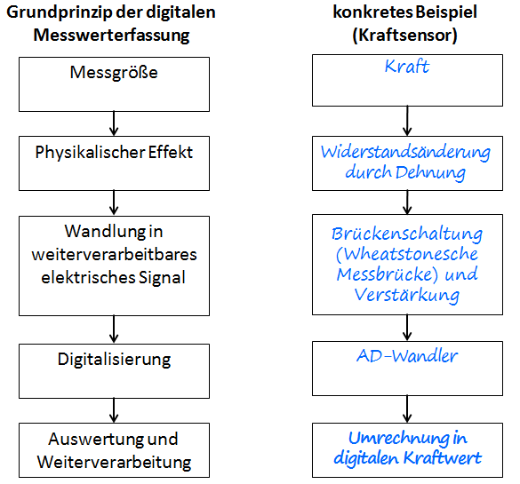

<span style="color:#5882FA; font-size: 12pt ">15. </span> Jetzt können wir unseren digitalen Kraftsensor abschließend in einem Physikexperiment testen. Dazu lassen wir uns den Kraftverlauf im Aufhängepunkt eines Federpendels anzeigen:

1. Wir hängen die Schraubenfeder mit einer angehängten Masse von *m* = 300 g an unserem Kraftsensor ein und versetzen das System in Schwingung.

2. Nun können wir die Messung wie gewohnt starten. 

Nachfolgend ist beispielhaft der zeitliche Kraftverlauf im Aufhängepunkt eines Federpendels dargestellt. 
  
Auf eine quantitative Auswertung verzichten wir an dieser Stelle. Trotzdem können wir einige grundsätzliche Beobachtungen festhalten.  
Die Kraft im Aufhängepunkt ist am oberen Umkehrpunkt des Federpendels am kleinsten und am unteren Umkehrpunkt am größten. Das Messsignal schwingt um einen Gleichgewichtszustand. Dieser Gleichgewichtszustand entspricht der Gewichtskraft von Feder und angehängter Masse.