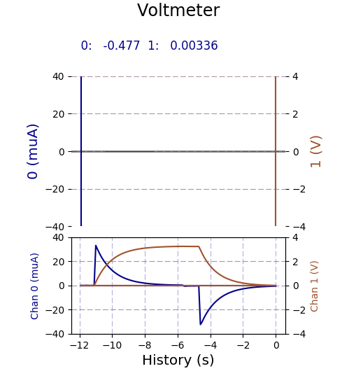

# Kondensatorladung/-entladung

Der folgende Versuch dient der Aufzeichnung der Lade- und Entladekurve eines Kondensators im RC-Glied.


**Benötigte Bauteile:**

* ADS1115 Analog-Digital-Wandler
* 1 Kondensator (empfohlen $100\mu F$)
* 1 Widerstand (empfohlen $10k\Omega$)
* 2 Schalter (optional)

Die Lade- und Entladezeit ist proportional zum Widerstand und zur Kapazität, für gute Resulate wird empfohlen, die Komponenten so zu Wählen, dass $ \tau= RC $ nicht << 1s oder >> 1s ist.

**Versuchsaufbau:**


Betätigen von Schalter S1 läd den Kondensator auf, betätigen von Schalter S2 entläd den Kondensator. Wird kein Schalter gedrückt behält der Kondensator seinen aktuellen Ladezustand bei. Alternativ kann statt zweier Schalter auch durch Umstecken eines Kabels umgeschaltet werden:


Wird ein Elektrolytkondensator verwendet, so ist zu beachten, dass diese gepolt sind. In der Regel ist der Pluspol durch einen längeren Anschlussdraht markiert, analog zu Dioden.
 Vor Abbau des Versuchs sollte der Kondensator noch einmal entladen werden.

**Erläuterung des Versuchs:**

In diesem Versuch wollen wir zwei Größen messen, den Ladezustand des Kondensators und den Stromfluss durch diesen.
Die Ladung des Kondensators ergibt sich aus der Gleichung $Q=CU$, die Ladung ist also, bis auf einen Faktor, gleich der Spannung über dem Kondensator. Mit dem Eingang A1 wird das Potential auf der einen Seite des Kondensators gemessen, die andere Seite liegt direkt an der Erdung. Eingang A1 liefert damit direkt die Spannung über dem Kondensator.
Der Strom kann mit PhyPi nicht direkt gemessen werden, aber mit Hilfe der Spannung über einem bekannten Widerstand errechnet werden. Die Differenz der Potentiale A0 und A1 ist in unserem Aufbau die Spannung über dem Widerstand, dessen Wert bekannt ist, folglich gilt für den Strom $I=(A0-A1)/R.$
Die notwendigen Rechnungen können direkt über die Kanal-Formel-Funktion von PhyPi durchgeführt werden. Erläuterungen zur Config finden sie weiter unten.

**Versuchsdurchführung:**

War der Kondensator vor Versuchsbeginn ungeladen, so sollte die Spannung über ihm 0V sein, bevor die Spannungsversorgung zum ersten Mal angeschlossen wird. Ist dies nicht der Fall, so ist der Kondensator bereits geladen und ein Schließen des Entladekreises sollte die Spannung auf 0V bringen.
Die eigentliche Durchführung besteht dann aus abwechselndem Laden und Entladen des Kondensators durch Drücken des passenden Schalters, beziehungsweise durch Einstecken des Kabels an die passende Stelle.

**Erläuterungen zur Config:**

Die mitgelieferte Config nimmt an, dass die Empfohlenen Werte für Widerstand und Kondensator verwendet wurden. Wenn andere Teile verwendet werden, muss dementsprechend die Datei editiert werden.

```Python
# Configuration Options for PhyPiDAQ 

# device configuration files 
DeviceFile: config/ADS1115Config.yaml  
#DeviceFile: config/MCP3008Config.yaml  
#DeviceFile: config/PSConfig.yaml         
#DeviceFile: config/MAX31865Config.yaml 
#DeviceFile: config/GPIOCount.yaml


#DisplayModule: DataLogger
DisplayModule: DataGraphs  # text, bar-graph, history and xy-view
Interval: 0.1                     # logging interval         
XYmode:     false                 # enable/disable XY-display


# channel-specific information
ChanLabels: [(muA), (muC)]          # names and/or units for channels 
ChanColors: [darkblue,sienna]    # channel colours in display

# eventually overwrite Channel Limits obtained from device config 
ChanLimits: 
 - [-400., 400.]   # chan 0 Stromstärkebereich ist umgekehrt proportional zum verwendeten Widerstand.
 - [-400., 400.]   # chan 1 Ladungsbereich ist proportional zum verwendeten Kondensator.
# Negativer Ladungsbereich wird nicht tatsächlich verwendet, diese Einstellung liefert aber bessere Visualierung.

# apply formulae to calibrated channel values
ChanFormula:
  - (c0 - c1)/(10**4)*10**6  # chan0 10**4 ist der Wert des verwendeten Widerstands in Ohm. 10**6 die Konvertierung von A in muA.
  - c1*100          # chan1 100 ist die Kapazität in muF. 


# name of output file

DataFile:   Kondensator.csv         # file name for output file 
CSVseparator: ';'

 
```

**Aufgaben:**

1. Bauen sie den Versuch wie beschrieben auf und führen ihn durch. Nehmen sie mindestens drei vollständige Ladungen und Entladungen auf.
2. Übertragen sie die gewonnenen Daten in Excel und stellen sie als ein passendes Diagramm dar.
3. Ermitteln sie Funktionsgleichungen für die Ladungs- und Stromkurven. Gehen sie dazu wie folgt vor
   * Suchen sie in ihren Daten den Startpunkt und einen ungefähren Endpunkt der Ladung/Entladung
   * Erzeugen sie ein t-Q- bzw. t-I-Diagramm nur über diesen Zeitraum
   * Schätzen sie eine Exponentialfunktion ab, die zu dieser Kurve passen könnte und zeichnen sie ein.
4. Diskutieren sie die Ergebnisse. Entspricht das Resultat ihrer Erwartung?
5. Nehmen sie weitere Lade-/Entladevorgänge mit anderen Widerstands/Kondensatorkombinationen auf und vergleichen sie es mit der ursprünglichen Messung.

## Anhang


### Erläuterung der Ergebnisse

Noch zu erledigen.




### Schaltplan

