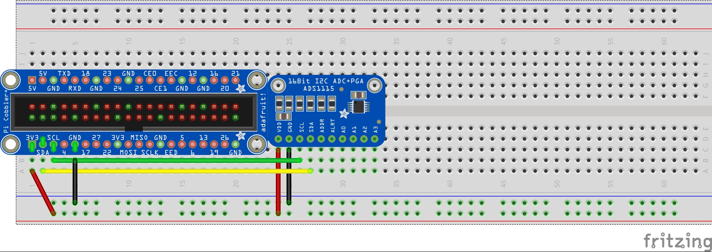
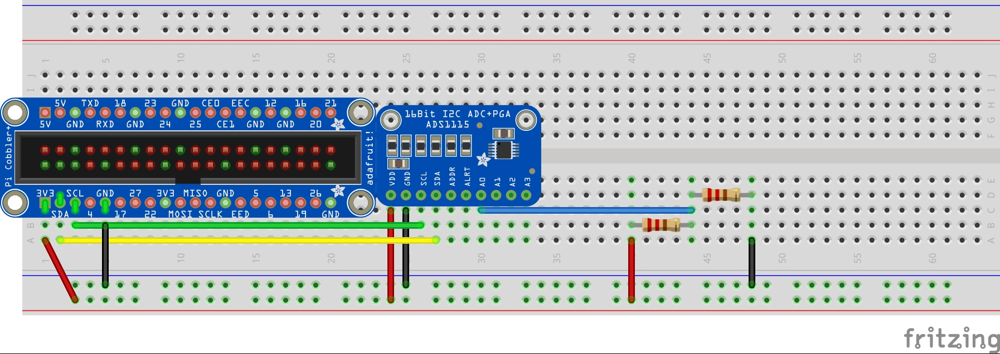
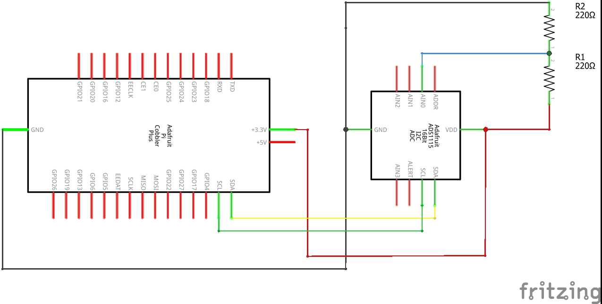
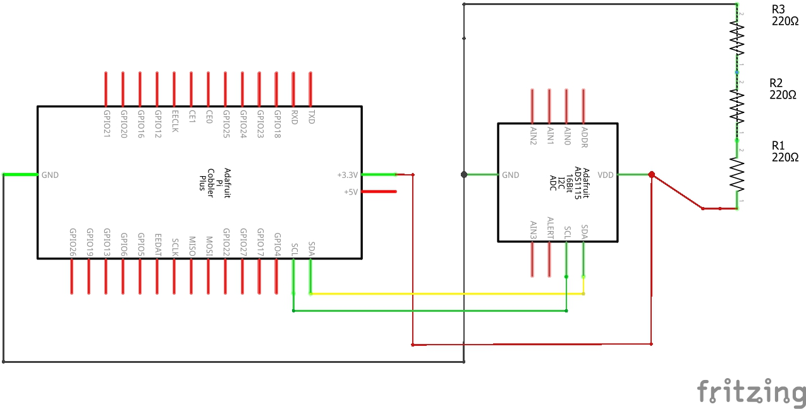
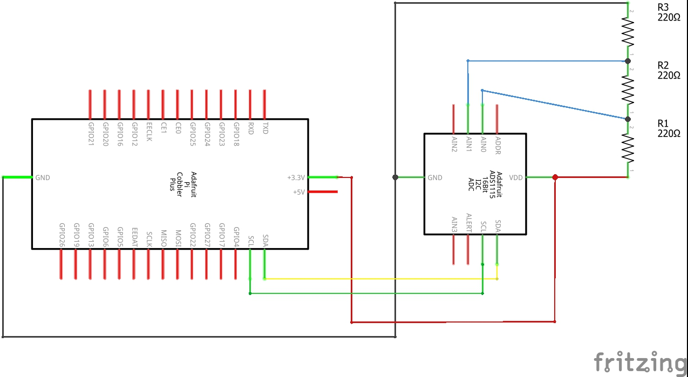

# Spannungsmessung mit dem ADS1115

Diese Anleitung dient als eine generelle Richtlinie zum Messen von Spannung mit dem ADS1115 Analog-Digital-Wandler. Spezielle Versuche werden in diesem Dokument nicht vorgestellt.

__*Wichtiger Hinweis: Unter keinen Umständen Schaltungen bauen, deren Spannung den zulässigen Arbeitsbereich des Raspberry Pi übersteigen! Insbesondere keine Spannungsquellen verwenden, die eine zu hohe Spannung erzeugen können und keine Schwingkreise über die GPIO-Pins messen.*__


**Benötigte Bauteile:**

* ADS1115 Analog-Digital-Wandler

Anschluss:

Der ADS1115 wird wie folgt an den Raspberry Pi angeschlossen:

* VDD auf 3.3V
* GND auf GND
* SCL auf SCL (GPIO3)
* SDA auf SDA (GPIO2)




Die Messleitungen werden an die Eingänge A0 - A3 des ADS1115 angeschlossen. Als Beispiel eine Messleitung an A0 in einem einfachen Stromkreis aus zwei Widerständen.



Wie erkennbar ist, wird über nur eine Leitung gemessen und nicht über zwei Leitungen, wie bei einer Spannungsmessung mit dem Voltmeter. **Mit dem ADS1115 kann daher nicht direkt die Spannung zwischen zwei Punkten gemessen werden, sondern das Potential an der Messstelle, relativ zur Erdung.** Zum messen des Spannungsabfalls über ein bestimmtes Bauteil oder einen Bereich der Schaltung, sind daher unter Umständen mehrere Messungen und zusätzlich Berechnungen nötig.

Dies soll nun noch an einigen Beispielen genauer erläutert werden. Betrachten wir den Schaltplan der Schaltung aus dem obigen Beispiel:



Unsere Schaltung misst das Potential im Bereich zwischen den beiden Widerständen. Widerstand R2 ist zwischen diesen Bereich und dem Nullpotential geschaltet. Hier entspricht der Spannungsabfall über R2 also genau dem gemessenen Potential.
Widerstand R1 befindet sich zwischen unserem gemessenen Potential und dem Eingangsniveau von 3.3V. Der Spannungsabfall hier ist also die Differenz zwischen Eingangsniveau und dem angezeigten Messergebnis.

Betrachten wir nun noch den komplizierteren Fall, dass auf einer Seite des auszumessenden Bauteils kein bekanntes Potentialniveau liegt, beispielsweise den mittleren Widerstand in dieser Schaltung.





Um hier den Spannungsabfall über R2 zu bestimmen, müssen die Potentiale vor und nach R2 gemessen werden und ihre Differenz bestimmt werden. Man schließe also A0 unterhalb und A1 oberhalb des Widerstands an.




Die gewünschte Differenz kann direkt mit PhyPi ermittelt und angezeigt werden. Hierzu gibt es zwei Möglichkeiten, entweder über den differentiellen Modus des ADS1115 oder über die Kanal-Formeln in der Konfigurationsdatei. Informationen zu den Dateien finden sie weiter unten.

In den beigefügten Ordnern finden sie vorbereitete Konfigurationsdateien zum Messen von 1 bis 4 Spannungen und für das Messen von einer bzw. zwei Spannungsdifferenzen.
Für weitere Beispiele zur Spannungsmessung können sie auch einen Blick in die Versuche "Kondensatorentladung" und "Diodenkennlinie" werfen.

**Erläuterung der Config-Dateien:**

Die hier gezeigte Datei ist die Config für das Messen von vier Spannungen, die im entsprechenden Ordner beiliegt.

```Python
# Configuration Options for PhyPiDAQ 

# device configuration files 
DeviceFile: config/ADS1115Config.yaml  
#DeviceFile: config/MCP3008Config.yaml  
#DeviceFile: config/PSConfig.yaml         
#DeviceFile: config/MAX31865Config.yaml 
#DeviceFile: config/GPIOCount.yaml

## an example for multiple devices
#DeviceFile: [config/ADS1115Config.yaml, config/GPIOCount.yaml]  


#DisplayModule: DataLogger
DisplayModule: DataGraphs  # text, bar-graph, history and xy-view
Interval: 0.1                     # logging interval         
XYmode:     false                 # enable/disable XY-display

# Das Modul DataLogger zeigt nur ein einfaches Diagramm an, Datagraphs zeigt zusätzlich noch aktuellen Wert und Balkendiagramme an.
# Der XY-Modus verwendet automatisch das Signal von chan0 als X-Wert des Diagramms, alle anderen Kanäle werden in die Y-Achse aufgetragen.

# channel-specific information
ChanLabels: [(V),(V),(V),(V)]          # names and/or units for channels 
ChanColors: [darkblue,sienna, green, orange]    # channel colours in display

# Die Anzahl Kanäle hier muss der Anzahl Kanäle entsprechen, die in der DeviceFile angegeben wurden.

# eventually overwrite Channel Limits obtained from device config 
##ChanLimits: 
## - [0., 1.]   # chan 0
## - [0., 1.]   # chan 1
## - [0., 1.]   # chan 2

# Die Kanallimits sind standarmäßig vom eingesetzten Modul vorgegeben. Beim ADS1115 wird standardmäßig ein Bereich im einstelligen Voltbereich angezeigt. Änderungen der ChanLimits sind insbesondere interessant, wenn mit ChanFormula etwas berechnet wird auf dem Kanal.

#ChanCalib:
##  - null    or  - <factor> or  - [ [ <true values> ], [ <raw values> ] ] 
#  - null                          # chan0:
# - null    # chan1:
#  - null                      # chan2: 

# Dieser Bereich ermöglicht es Messwerte zu kalibrieren. Entweder durch einfache Multiplikation oder durch Interpolation.

# apply formulae to calibrated channel values
#ChanFormula:
#  - c0 + c1  # chan0
#  - c1          # chan1
#  - null        # chan2 

# Hier können einfache Rechnungen durchgeführt werden. Beispielsweise Addition oder Multiplikation von Kanälen. Auch möglich ist Beispielsweise die Berechnung eines Stromflusses aus einer gemessenen Spannung und einem bekannten Widerstand.

# name of output file
DataFile:   4Spannungen.csv         # file name for output file 
CSVseparator: ';'

  
```

Die hier gezeigte AD1115Config ist die zu 4 Spannungen gehörige.

```Python
# example of a configuration file for ADC ADS1115

DAQModule: ADS1115Config  

ADCChannels: [0,1,2,3]         # active ADC-Channels
                            # possible values: 0, 1, 2, 3
                              # when using differential mode:
                                #  -  0 = ADCChannel 0 
                                #          minus ADCChannel 1
                                #  -  1 = ADCChannel 0 
                                #          minus ADCChannel 3
                                #  -  2 = ADCChannel 1 
                                #          minus ADCChannel 3
                                #  -  3 = ADCChannel 2 
                                #          minus ADCChannel 3
                                
                                
                                
DifModeChan: [false,false,false,false]   # enable differential mode for Channels

   
    
Gain: [2/3,2/3,2/3,2/3]                # programmable gain of ADC-Channel
                              # possible values for Gain:
                              #  - 2/3 = +/-6.144V
                              #  -   1 = +/-4.096V
                              #  -   2 = +/-2.048V  
                              #  -   4 = +/-1.024V
                              #  -   8 = +/-0.512V
                              #  -  16 = +/-0.256V
                                
# Die einstellbare Verstärkung ermöglicht es den Messbereich des ADS1115 einzuschränken, falls nur geringe Spannungen gemessen werden, um eine höhere Präzision zu erzielen.                                
                                
sampleRate: 860             # programmable Sample Rate of ADS1115
                              # possible values for SampleRate: 
                              # 8, 16, 32, 64, 128, 250, 475, 860


# Die Rate, mit der der ADS1115 Daten erzeugt, standardmäßig immer auf das Maximum eingestellt.


```


## Beispiel

Als Beispiel und zur Bestätigung der Funktionalität dieser Messmethoden, bauen wir einmal den folgenden kleinen Versuch auf.

**Benötigte Bauteile:**

* ADS1115 Analog-Digital-Wandler
* 1 Drehpotentiometer
* 3 Widerstände

Die Beispielschaltung verwendet drei $220\Omega$-Widerstände. Prinzipiell können die Widerstände beliebig gewählt werden, es sollte nur darauf geachtet werden, dass die Differenzen nicht so groß sind, dass praktisch alle Spannung an einem Widerstand abfällt.

**Versuchsaufbau:**

Es werden drei Widerstände in Reihe geschaltet und ein Drehpotentiometer vorgeschaltet, um die Spannung zu regulieren. An drei verschiedenen Stellen werden Spannungsmessungen vorgenommen.


**Versuchserläuterung:**

Wir wollen diesen Versuch einfach als kleine Fingerübung nutzen, um die Spannungsmessung zu testen. Gemäß der obigen Ausführungen erhalten wir aus unseren Ergebnissen die folgenden Spannungen:

* Kanal A0 liefert die Gesamtspannung. Sie kann mit dem Potentiometer variiert werden.
* Die Differenz A0 - A1 liefert die Spannung über dem ersten Widerstand in der Reihe
* Die Differenz A1 - A2 liefert die Spannung über dem zweiten Widerstand in der Reihe
* Kanal A2 liefert die Spannung über dem dritten Widerstand in der Reihe.

**Erläuterung der Config:**

Für diesen Versuch verwenden wir die beigefügte Config Beispiel.daq.

```Python
# Configuration Options for PhyPiDAQ 

# device configuration files 
DeviceFile: config/ADS1115Config.yaml  
#DeviceFile: config/MCP3008Config.yaml  
#DeviceFile: config/PSConfig.yaml         
#DeviceFile: config/MAX31865Config.yaml 
#DeviceFile: config/GPIOCount.yaml

## an example for multiple devices
#DeviceFile: [config/ADS1115Config.yaml, config/GPIOCount.yaml]  


#DisplayModule: DataLogger
DisplayModule: DataGraphs  # text, bar-graph, history and xy-view
Interval: 0.1                     # logging interval         
XYmode:     false                 # enable/disable XY-display


# channel-specific information
ChanLabels: [(V),(V),(V),(V)]          # names and/or units for channels 
ChanColors: [darkblue, sienna, green, orange]    # channel colours in display

#Es muss jeder Kanal einzeln benannt werden.

# apply formulae to calibrated channel values
ChanFormula:
  - c0          # chan0
  - c0-c1       # chan1
  - c1-c2       # chan2
  - c2          # chan3 
 # Die Anzeige unserer gewünschten Spannungen wird hier über die ChanFormula erzeugt.

# name of output file
DataFile:   Beispiel.csv         # file name for output file 
CSVseparator: ';'
```


Als DeviceConfig dient die im gleichen Ordner mitgelieferte ADS1115Config.yaml. Sie ist identisch mit der für vier Spannungen verwendeten Datei.

```Python
# example of a configuration file for ADC ADS1115

DAQModule: ADS1115Config  

ADCChannels: [0,1,2,3]         # active ADC-Channels
                            # possible values: 0, 1, 2, 3
                           
DifModeChan: [false,false,false,false]   # enable differential mode for Channels
Gain: [2/3,2/3,2/3,2/3]                # programmable gain of ADC-Channel
                              # possible values for Gain:
                              #  - 2/3 = +/-6.144V
                              #  -   1 = +/-4.096V
                              #  -   2 = +/-2.048V  
                              #  -   4 = +/-1.024V
                              #  -   8 = +/-0.512V
                              #  -  16 = +/-0.256V
sampleRate: 860             # programmable Sample Rate of ADS1115
                              # possible values for SampleRate: 
                              # 8, 16, 32, 64, 128, 250, 475, 860
            
# Es wird zwar tatsächlich nur auf Kanal 0, 1 und 2 gemessen, aber aus programmiertechnischen Gründen muss aktuell auch Kanal 3 hier aktiviert sein, da wir in der Config auch vier Kanäle verwenden.
        
```

### Aufgaben

1. Bauen sie den Beispielversuch auf.
2. Überlegen sie an Hand ihrer verwendeten Widerstände, welche Verhältnisse von Spannungen zueinander sie an den einzelnen Widerständen erwarten.
3. Führen sie den Versuch durch und überprüfen sie, ob die Ergebnisse den Erwartungen entsprechen.
4. Testen sie das System noch mit anderen Widerständen.

## Anhang

### Erläuterung der Ergebnisse

Noch zu erledigen.

)

